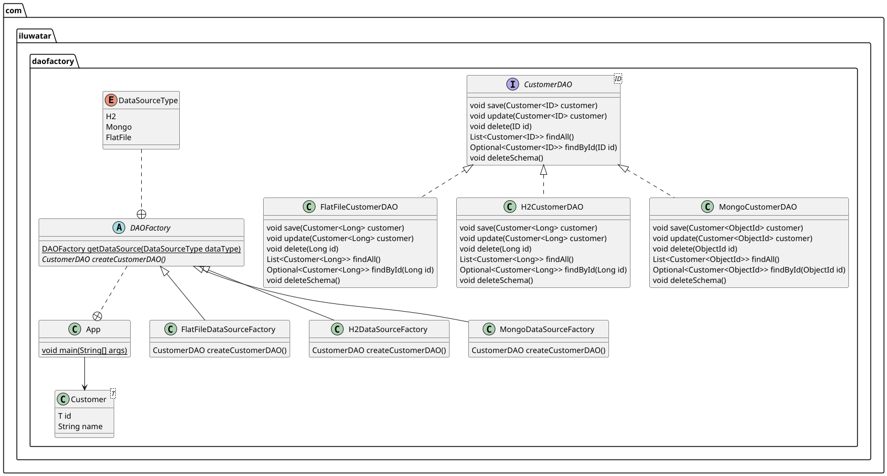

## Intent

DAO Factory is a design pattern which utilise the Abstract Factory and Factory Method to create and produce a new instance of DAOs that are needed by the client application by creating a concrete Factory for a specific data source type.

## Explanation

**Programmatic Example**

Below are an example of how the pattern can be used in a client code.

Concrete type of DAO Factory can be called by passing in the specific data source type in the parameter of `getDAOFactory`, in this case a concrete of PostgreSQL data source type.

```java
// Create a PostgreSQL DAO Factory
DAOFactory postgres = DAOFactory.getDAOFactory(DAOFactory.POSTGRES);
...
```

The specified factory has each a DAO for different objects within the data source `Account` and `Order` for the following example which could be called as follow

```java
// Create an Account DAO
AccountDAO psqlAccount = postgres.getAccountDAO();

// Create an Order DAO
OrderDAO psqlOrder = postgres.getOrderDAO();
...
```

Each of the DAOFactory for different object supports operations that are implemented within the DAO. For AccountDAO, examples are as follow

```java
// Inserting a new account to the database
psqlAccount.insertAccount("Richard", "Reynaldo", "Canberra");

// Finding an account
Account tempAcc = psqlAccount.findAccount("Richard", "Reynaldo", null);

// Delete an account from the database
psqlAccount.deleteAccount(null, null, "Boston");
...
```

## Class diagram



## Applicability

Data Access Object Factory might be suitable for the following situations:

* Creating a DAO with multiple data source type.
* Ensuring a consistent DAO implementation for multiple data source type.
* Reusing implementation from other type (Increase re-usability).

## Credits

* [Core J2EE Patterns - Data Access Object](https://www.oracle.com/java/technologies/dataaccessobject.html)
