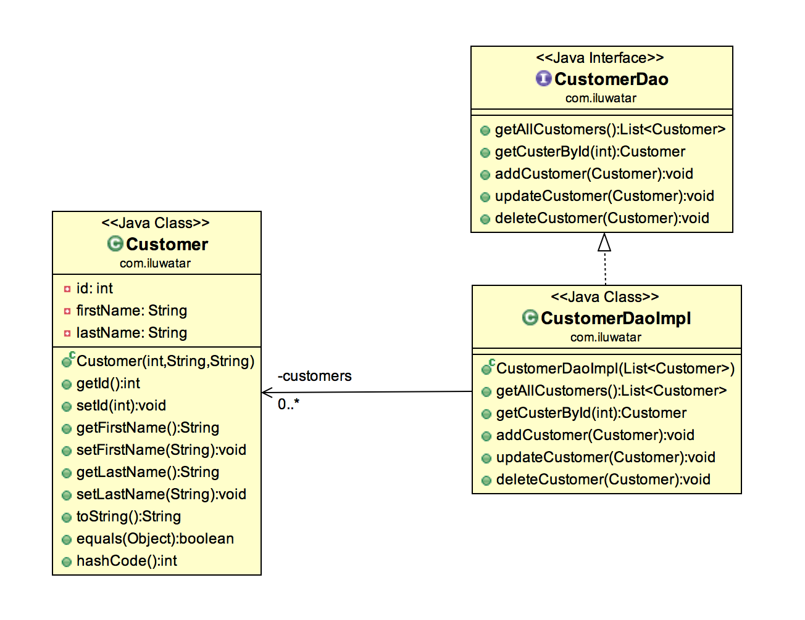

## Intent

Object provides an abstract interface to some type of database or other persistence mechanism.

## Explanation

Real world example

> There's a set of customers that need to be persisted to database. Additionally we need the whole 
> set of CRUD (create/read/update/delete) operations so we can operate on customers easily. 

In plain words

> DAO is an interface we provide over the base persistence mechanism. 

Wikipedia says

> In computer software, a data access object (DAO) is a pattern that provides an abstract interface 
> to some type of database or other persistence mechanism.

**Programmatic Example**

Walking through our customers example, here's the basic `Customer` entity.

```java
public class Customer {

  private int id;
  private String firstName;
  private String lastName;

  public Customer(int id, String firstName, String lastName) {
    this.id = id;
    this.firstName = firstName;
    this.lastName = lastName;
  }
  // getters and setters ->
  ...
}
```

Here's the `CustomerDao` interface and two different implementations for it. `InMemoryCustomerDao` 
keeps a simple map of customers in memory while `DBCustomerDao` is the real RDBMS implementation.

```java
public interface CustomerDao {

  Stream<Customer> getAll() throws Exception;

  Optional<Customer> getById(int id) throws Exception;

  boolean add(Customer customer) throws Exception;

  boolean update(Customer customer) throws Exception;

  boolean delete(Customer customer) throws Exception;
}

public class InMemoryCustomerDao implements CustomerDao {

  private final Map<Integer, Customer> idToCustomer = new HashMap<>();

  // implement the interface using the map
  ...
}

@Slf4j
public class DbCustomerDao implements CustomerDao {

  private final DataSource dataSource;

  public DbCustomerDao(DataSource dataSource) {
    this.dataSource = dataSource;
  }

  // implement the interface using the data source
  ...
```

Finally here's how we use our DAO to manage customers.

```java
    final var dataSource = createDataSource();
    createSchema(dataSource);
    final var customerDao = new DbCustomerDao(dataSource);
    
    addCustomers(customerDao);
    log.info(ALL_CUSTOMERS);
    try (var customerStream = customerDao.getAll()) {
      customerStream.forEach((customer) -> log.info(customer.toString()));
    }
    log.info("customerDao.getCustomerById(2): " + customerDao.getById(2));
    final var customer = new Customer(4, "Dan", "Danson");
    customerDao.add(customer);
    log.info(ALL_CUSTOMERS + customerDao.getAll());
    customer.setFirstName("Daniel");
    customer.setLastName("Danielson");
    customerDao.update(customer);
    log.info(ALL_CUSTOMERS);
    try (var customerStream = customerDao.getAll()) {
      customerStream.forEach((cust) -> log.info(cust.toString()));
    }
    customerDao.delete(customer);
    log.info(ALL_CUSTOMERS + customerDao.getAll());
    
    deleteSchema(dataSource);
```

The program output:

```java
customerDao.getAllCustomers(): 
Customer{id=1, firstName='Adam', lastName='Adamson'}
Customer{id=2, firstName='Bob', lastName='Bobson'}
Customer{id=3, firstName='Carl', lastName='Carlson'}
customerDao.getCustomerById(2): Optional[Customer{id=2, firstName='Bob', lastName='Bobson'}]
customerDao.getAllCustomers(): java.util.stream.ReferencePipeline$Head@7cef4e59
customerDao.getAllCustomers(): 
Customer{id=1, firstName='Adam', lastName='Adamson'}
Customer{id=2, firstName='Bob', lastName='Bobson'}
Customer{id=3, firstName='Carl', lastName='Carlson'}
Customer{id=4, firstName='Daniel', lastName='Danielson'}
customerDao.getAllCustomers(): java.util.stream.ReferencePipeline$Head@2db0f6b2
customerDao.getAllCustomers(): 
Customer{id=1, firstName='Adam', lastName='Adamson'}
Customer{id=2, firstName='Bob', lastName='Bobson'}
Customer{id=3, firstName='Carl', lastName='Carlson'}
customerDao.getCustomerById(2): Optional[Customer{id=2, firstName='Bob', lastName='Bobson'}]
customerDao.getAllCustomers(): java.util.stream.ReferencePipeline$Head@12c8a2c0
customerDao.getAllCustomers(): 
Customer{id=1, firstName='Adam', lastName='Adamson'}
Customer{id=2, firstName='Bob', lastName='Bobson'}
Customer{id=3, firstName='Carl', lastName='Carlson'}
Customer{id=4, firstName='Daniel', lastName='Danielson'}
customerDao.getAllCustomers(): java.util.stream.ReferencePipeline$Head@6ec8211c
```

## Class diagram



## Applicability

Use the Data Access Object in any of the following situations:

* When you want to consolidate how the data layer is accessed.
* When you want to avoid writing multiple data retrieval/persistence layers.

## Credits

* [J2EE Design Patterns](https://www.amazon.com/gp/product/0596004273/ref=as_li_tl?ie=UTF8&camp=1789&creative=9325&creativeASIN=0596004273&linkCode=as2&tag=javadesignpat-20&linkId=48d37c67fb3d845b802fa9b619ad8f31)
