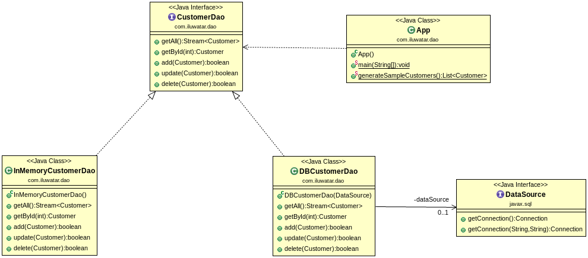

## Also known as

* Data Access Layer
* DAO

## Intent

The Data Access Object (DAO) design pattern aims to separate the application's business logic from the persistence layer, typically a database or any other storage mechanism. By using DAOs, the application can access and manipulate data without being dependent on the specific database implementation details.

## Explanation

Real world example

> Imagine a library system where the main application manages book loans, user accounts, and inventory. The Data Access Object (DAO) pattern in this context would be used to separate the database operations (such as fetching book details, updating user records, and checking inventory) from the business logic of managing loans and accounts. For instance, there would be a `BookDAO` class responsible for all database interactions related to books, such as retrieving a book by its ISBN or updating its availability status. This abstraction allows the library system's main application code to focus on business rules and workflows, while the `BookDAO` handles the complex SQL queries and data management. This separation makes the system easier to maintain and test, as changes to the data source or business logic can be managed independently.

In plain words

> DAO is an interface we provide over the base persistence mechanism.

Wikipedia says

> In computer software, a data access object (DAO) is a pattern that provides an abstract interface to some type of database or other persistence mechanism.

**Programmatic Example**

There's a set of customers that need to be persisted to database. Additionally, we need the whole set of CRUD (create/read/update/delete) operations, so we can operate on customers easily.

Walking through our customers example, here's the basic `Customer` entity.

```java
@Setter
@Getter
@ToString
@EqualsAndHashCode(onlyExplicitlyIncluded = true)
@AllArgsConstructor
public class Customer {

    @EqualsAndHashCode.Include
    private int id;
    private String firstName;
    private String lastName;
}
```

Here's the `CustomerDao` interface and two different implementations for it. `InMemoryCustomerDao` keeps a simple map of customers in memory while `DBCustomerDao` is the real RDBMS implementation.

```java
public interface CustomerDao {

    Stream<Customer> getAll() throws Exception;

    Optional<Customer> getById(int id) throws Exception;

    boolean add(Customer customer) throws Exception;

    boolean update(Customer customer) throws Exception;

    boolean delete(Customer customer) throws Exception;
}

public class InMemoryCustomerDao implements CustomerDao {

    private final Map<Integer, Customer> idToCustomer = new HashMap<>();

    // implement the interface using the map
}

@Slf4j
@RequiredArgsConstructor
public class DbCustomerDao implements CustomerDao {

  private final DataSource dataSource;

  // implement the interface using the data source
}
```

Finally, here's how we use our DAO to manage customers.

```java

@Slf4j
public class App {
    private static final String DB_URL = "jdbc:h2:mem:dao;DB_CLOSE_DELAY=-1";
    private static final String ALL_CUSTOMERS = "customerDao.getAllCustomers(): ";

    public static void main(final String[] args) throws Exception {
        final var inMemoryDao = new InMemoryCustomerDao();
        performOperationsUsing(inMemoryDao);

        final var dataSource = createDataSource();
        createSchema(dataSource);
        final var dbDao = new DbCustomerDao(dataSource);
        performOperationsUsing(dbDao);
        deleteSchema(dataSource);
    }

    private static void deleteSchema(DataSource dataSource) throws SQLException {
        try (var connection = dataSource.getConnection();
             var statement = connection.createStatement()) {
            statement.execute(CustomerSchemaSql.DELETE_SCHEMA_SQL);
        }
    }

    private static void createSchema(DataSource dataSource) throws SQLException {
        try (var connection = dataSource.getConnection();
             var statement = connection.createStatement()) {
            statement.execute(CustomerSchemaSql.CREATE_SCHEMA_SQL);
        }
    }

    private static DataSource createDataSource() {
        var dataSource = new JdbcDataSource();
        dataSource.setURL(DB_URL);
        return dataSource;
    }

    private static void performOperationsUsing(final CustomerDao customerDao) throws Exception {
        addCustomers(customerDao);
        LOGGER.info(ALL_CUSTOMERS);
        try (var customerStream = customerDao.getAll()) {
            customerStream.forEach(customer -> LOGGER.info(customer.toString()));
        }
        LOGGER.info("customerDao.getCustomerById(2): " + customerDao.getById(2));
        final var customer = new Customer(4, "Dan", "Danson");
        customerDao.add(customer);
        LOGGER.info(ALL_CUSTOMERS + customerDao.getAll());
        customer.setFirstName("Daniel");
        customer.setLastName("Danielson");
        customerDao.update(customer);
        LOGGER.info(ALL_CUSTOMERS);
        try (var customerStream = customerDao.getAll()) {
            customerStream.forEach(cust -> LOGGER.info(cust.toString()));
        }
        customerDao.delete(customer);
        LOGGER.info(ALL_CUSTOMERS + customerDao.getAll());
    }

    private static void addCustomers(CustomerDao customerDao) throws Exception {
        for (var customer : generateSampleCustomers()) {
            customerDao.add(customer);
        }
    }

    public static List<Customer> generateSampleCustomers() {
        final var customer1 = new Customer(1, "Adam", "Adamson");
        final var customer2 = new Customer(2, "Bob", "Bobson");
        final var customer3 = new Customer(3, "Carl", "Carlson");
        return List.of(customer1, customer2, customer3);
    }
}
```

The program output:

```
10:02:09.788 [main] INFO com.iluwatar.dao.App -- customerDao.getAllCustomers(): 
10:02:09.793 [main] INFO com.iluwatar.dao.App -- Customer(id=1, firstName=Adam, lastName=Adamson)
10:02:09.793 [main] INFO com.iluwatar.dao.App -- Customer(id=2, firstName=Bob, lastName=Bobson)
10:02:09.793 [main] INFO com.iluwatar.dao.App -- Customer(id=3, firstName=Carl, lastName=Carlson)
10:02:09.794 [main] INFO com.iluwatar.dao.App -- customerDao.getCustomerById(2): Optional[Customer(id=2, firstName=Bob, lastName=Bobson)]
10:02:09.794 [main] INFO com.iluwatar.dao.App -- customerDao.getAllCustomers(): java.util.stream.ReferencePipeline$Head@4c3e4790
10:02:09.794 [main] INFO com.iluwatar.dao.App -- customerDao.getAllCustomers(): 
10:02:09.795 [main] INFO com.iluwatar.dao.App -- Customer(id=1, firstName=Adam, lastName=Adamson)
10:02:09.795 [main] INFO com.iluwatar.dao.App -- Customer(id=2, firstName=Bob, lastName=Bobson)
10:02:09.795 [main] INFO com.iluwatar.dao.App -- Customer(id=3, firstName=Carl, lastName=Carlson)
10:02:09.795 [main] INFO com.iluwatar.dao.App -- Customer(id=4, firstName=Daniel, lastName=Danielson)
10:02:09.795 [main] INFO com.iluwatar.dao.App -- customerDao.getAllCustomers(): java.util.stream.ReferencePipeline$Head@5679c6c6
10:02:09.894 [main] INFO com.iluwatar.dao.App -- customerDao.getAllCustomers(): 
10:02:09.895 [main] INFO com.iluwatar.dao.App -- Customer(id=1, firstName=Adam, lastName=Adamson)
10:02:09.895 [main] INFO com.iluwatar.dao.App -- Customer(id=2, firstName=Bob, lastName=Bobson)
10:02:09.895 [main] INFO com.iluwatar.dao.App -- Customer(id=3, firstName=Carl, lastName=Carlson)
10:02:09.895 [main] INFO com.iluwatar.dao.App -- customerDao.getCustomerById(2): Optional[Customer(id=2, firstName=Bob, lastName=Bobson)]
10:02:09.896 [main] INFO com.iluwatar.dao.App -- customerDao.getAllCustomers(): java.util.stream.ReferencePipeline$Head@23282c25
10:02:09.897 [main] INFO com.iluwatar.dao.App -- customerDao.getAllCustomers(): 
10:02:09.897 [main] INFO com.iluwatar.dao.App -- Customer(id=1, firstName=Adam, lastName=Adamson)
10:02:09.897 [main] INFO com.iluwatar.dao.App -- Customer(id=2, firstName=Bob, lastName=Bobson)
10:02:09.898 [main] INFO com.iluwatar.dao.App -- Customer(id=3, firstName=Carl, lastName=Carlson)
10:02:09.898 [main] INFO com.iluwatar.dao.App -- Customer(id=4, firstName=Daniel, lastName=Danielson)
10:02:09.898 [main] INFO com.iluwatar.dao.App -- customerDao.getAllCustomers(): java.util.stream.ReferencePipeline$Head@f2f2cc1
```

## Class diagram



## Applicability

Use the Data Access Object in any of the following situations:

* There is a need to abstract and encapsulate all access to the data source.
* The application needs to support multiple types of databases or storage mechanisms without significant code changes.
* You want to keep the database access clean and simple, and separate from business logic.

## Tutorials

* [The DAO Pattern in Java(Baeldung)](https://www.baeldung.com/java-dao-pattern)
* [Data Access Object Pattern (TutorialsPoint)](https://www.tutorialspoint.com/design_pattern/data_access_object_pattern.htm)

## Known Uses

* Enterprise applications that require database interaction.
* Applications requiring data access to be adaptable to multiple storage types (relational databases, XML files, flat files, etc.).
* Frameworks providing generic data access functionalities.

## Consequences

Benefits:

* Decoupling: Separates the data access logic from the business logic, enhancing modularity and clarity.
* Reusability: DAOs can be reused across different parts of the application or even in different projects.
* Testability: Simplifies testing by allowing business logic to be tested separately from the data access logic.
* Flexibility: Makes it easier to switch underlying storage mechanisms with minimal impact on the application code.

Trade-offs:

* Layer Complexity: Introduces additional layers to the application, which can increase complexity and development time.
* Overhead: For simple applications, the DAO pattern might introduce more overhead than necessary.
* Learning Curve: Developers might need time to understand and implement the pattern effectively, especially in complex projects.

## Related Patterns

* [Abstract Factory](https://java-design-patterns.com/patterns/abstract-factory/): Helps in abstracting the creation of DAOs, especially when supporting multiple databases or storage mechanisms.
* [Factory](https://java-design-patterns.com/patterns/factory/): Can be used to instantiate DAOs dynamically, providing flexibility in the choice of implementation.
* [Service Layer](https://java-design-patterns.com/patterns/service-layer/): Often used in conjunction with the DAO pattern to define application's boundaries and its set of available operations.
* [Strategy](https://java-design-patterns.com/patterns/strategy/): Might be employed to change the data access strategy at runtime, depending on the context.

## Credits

* [Core J2EE Patterns: Best Practices and Design Strategies](https://amzn.to/49u3r91)
* [Expert One-on-One J2EE Design and Development](https://amzn.to/3vK3pfq)
* [J2EE Design Patterns](https://amzn.to/4dpzgmx)
* [Patterns of Enterprise Application Architecture](https://amzn.to/3U5cxEI)
* [Professional Java Development with the Spring Framework](https://amzn.to/49tANF0)
