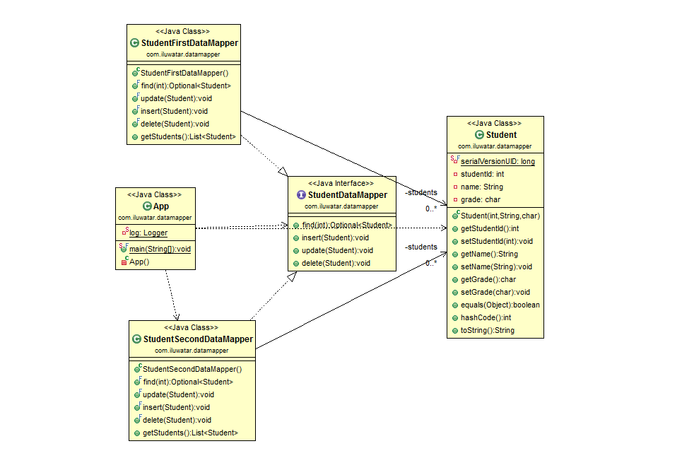

## Also known as

* Object-Relational Mapping (ORM)

## Intent

The Data Mapper pattern aims to create an abstraction layer between the database and the business logic, allowing them to evolve independently. It maps data from the database objects to in-memory data structures and vice versa, minimizing direct dependencies between the application's core logic and the underlying database structure.

## Explanation

Real-world example

> Consider a library system where books are stored in a database with complex relationships and various attributes such as title, author, publication year, and genre. In this scenario, a Data Mapper pattern can be used to map the database records of books to in-memory objects in the application. The Data Mapper would handle the retrieval, storage, and update of book objects in the database, allowing the application's business logic to work directly with the book objects without concern for the underlying database structure. This separation makes it easier to change the database schema without affecting the business logic, and vice versa.

In plain words

> A layer of mappers that moves data between objects and a database while keeping them independent of each other.

Wikipedia says

> A Data Mapper is a Data Access Layer that performs bidirectional transfer of data between a persistent data store (often a relational database) and an in-memory data representation (the domain layer). The goal of the pattern is to keep the in-memory representation and the persistent data store independent of each other and the data mapper itself. This is useful when one needs to model and enforce strict business processes on the data in the domain layer that do not map neatly to the persistent data store.

**Programmatic Example**

The Data Mapper is a design pattern that separates the in-memory objects from the database. Its responsibility is to transfer data between the two and also to isolate them from each other. This pattern promotes the [Single Responsibility Principle](https://java-design-patterns.com/principles/#single-responsibility-principle) and [Separation of Concerns](https://java-design-patterns.com/principles/#separation-of-concerns).

In the data-mapper module, the pattern is demonstrated using a Student class and a StudentDataMapper interface.

The Student class is a simple POJO (Plain Old Java Object) that represents a student. It has properties like studentId, name, and grade.

```java
public class Student {
    private int studentId;
    private String name;
    private char grade;
    // ...
}
```

The StudentDataMapper interface defines the operations that can be performed on Student objects. These operations include insert, update, delete, and find.

```java
public interface StudentDataMapper {
    void insert(final Student student);

    void update(final Student student);

    void delete(final Student student);

    Optional<Student> find(final int studentId);
    // ...
}
```

The StudentDataMapperImpl class implements the StudentDataMapper interface. It contains the actual logic for interacting with the database.

```java
public class StudentDataMapperImpl implements StudentDataMapper {
    // ...
    @Override
    public void insert(final Student student) {
        // Insert student into the database
    }

    @Override
    public void update(final Student student) {
        // Update student in the database
    }

    @Override
    public void delete(final Student student) {
        // Delete student from the database
    }

    @Override
    public Optional<Student> find(final int studentId) {
        // Find student in the database
    }
    // ...
}
```

The App class contains the main method that demonstrates the use of the StudentDataMapper. It creates a Student object, inserts it into the database, finds it, updates it, and finally deletes it.

```java
public class App {
    public static void main(final String... args) {
        final var mapper = new StudentDataMapperImpl();
        var student = new Student(1, "Adam", 'A');
        mapper.insert(student);
        final var studentToBeFound = mapper.find(student.getStudentId());
        student = new Student(student.getStudentId(), "AdamUpdated", 'A');
        mapper.update(student);
        mapper.delete(student);
    }
}
```

Program output:

```
13:54:29.234 [main] DEBUG com.iluwatar.datamapper.App -- App.main(), student : Student(studentId=1, name=Adam, grade=A), is inserted
13:54:29.237 [main] DEBUG com.iluwatar.datamapper.App -- App.main(), student : Optional[Student(studentId=1, name=Adam, grade=A)], is searched
13:54:29.237 [main] DEBUG com.iluwatar.datamapper.App -- App.main(), student : Student(studentId=1, name=AdamUpdated, grade=A), is updated
13:54:29.238 [main] DEBUG com.iluwatar.datamapper.App -- App.main(), student : Student(studentId=1, name=AdamUpdated, grade=A), is going to be deleted
```

## Class diagram



## Applicability

Use the Data Mapper in any of the following situations

* When there's a need to decouple the in-memory objects from the database entities to promote the [Single Responsibility Principle](https://java-design-patterns.com/principles/#single-responsibility-principle) and [Separation of Concerns](https://java-design-patterns.com/principles/#separation-of-concerns).
* In applications requiring an ORM tool to bridge the gap between object-oriented models and relational databases.
* When working with complex database schemas where direct data manipulation and object creation lead to cumbersome and error-prone code.

## Tutorials

* [Spring Boot RowMapper (ZetCode)](https://zetcode.com/springboot/rowmapper/)
* [Spring BeanPropertyRowMapper tutorial (ZetCode)](https://zetcode.com/spring/beanpropertyrowmapper/)
* [Data Transfer Object Pattern in Java - Implementation and Mapping (StackAbuse)](https://stackabuse.com/data-transfer-object-pattern-in-java-implementation-and-mapping/)

## Known uses

* ORM frameworks such as Hibernate in Java.
* Data access layers in enterprise applications where business logic and database management are kept separate.
* Applications requiring database interactions without tying the code to a specific database implementation.

## Consequences

Benefits:

* Promotes [Single Responsibility Principle](https://java-design-patterns.com/principles/#single-responsibility-principle) by separating persistence logic from business logic.
* Enhances maintainability and readability by centralizing data interaction logic.
* Improves application's ability to adapt to changes in the database schema with minimal changes to the business logic.

Trade-offs:

* Introduces complexity through the additional abstraction layer.
* Might lead to performance overhead due to the abstraction layer, especially in large-scale applications or with complex queries.
* Requires developers to learn and understand the abstraction layer in addition to the database and ORM framework being used.

## Related patterns

* Active Record: Combines data access logic and business logic in the domain entities themselves, contrary to Data Mapper's separation of concerns.
* Object–Relational Mapping (ORM): A technique to map object-oriented programming language data to a relational database.
* [Repository](https://java-design-patterns.com/patterns/repository/): Provides an abstraction of the data layer, acting as a collection of domain objects in memory.
* [Unit of Work](https://java-design-patterns.com/patterns/unit-of-work/): Manages transactions and keeps track of the objects affected by a business transaction to ensure changes are consistent and transactional.

## Credits

* [Clean Architecture: A Craftsman's Guide to Software Structure and Design](https://amzn.to/3xyEFag)
* [Java Persistence with Hibernate](https://amzn.to/3VNzlKe)
* [Patterns of Enterprise Application Architecture](https://amzn.to/3WfKBPR)
