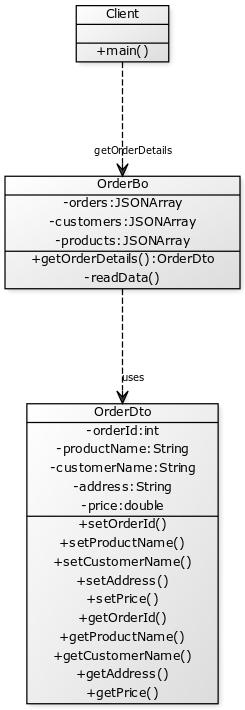

## Also known as
Virtual Constructor

## Intent
Remote calls are expensive. Hence instead of giving multiple calls,
you can get all the information you want as a data transfer object.

## Applicability
Use this pattern when

* you need to make multiple calls to remote.

## Credits

* https://msdn.microsoft.com/en-us/library/ff649585.aspx
* http://www.tutorialspoint.com/design_pattern/transfer_object_pattern.htm
