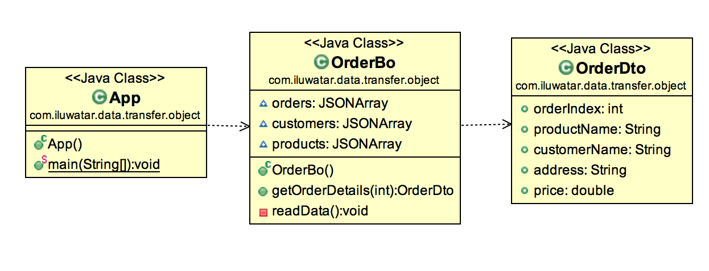
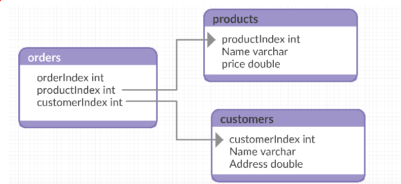

## Also known as
Virtual Constructor

## Intent
Data transfer object is an object that carries data between processes. The motivation for its use has to do with the fact that communication between processes is usually done resorting to remote interfaces (e.g. web services), where each call is an expensive operation. One way of reducing the number of calls is to use an object (the DTO) that aggregates the data that would have been transferred by the several calls, but that is served by one call only.

## Class UML

## Data structure

## Applicability
Use this pattern when

* you need to make multiple calls to remote, you can reduce the number of calls by tranferring all the data at once as a data transfer object.

## Credits

* https://msdn.microsoft.com/en-us/library/ff649585.aspx
* http://www.tutorialspoint.com/design_pattern/transfer_object_pattern.htm
