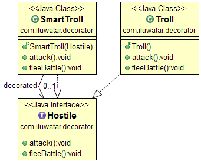

## Also known as
Wrapper

## Intent
Attach additional responsibilities to an object dynamically.
Decorators provide a flexible alternative to subclassing for extending
functionality.

## Applicability
Use Decorator

* to add responsibilities to individual objects dynamically and transparently, that is, without affecting other objects
* for responsibilities that can be withdrawn
* when extension by subclassing is impractical. Sometimes a large number of independent extensions are possible and would produce an explosion of subclasses to support every combination. Or a class definition may be hidden or otherwise unavailable for subclassing

## Real world examples
 * [java.io.InputStream](http://docs.oracle.com/javase/8/docs/api/java/io/InputStream.html), [java.io.OutputStream](http://docs.oracle.com/javase/8/docs/api/java/io/OutputStream.html),
 [java.io.Reader](http://docs.oracle.com/javase/8/docs/api/java/io/Reader.html) and [java.io.Writer](http://docs.oracle.com/javase/8/docs/api/java/io/Writer.html)
 * [java.util.Collections#synchronizedXXX()](http://docs.oracle.com/javase/8/docs/api/java/util/Collections.html#synchronizedCollection-java.util.Collection-)
 * [java.util.Collections#unmodifiableXXX()](http://docs.oracle.com/javase/8/docs/api/java/util/Collections.html#unmodifiableCollection-java.util.Collection-)
 * [java.util.Collections#checkedXXX()](http://docs.oracle.com/javase/8/docs/api/java/util/Collections.html#checkedCollection-java.util.Collection-java.lang.Class-)

## Credits

* [Design Patterns: Elements of Reusable Object-Oriented Software](http://www.amazon.com/Design-Patterns-Elements-Reusable-Object-Oriented/dp/0201633612)
* [Functional Programming in Java: Harnessing the Power of Java 8 Lambda Expressions](http://www.amazon.com/Functional-Programming-Java-Harnessing-Expressions/dp/1937785467/ref=sr_1_1)
* [J2EE Design Patterns](http://www.amazon.com/J2EE-Design-Patterns-William-Crawford/dp/0596004273/ref=sr_1_2)
