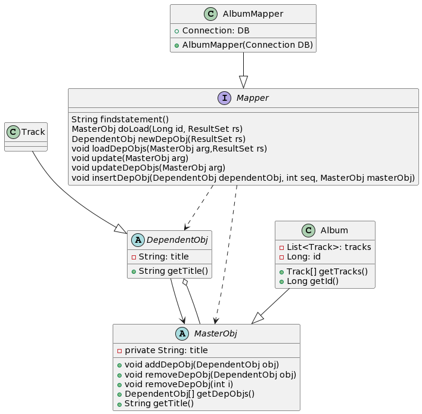

---  
layout: pattern  
title: Dependent Mapping
folder: dependent-mapping
permalink: /patterns/dependent-mapping/  
categories: Behavioral
tags:
- Database
---  

## Intent
The basic idea behind Dependent Mapping is that one class (the dependent) relies upon some other class (the owner) for its database persistence. Each dependent can have only one owner and must have one owner.

A dependent may itself be the owner of another dependent. In this case the owner of the first dependent is also responsible for the persistence of the second dependent. You can have a whole hierarchy of dependents controlled by a single primary owner.

Writing and saving of dependents is left to the owner, and there are no outside references, updates to the dependents can be handled through deletion and insertion. Thus, if you want to update the collection of dependents you can safely delete all rows that link to the owner and then reinsert all the dependents.
## Class diagram

## Applicability
You use Dependent Mapping when you have an object that’s only referred to by one other object, which usually occurs when one object has a collection of dependents. Dependent Mapping is a good way of dealing with the awkward situation where the owner has a collection of references to its dependents but there’s no back pointer. Providing that the many objects don’t need their own identity, using Dependent Mapping makes it easier to manage their persistence.

For Dependent Mapping to work there are a number of preconditions.
-   A dependent must have exactly one owner.
-   There must be no references from any object other than the owner to the dependent.

## Credits

* [Dependent Mapping Pattern-1]([https://martinfowler.com/eaaCatalog/dependentMapping.html](https://martinfowler.com/eaaCatalog/dependentMapping.html))
* [Dependent Mapping Pattern-2]([https://www.sourcecodeexamples.net/2018/05/dependent-mapping-pattern.html](https://www.sourcecodeexamples.net/2018/05/dependent-mapping-pattern.html))
