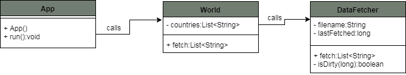

## Also known as
* IsDirty pattern

## Intent
To avoid expensive re-acquisition of resources. The resources retain their identity, are kept in some
fast-access storage, and are re-used to avoid having to acquire them again.

## Class diagram

## Applicability
Use the Dirty Flag pattern when

* Repetitious acquisition, initialization, and release of the same resource causes unnecessary performance overhead.

## Credits

* [Design Patterns: Dirty Flag](https://www.takeupcode.com/podcast/89-design-patterns-dirty-flag/)
* [J2EE Design Patterns](https://www.amazon.com/gp/product/0596004273/ref=as_li_tl?ie=UTF8&camp=1789&creative=9325&creativeASIN=0596004273&linkCode=as2&tag=javadesignpat-20&linkId=48d37c67fb3d845b802fa9b619ad8f31)
