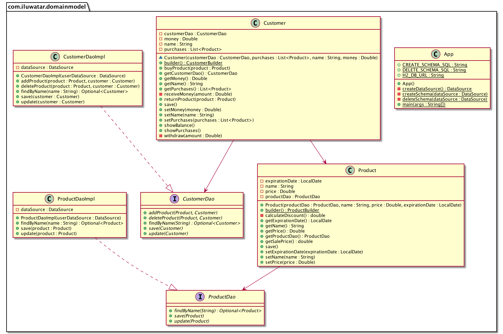

## Also known as

* Conceptual Model
* Domain Object Model

## Intent

The Domain Model pattern aims to create a conceptual model in your software that matches the real-world system it's designed to represent. It involves using rich domain objects that encapsulate both data and behavior relevant to the application domain.

## Explanation

Real-world example

> Consider an online bookstore system that uses the Domain Model design pattern. In this system, various domain objects such as `Book`, `Author`, `Customer`, and `Order` encapsulate the core business logic and rules. For instance, the `Book` object contains attributes like title, author, price, and stock quantity, along with methods to manage these attributes. The `Order` object manages order details, calculates the total price, and verifies stock availability. This approach ensures that the business logic is centralized within the domain objects, making the system more modular, easier to maintain, and scalable as new features are added.

In plain words

> The Domain Model is an object model of the domain that incorporates both behavior and data.

**Programmatic Example**

Let's assume that we need to build an e-commerce web application. While analyzing requirements you will notice that there are few nouns you talk about repeatedly. It’s your Customer, and a Product the customer looks for. These two are your domain-specific classes and each of that classes will include some business logic specific to its domain.

In the example of the e-commerce app, we need to deal with the domain logic of customers who want to buy products and return them if they want. We can use the domain model pattern and create classes `Customer` and `Product` where every single instance of that class incorporates both behavior and data and represents only one record in the underlying table.

```java
public class Customer {
    // Customer properties and methods
}

public class Product {
    // Product properties and methods
}
```

Data Access Objects (DAOs): These objects provide an abstract interface to the database. They are used to retrieve domain entities and save changes back to the database. In the provided code, `CustomerDaoImpl` and `ProductDaoImpl` are the DAOs.

```java
public class CustomerDaoImpl implements CustomerDao {
    // Implementation of the methods defined in the CustomerDao interface
}

public class ProductDaoImpl implements ProductDao {
    // Implementation of the methods defined in the ProductDao interface
}
```

Domain Logic: This is encapsulated within the domain entities. For example, the `Customer` class has methods like `buyProduct` and `returnProduct` which represent the actions a customer can perform.

```java
public class Customer {
    
    // Other properties and methods...

    public void buyProduct(Product product) {
        // Implementation of buying a product
    }

    public void returnProduct(Product product) {
        // Implementation of returning a product
    }
}
```

Application: The `App` class uses the domain entities and their methods to implement the business logic of the application.

```java
public class App {

    public static final String H2_DB_URL = "jdbc:h2:mem:testdb;DB_CLOSE_DELAY=-1";

    public static final String CREATE_SCHEMA_SQL =
            "CREATE TABLE CUSTOMERS (name varchar primary key, money decimal);"
                    + "CREATE TABLE PRODUCTS (name varchar primary key, price decimal, expiration_date date);"
                    + "CREATE TABLE PURCHASES ("
                    + "product_name varchar references PRODUCTS(name),"
                    + "customer_name varchar references CUSTOMERS(name));";

    public static final String DELETE_SCHEMA_SQL =
            "DROP TABLE PURCHASES IF EXISTS;"
                    + "DROP TABLE CUSTOMERS IF EXISTS;"
                    + "DROP TABLE PRODUCTS IF EXISTS;";

    public static void main(String[] args) throws Exception {

        // Create data source and create the customers, products and purchases tables
        final var dataSource = createDataSource();
        deleteSchema(dataSource);
        createSchema(dataSource);

        // create customer
        var customerDao = new CustomerDaoImpl(dataSource);

        var tom =
                Customer.builder()
                        .name("Tom")
                        .money(Money.of(USD, 30))
                        .customerDao(customerDao)
                        .build();

        tom.save();

        // create products
        var productDao = new ProductDaoImpl(dataSource);

        var eggs =
                Product.builder()
                        .name("Eggs")
                        .price(Money.of(USD, 10.0))
                        .expirationDate(LocalDate.now().plusDays(7))
                        .productDao(productDao)
                        .build();

        var butter =
                Product.builder()
                        .name("Butter")
                        .price(Money.of(USD, 20.00))
                        .expirationDate(LocalDate.now().plusDays(9))
                        .productDao(productDao)
                        .build();

        var cheese =
                Product.builder()
                        .name("Cheese")
                        .price(Money.of(USD, 25.0))
                        .expirationDate(LocalDate.now().plusDays(2))
                        .productDao(productDao)
                        .build();

        eggs.save();
        butter.save();
        cheese.save();

        // show money balance of customer after each purchase
        tom.showBalance();
        tom.showPurchases();

        // buy eggs
        tom.buyProduct(eggs);
        tom.showBalance();

        // buy butter
        tom.buyProduct(butter);
        tom.showBalance();

        // trying to buy cheese, but receive a refusal
        // because he didn't have enough money
        tom.buyProduct(cheese);
        tom.showBalance();

        // return butter and get money back
        tom.returnProduct(butter);
        tom.showBalance();

        // Tom can buy cheese now because he has enough money
        // and there is a discount on cheese because it expires in 2 days
        tom.buyProduct(cheese);

        tom.save();

        // show money balance and purchases after shopping
        tom.showBalance();
        tom.showPurchases();
    }

    private static DataSource createDataSource() {
        var dataSource = new JdbcDataSource();
        dataSource.setUrl(H2_DB_URL);
        return dataSource;
    }

    private static void deleteSchema(DataSource dataSource) throws SQLException {
        try (var connection = dataSource.getConnection();
             var statement = connection.createStatement()) {
            statement.execute(DELETE_SCHEMA_SQL);
        }
    }

    private static void createSchema(DataSource dataSource) throws SQLException {
        try (var connection = dataSource.getConnection();
             var statement = connection.createStatement()) {
            statement.execute(CREATE_SCHEMA_SQL);
        }
    }
}
```

The program output:

```java
12:17:23.834 [main] INFO com.iluwatar.domainmodel.Customer -- Tom balance: USD 30.00
12:17:23.836 [main] INFO com.iluwatar.domainmodel.Customer -- Tom didn't bought anything
12:17:23.841 [main] INFO com.iluwatar.domainmodel.Customer -- Tom want to buy Eggs($10,00)...
12:17:23.842 [main] INFO com.iluwatar.domainmodel.Customer -- Tom bought Eggs!
12:17:23.842 [main] INFO com.iluwatar.domainmodel.Customer -- Tom balance: USD 20.00
12:17:23.842 [main] INFO com.iluwatar.domainmodel.Customer -- Tom want to buy Butter($20,00)...
12:17:23.843 [main] INFO com.iluwatar.domainmodel.Customer -- Tom bought Butter!
12:17:23.843 [main] INFO com.iluwatar.domainmodel.Customer -- Tom balance: USD 0.00
12:17:23.843 [main] INFO com.iluwatar.domainmodel.Customer -- Tom want to buy Cheese($20,00)...
12:17:23.843 [main] ERROR com.iluwatar.domainmodel.Customer -- Not enough money!
12:17:23.843 [main] INFO com.iluwatar.domainmodel.Customer -- Tom balance: USD 0.00
12:17:23.843 [main] INFO com.iluwatar.domainmodel.Customer -- Tom want to return Butter($20,00)...
12:17:23.844 [main] INFO com.iluwatar.domainmodel.Customer -- Tom returned Butter!
12:17:23.844 [main] INFO com.iluwatar.domainmodel.Customer -- Tom balance: USD 20.00
12:17:23.844 [main] INFO com.iluwatar.domainmodel.Customer -- Tom want to buy Cheese($20,00)...
12:17:23.844 [main] INFO com.iluwatar.domainmodel.Customer -- Tom bought Cheese!
12:17:23.846 [main] INFO com.iluwatar.domainmodel.Customer -- Tom balance: USD 0.00
12:17:23.846 [main] INFO com.iluwatar.domainmodel.Customer -- Tom bought: Eggs - $10.00, Cheese - $20.00
```

## Class diagram



## Applicability

* Appropriate in complex applications with rich business logic.
* When the business logic or domain complexity is high and requires a model that closely represents real-world entities and their relationships.
* Suitable for applications where domain experts are involved in the development process to ensure the model accurately reflects domain concepts.

## Tutorials

* [Architecture patterns: domain model and friends (Inviqa)](https://inviqa.com/blog/architecture-patterns-domain-model-and-friends)

## Known Uses

* Enterprise applications (ERP, CRM systems)
* Financial systems (banking, trading platforms)
* Healthcare applications (patient records management)
* E-commerce platforms (product catalogs, shopping carts)

## Consequences

Benefits:

* Improved Communication: Provides a common language for developers and domain experts, enhancing understanding and collaboration.
* Flexibility: Encapsulates business logic within domain entities, making it easier to modify and extend without affecting other system parts.
* Maintainability: A well-structured domain model can simplify maintenance and evolution of the application over time.
* Reusability: Domain classes can often be reused across different projects within the same domain.

Trade-offs:

* Complexity: Can introduce complexity, especially in simple applications where a domain model might be overkill.
* Performance Concerns: Rich domain objects with complex behaviors might lead to performance bottlenecks, requiring careful optimization.
* Learning Curve: Requires a good understanding of the domain and may involve a steep learning curve for developers unfamiliar with the domain concepts.

## Related Patterns

* [Data Access Object (DAO)](https://java-design-patterns.com/patterns/dao/): For abstracting and encapsulating all access to the data source.
* [Repository](https://java-design-patterns.com/patterns/repository/): Mediates between the domain and data mapping layers, acting like an in-memory domain object collection.
* [Service Layer](https://java-design-patterns.com/patterns/service-layer/): Defines an application's boundary with a layer of services that establishes a set of available operations and coordinates the application's response in each operation.
* [Unit of Work](https://java-design-patterns.com/patterns/unit-of-work/): Maintains a list of objects affected by a business transaction and coordinates the writing out of changes.

## Credits

* [Domain-Driven Design: Tackling Complexity in the Heart of Software](https://amzn.to/3vMCjnP)
* [Implementing Domain-Driven Design](https://amzn.to/4cUX4OL)
* [Patterns of Enterprise Application Architecture](https://amzn.to/3WfKBPR)
* [Domain Model (Martin Fowler)](https://martinfowler.com/eaaCatalog/domainModel.html)
