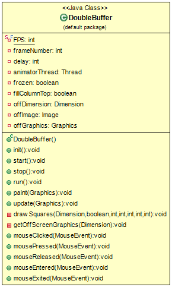

## Also known as
Double buffer

## Intent
Cause a series of sequential operations to appear instantaneous or simultaneous.

## Applicability
This pattern is one of those ones where you’ll know when you need it. 
If you have a system that lacks double buffering, it will probably look visibly wrong (tearing, etc.) 
or will behave incorrectly. But saying, “you’ll know when you need it” doesn’t give you much to go on. 
More specifically, this pattern is appropriate when all of these are true:

## When to use it
* We have some state that is being modified incrementally.
* That same state may be accessed in the middle of modification.
* We want to prevent the code that’s accessing the state from seeing the work in progress.
* We want to be able to read the state and we don’t want to have to wait while it’s being written.

## Credits
* [Gabor Kallay - [Double Buffer](http://gameprogrammingpatterns.com/double-buffer.html)]
