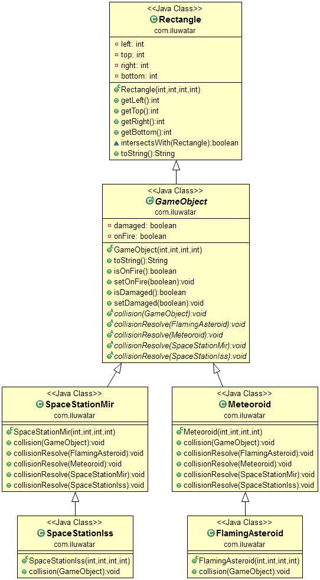

## Also known as

* Multi-methods

## Intent

The Double Dispatch pattern is used to achieve dynamic polymorphism based on the types of two objects involved in a method call. It allows method behavior to be different based on the combination of the runtime types of both the object on which the method is called and the object being passed as a parameter.

## Explanation

Real world example

> In a logistics company, different types of delivery vehicles like trucks, drones, and bikes interact with various types of packages (fragile, oversized, standard). The Double Dispatch design pattern is used to determine the optimal delivery method: trucks might handle oversized items, drones for quick deliveries of light packages, and bikes for urban areas. Each vehicle-package combination results in a different handling and delivery strategy, dynamically determined at runtime based on the types of both the vehicle and the package.

In plain words

> The Double Dispatch design pattern allows a program to select a different function to execute based on the types of two objects involved in a call, enhancing flexibility in handling interactions between them.

Wikipedia says

> In software engineering, double dispatch is a special form of multiple dispatch, and a mechanism that dispatches a function call to different concrete functions depending on the runtime types of two objects involved in the call. In most object-oriented systems, the concrete function that is called from a function call in the code depends on the dynamic type of a single object and therefore they are known as single dispatch calls, or simply virtual function calls.

**Programmatic Example**

The Double Dispatch pattern is used to handle collisions between different types of game objects. Each game object is an instance of a class that extends the `GameObject` abstract class. The `GameObject` class has method `collision`, which is overridden in each subclass to define the behavior when a collision occurs with another game object.  Here is a simplified version of the `GameObject` class and its subclasses:

```java
public abstract class GameObject {
  // Other properties and methods...

  public abstract void collision(GameObject gameObject);
}

public class FlamingAsteroid extends GameObject {
  // Other properties and methods...

  @Override
  public void collision(GameObject gameObject) {
    gameObject.collisionWithFlamingAsteroid(this);
  }
}

public class SpaceStationMir extends GameObject {
  // Other properties and methods...

  @Override
  public void collision(GameObject gameObject) {
    gameObject.collisionWithSpaceStationMir(this);
  }
}
```

In the `App` class's `main` method, the Double Dispatch pattern is used to check for collisions between all pairs of game objects:

```java
public static void main(String[] args) {
    // initialize game objects and print their status
    LOGGER.info("Init objects and print their status");
    var objects = List.of(
            new FlamingAsteroid(0, 0, 5, 5),
            new SpaceStationMir(1, 1, 2, 2),
            new Meteoroid(10, 10, 15, 15),
            new SpaceStationIss(12, 12, 14, 14)
    );
    objects.forEach(o -> LOGGER.info(o.toString()));

    // collision check
    LOGGER.info("Collision check");
    objects.forEach(o1 -> objects.forEach(o2 -> {
        if (o1 != o2 && o1.intersectsWith(o2)) {
            o1.collision(o2);
        }
    }));

    // output eventual object statuses
    LOGGER.info("Print object status after collision checks");
    objects.forEach(o -> LOGGER.info(o.toString()));
}
```

When a collision is detected between two objects, the `collision(GameObject)` method is called on the first object (o1) with the second object (o2) as the argument. This method call is dispatched at runtime to the appropriate `collision(GameObject)` method in the class of o1. Inside this method, another method call `gameObject.collisionWithX(this)` is made on o2 (where X is the type of o1), which is dispatched at runtime to the appropriate `collisionWithX(GameObject)` method in the class of o2. This is the "double dispatch" - two method calls are dispatched at runtime based on the types of two objects.

Here is the program output:

```
15:47:23.763 [main] INFO com.iluwatar.doubledispatch.App -- Init objects and print their status
15:47:23.772 [main] INFO com.iluwatar.doubledispatch.App -- FlamingAsteroid at [0,0,5,5] damaged=false onFire=true
15:47:23.772 [main] INFO com.iluwatar.doubledispatch.App -- SpaceStationMir at [1,1,2,2] damaged=false onFire=false
15:47:23.772 [main] INFO com.iluwatar.doubledispatch.App -- Meteoroid at [10,10,15,15] damaged=false onFire=false
15:47:23.772 [main] INFO com.iluwatar.doubledispatch.App -- SpaceStationIss at [12,12,14,14] damaged=false onFire=false
15:47:23.772 [main] INFO com.iluwatar.doubledispatch.App -- Collision check
15:47:23.772 [main] INFO com.iluwatar.doubledispatch.SpaceStationMir -- FlamingAsteroid hits SpaceStationMir. SpaceStationMir is damaged! SpaceStationMir is set on fire!
15:47:23.773 [main] INFO com.iluwatar.doubledispatch.Meteoroid -- SpaceStationMir hits FlamingAsteroid.
15:47:23.773 [main] INFO com.iluwatar.doubledispatch.SpaceStationMir --  {} is damaged! hits Meteoroid.
15:47:23.773 [main] INFO com.iluwatar.doubledispatch.Meteoroid -- SpaceStationIss hits Meteoroid.
15:47:23.773 [main] INFO com.iluwatar.doubledispatch.App -- Print object status after collision checks
15:47:23.773 [main] INFO com.iluwatar.doubledispatch.App -- FlamingAsteroid at [0,0,5,5] damaged=false onFire=true
15:47:23.773 [main] INFO com.iluwatar.doubledispatch.App -- SpaceStationMir at [1,1,2,2] damaged=true onFire=true
15:47:23.773 [main] INFO com.iluwatar.doubledispatch.App -- Meteoroid at [10,10,15,15] damaged=false onFire=false
15:47:23.773 [main] INFO com.iluwatar.doubledispatch.App -- SpaceStationIss at [12,12,14,14] damaged=true onFire=false
```

## Class diagram



## Applicability

* When the behavior of a method needs to vary not just based on the object it is called on, but also based on the type of the argument.
* In scenarios where if-else or switch-case type checks against the type of objects are cumbersome and not scalable.
* When implementing operations in domain classes without contaminating their code with complex decision-making logic about other domain classes.

## Known Uses

* Graphical user interfaces where different actions are taken based on different types of mouse events interacting with different types of elements.
* Simulation systems where interactions between different types of objects need to trigger distinct behaviors.

## Consequences

Benefits:

* Increases the flexibility of code by handling interaction between objects in a manner that is easy to understand and maintain.
* Helps in adhering to the [Open/Closed Principle](https://java-design-patterns.com/principles/#open-closed-principle) by allowing new classes to be introduced without modifying existing classes.

Trade-offs:

* Can lead to more complex code structures, especially in languages like Java that do not support this pattern natively.
* May require additional effort in maintaining and extending as new classes are added.

## Related Patterns

* [Strategy](https://java-design-patterns.com/patterns/strategy/): Similar in intent where it's used to choose an algorithm at runtime, though Strategy focuses on single object context rather than interactions between multiple objects.
* [Visitor](https://java-design-patterns.com/patterns/visitor/): Often used together with Double Dispatch to encapsulate operations performed on a set of element objects.

## Real world examples

* [Design Patterns: Elements of Reusable Object-Oriented Software](https://amzn.to/4awj7cV)
* [Java Design Pattern Essentials](https://amzn.to/3Jg8ZZV)
* [Refactoring to Patterns](https://amzn.to/3vRBJ8k)
