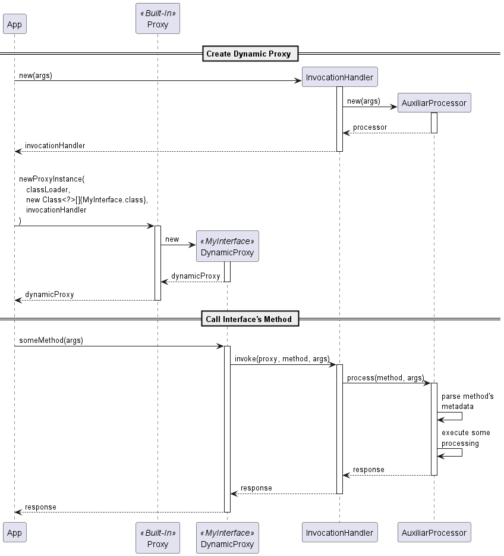
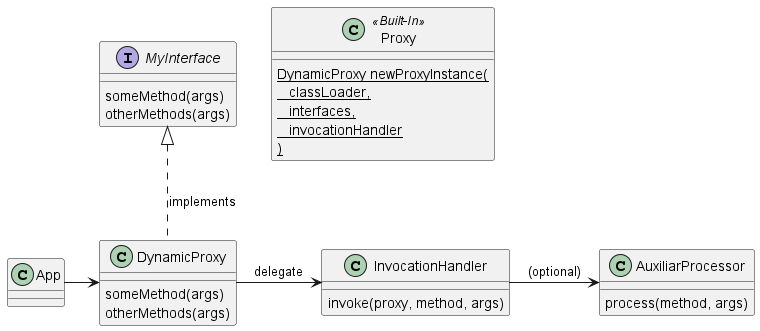

## Intent
Dynamic proxy is a Java mechanism that allows developers to create a proxy instance for interfaces at runtime. It is primarily used for intercepting method calls, enabling developers to add additional processing around the actual method invocation.

## Explanation

### Real-world example
Mockito, a popular Java mocking framework, employs dynamic proxy to create mock objects for testing. Mock objects mimic the behavior of real objects, allowing developers to isolate components and verify interactions in unit tests.

Consider a scenario where a service class depends on an external component, such as a database access object (DAO). Instead of interacting with a real DAO in a test, Mockito can dynamically generate a proxy, intercepting method invocations and returning predefined values. This enables focused unit testing without the need for a real database connection.

### In plain words
Dynamic proxy is a specialized form of proxy in Java, serving as a flexible and dynamic method to intercept and manipulate method calls. By utilizing dynamic proxies, developers can implement additional functionalities without modifying the original class code.

### Wikipedia says
A dynamic proxy class is a class that implements a list of interfaces specified at runtime such that a method invocation through one of the interfaces on an instance of the class will be encoded and dispatched to another object through a uniform interface. Thus, a dynamic proxy class can be used to create a type-safe proxy object for a list of interfaces without requiring pre-generation of the proxy class, such as with compile-time tools. Method invocations on an instance of a dynamic proxy class are dispatched to a single method in the instance's invocation handler, and they are encoded with a _java.lang.reflect.Method_ object identifying the method that was invoked and an array of type _Object_ containing the arguments.

### Programmatic Example
This example allow us to hit the public fake API https://jsonplaceholder.typicode.com for the resource Album through an interface.

The call to _Proxy.newProxyInstance_ creates a new dynamic proxy for the _AlbumService_ interface and sets the _AlbumInvocationHandler_ class as the handler to intercept all the interface's methods. Everytime that we call an _AlbumService_'s method, the handler's method `invoke` will be call automatically, and it will pass all the method's metadata and arguments to other specialized class - _TinyRestClient_ - to prepare the Rest API call accordingly.



In this demo, the Dynamic Proxy pattern help us to run business logic through an interface without an explicit implementation of that interface and supported on the Java Reflection approach.

```java
public class App {

  private static final Logger logger = LoggerFactory.getLogger(App.class);

  static final String REST_API_URL = "https://jsonplaceholder.typicode.com";

  private String baseUrl;
  private HttpClient httpClient;
  private AlbumService albumServiceProxy;

  /**
   * Class constructor.
   *
   * @param baseUrl    Root url for endpoints.
   * @param httpClient Handle the http communication.
   */
  public App(String baseUrl, HttpClient httpClient) {
    this.baseUrl = baseUrl;
    this.httpClient = httpClient;
  }

  /**
   * Create the Dynamic Proxy linked to the AlbumService interface and to the AlbumInvocationHandler.
   */
  public void createDynamicProxy() {
    AlbumInvocationHandler albumInvocationHandler = new AlbumInvocationHandler(baseUrl, httpClient);

    albumServiceProxy = (AlbumService) Proxy.newProxyInstance(
        App.class.getClassLoader(), new Class<?>[] { AlbumService.class }, albumInvocationHandler);
  }

  /**
   * Call the methods of the Dynamic Proxy, in other words, the AlbumService interface's methods
   * and receive the responses from the Rest API.
   */
  public void callMethods() {
    int albumId = 17;
    int userId = 3;

    var albums = albumServiceProxy.readAlbums();
    albums.forEach(album -> logger.info("{}", album));

    var album = albumServiceProxy.readAlbum(albumId);
    logger.info("{}", album);

    var newAlbum = albumServiceProxy.createAlbum(Album.builder()
        .title("Big World").userId(userId).build());
    logger.info("{}", newAlbum);

    var editAlbum = albumServiceProxy.updateAlbum(albumId, Album.builder()
        .title("Green Valley").userId(userId).build());
    logger.info("{}", editAlbum);

    var removedAlbum = albumServiceProxy.deleteAlbum(albumId);
    logger.info("{}", removedAlbum);
  }

  /**
   * Application entry point.
   *
   * @param args External arguments to be passed. Optional.
   */
  public static void main(String[] args) {
    App app = new App(App.REST_API_URL, HttpClient.newHttpClient());
    app.createDynamicProxy();
    app.callMethods();
  }

}
```

Declaration of the AlbumService interface. Annotations were used to provide additional information such as: http method (Get, Post, Put, Delete), endpoint's url, path parameters, body parameters, among others.

```java
public interface AlbumService {

  /**
   * Get a list of albums from an endpoint.
   *
   * @return List of albums' data.
   */
  @Get("/albums")
  List<Album> readAlbums();

  /**
   * Get a specific album from an endpoint.
   *
   * @param albumId Album's id to search for.
   * @return Album's data.
   */
  @Get("/albums/{albumId}")
  Album readAlbum(@Path("albumId") Integer albumId);

  /**
   * Creates a new album.
   *
   * @param album Album's data to be created.
   * @return New album's data.
   */
  @Post("/albums")
  Album createAlbum(@Body Album album);

  /**
   * Updates an existing album.
   *
   * @param albumId Album's id to be modified.
   * @param album   New album's data.
   * @return Updated album's data.
   */
  @Put("/albums/{albumId}")
  Album updateAlbum(@Path("albumId") Integer albumId, @Body Album album);

  /**
   * Deletes an album.
   *
   * @param albumId Album's id to be deleted.
   * @return Empty album.
   */
  @Delete("/albums/{albumId}")
  Album deleteAlbum(@Path("albumId") Integer albumId);

}
```

Declaration of the AlbumInvocationHandler class whose method _invoke_ will be called automatically every time that an AlbumService's method is called. The call processing is delegated to the _TinyRestClient_.

```java
public class AlbumInvocationHandler implements InvocationHandler {

  private static final Logger logger = LoggerFactory.getLogger(AlbumInvocationHandler.class);

  private TinyRestClient restClient;

  /**
   * Class constructor. It instantiates a TinyRestClient object.
   *
   * @param baseUrl    Root url for endpoints.
   * @param httpClient Handle the http communication.
   */
  public AlbumInvocationHandler(String baseUrl, HttpClient httpClient) {
    this.restClient = new TinyRestClient(baseUrl, httpClient);
  }

  @Override
  public Object invoke(Object proxy, Method method, Object[] args) throws Throwable {

    logger.info("===== Calling the method {}.{}()",
        method.getDeclaringClass().getSimpleName(), method.getName());

    return restClient.send(method, args);
  }

}
```

The TinyRestClient class handle all the http communication with a Rest API. It is supported by the built-in component HttpClient. This class is an optional part of the pattern.

```java
public class TinyRestClient {

  private String baseUrl;
  private HttpClient httpClient;

  /**
   * Class constructor.
   *
   * @param baseUrl    Root url for endpoints.
   * @param httpClient Handle the http communication.
   */
  public TinyRestClient(String baseUrl, HttpClient httpClient) {
    this.baseUrl = baseUrl;
    this.httpClient = httpClient;
  }

  /**
   * Creates a http communication to request and receive data from an endpoint.
   *
   * @param method Interface's method which is annotated with a http method.
   * @param args   Method's arguments passed in the call.
   * @return Response from the endpoint.
   * @throws IOException          Exception thrown when any fail happens in the call.
   * @throws InterruptedException Exception thrown when call is interrupted.
   */
  public Object send(Method method, Object[] args) throws IOException, InterruptedException {
    var httpMethodAnnotation = getHttpMethodAnnotation(method.getDeclaredAnnotations());
    if (httpMethodAnnotation == null) {
      return  null;
    }
    var httpMethodName = httpMethodAnnotation.annotationType().getSimpleName().toUpperCase();
    var url = baseUrl + buildUrl(method, args, httpMethodAnnotation);
    var bodyPublisher = buildBodyPublisher(method, args);
    var httpRequest = HttpRequest.newBuilder()
        .uri(URI.create(url))
        .header("Content-Type", "application/json")
        .method(httpMethodName, bodyPublisher)
        .build();
    var httpResponse = httpClient.send(httpRequest, HttpResponse.BodyHandlers.ofString());
    return getResponse(method, httpResponse);
  }

  private String buildUrl(Method method, Object[] args, Annotation httpMethodAnnotation) {
    var url = annotationValue(httpMethodAnnotation);
    if (url == null) {
      return "";
    }
    var index = 0;
    for (var parameter : method.getParameters()) {
      var pathAnnotation = getAnnotationOf(parameter.getDeclaredAnnotations(), Path.class);
      if (pathAnnotation != null) {
        var pathParam = "{" + annotationValue(pathAnnotation) + "}";
        var pathValue = args[index].toString();
        url = url.replace(pathParam, pathValue);
      }
      index++;
    }
    return url;
  }

  private HttpRequest.BodyPublisher buildBodyPublisher(Method method, Object[] args) {
    var index = 0;
    for (var parameter : method.getParameters()) {
      var bodyAnnotation = getAnnotationOf(parameter.getDeclaredAnnotations(), Body.class);
      if (bodyAnnotation != null) {
        var body = JsonUtil.objectToJson(args[index]);
        return HttpRequest.BodyPublishers.ofString(body);
      }
      index++;
    }
    return HttpRequest.BodyPublishers.noBody();
  }

  private Object getResponse(Method method, HttpResponse<String> httpResponse) {
    var rawData = httpResponse.body();
    var returnType = method.getGenericReturnType();
    if (returnType instanceof ParameterizedType) {
      Class<?> responseClass = (Class<?>) (((ParameterizedType) returnType)
          .getActualTypeArguments()[0]);
      return JsonUtil.jsonToList(rawData, responseClass);
    } else {
      Class<?> responseClass = method.getReturnType();
      return JsonUtil.jsonToObject(rawData, responseClass);
    }
  }

  private Annotation getHttpMethodAnnotation(Annotation[] annotations) {
    return Arrays.stream(annotations)
        .filter(annot -> annot.annotationType().isAnnotationPresent(HttpMethod.class))
        .findFirst().orElse(null);
  }

  private Annotation getAnnotationOf(Annotation[] annotations, Class<?> clazz) {
    return Arrays.stream(annotations)
        .filter(annot -> annot.annotationType().equals(clazz))
        .findFirst().orElse(null);
  }

  private String annotationValue(Annotation annotation) {
    var valueMethod = Arrays.stream(annotation.annotationType().getDeclaredMethods())
        .filter(methodAnnot -> methodAnnot.getName().equals("value"))
        .findFirst().orElse(null);
    if (valueMethod == null) {
      return null;
    }
    Object result;
    try {
      result = valueMethod.invoke(annotation, (Object[]) null);
    } catch (Exception e) {
      result = null;
    }
    return (result instanceof String strResult ? strResult : null);
  }
}
```

## Class diagram


## Applicability
Dynamic proxy should be used when you need to augment or enhance your current functionality without modifying your current code. Some examples of that usage could be:

- _Logging and Monitoring_: By creating a logging proxy, developers can intercept method invocations and log relevant information like method names, parameters, and execution times.

- _Security and Access Control_: Developers can create proxies that enforce security policies, restricting access to certain methods based on user roles or permissions.

- _Aspect-Oriented Programming_: Dynamic proxies facilitate the application of transversal aspects to methods without changing the original code.

## Tutorials
- [Dynamic Proxies in Java - CodeGym](https://codegym.cc/groups/posts/208-dynamic-proxies)
- [Introduction To Java Dynamic Proxy - Xperti](https://xperti.io/blogs/java-dynamic-proxies-introduction/)

## Known uses
Many frameworks and libraries use dynamic proxy to implement their functionalities:
- [Spring Framework](https://docs.spring.io/spring-framework/reference/core/aop.html), for aspect oriented programming.
- [Hibernate](https://hibernate.org/orm/), for data lazy loading.
- [Mockito](https://site.mockito.org/), for mocking objects in testing.
- [Cleverclient](https://github.com/sashirestela/cleverclient), for calling http endpoints through annotated interfaces.

## Consequences

### Pros
- **Increased flexibility in code**: Dynamic proxies in Java offer a high degree of flexibility, allowing developers to create versatile and adaptable applications. By using dynamic proxies, software
engineers can modify the behavior of methods at runtime, which is particularly useful in scenarios where the behavior of classes needs to be augmented or manipulated without altering their source code.
This flexibility is crucial in developing applications that require dynamic response to varying conditions or need to integrate with systems where interfaces may change over time.
- **Simplifying complex operations**: Dynamic proxies excel in simplifying complex operations, particularly in the areas of cross-cutting concerns such as logging, transaction management, and security. By intercepting method calls, dynamic proxies can uniformly apply certain operations across various methods and classes, thereby reducing the need for repetitive code. This capability is particularly beneficial in large-scale applications where such cross-cutting concerns are prevalent. For example, adding logging or authorization checks across multiple methods becomes a matter of implementing these features once in an invocation handler, rather than modifying each method individually.
- **Enhancing code maintainability**: Maintainability is a key advantage of using dynamic proxies. They promote cleaner and more organized code by separating the core business logic from cross-cutting concerns. This separation of concerns not only makes the codebase more understandable but also easier to test and debug. When the business logic is decoupled from aspects like logging or transaction handling, any changes in these areas do not impact the core functionality of the application. As a result, applications become more robust and easier to maintain and update, which is crucial in the fast-paced environment of software development where requirements and technologies are constantly evolving.

### Cons
- **Performance overhead**: The use of reflection and method invocation through proxies can introduce latency, especially in performance-critical applications. This overhead might be negligible in most cases, but it becomes significant in scenarios with high-frequency method calls.
- **Complexity of debugging**: Since dynamic proxies introduce an additional layer of abstraction, tracing and debugging issues can be more challenging. It can be difficult to trace the flow of execution through proxies, especially when multiple proxies are involved.
- **Limited to interface-based programming**: They can only proxy interfaces, not classes. This limitation requires careful design considerations, particularly in situations where class-based proxies would be more appropriate.
- **Higher level of expertise**: Developers are normally not a fan of “magic code” — code that works in a non-transparent or overly complex manner. Those unfamiliar with the proxy pattern or reflection might find the codebase more complex to understand and maintain, potentially leading to errors or misuse of the feature. This complexity can be perceived as a form of “magic” that obscures the underlying process, making the code less intuitive and more challenging to debug or extend. Therefore, while dynamic proxies are powerful, their use should be approached with caution and a thorough understanding of their inner workings.

## Related patterns
- [Proxy](https://java-design-patterns.com/patterns/proxy)

## Credits
- [Dynamic Proxies in Java - Baeldung](https://www.baeldung.com/java-dynamic-proxies)
- [Dynamic Proxy Classes - Oracle](https://docs.oracle.com/javase/8/docs/technotes/guides/reflection/proxy.html)
- [Intro To Java Dynamic Proxies - KapreSoft](https://www.kapresoft.com/java/2023/12/27/intro-to-java-proxies.html)
- [Exploring the Depths of Dynamic Proxy in Java: A Comprehensive Guide](https://naveen-metta.medium.com/exploring-the-depths-of-dynamic-proxy-in-java-a-comprehensive-guide-f34fb45b38a3)
