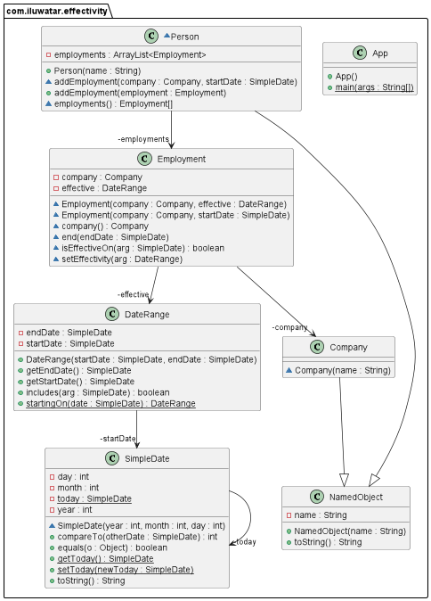

--- 
layout: pattern
title: Effectivity
folder: effectivity
permalink: /patterns/effectivity/
categories: Creational
language: en 
tags:
 - Data access
---

## Name / classification

Effectivity.

## Also known as

Effective Dating, Temporal Database Design.

## Intent

Add a time period to an object to show when it is effective.

## Explanation

Real-world example

> An individual is employed at different companies over different periods of time during their 
> life. It is useful to know if they were working at a company at certain times.

In plain words

> Effectivity pattern lets you specify a time period over which an object is effective.

[Martin Fowler](https://martinfowler.com/eaaDev/Effectivity.html) says
> Many facts are true only for a certain period of time. So an obvious way to describe these 
> facts is to mark them with a period of time. For many that period is a pair of dates, however 
> Range can be used here to make that date range an object.
>
>Once defined, effectivity ranges are then used in queries to return the appropriate objects 
> that are effective on a certain date.

**Programmatic Example**

In this example implementation, a `Person` has several `Employment`s, that are only effective over 
certain `DateRange`s. 

Here are the relevant parts of `Person`

```java
class Person extends NamedObject {
  private final ArrayList<Employment> employments;

  public Person(String name) {
    super(name);
    employments =  new ArrayList<>();
  }

  ArrayList<Employment> getEmployments() {
    return employments;
  }

  void addEmployment(Company company, SimpleDate startDate) {
    employments.add(new Employment(company, DateRange.startingOn(startDate)));
  }

  public void addEmployment(Employment employment) {
    employments.add(employment);
  }
}

```

The relevant parts of `Employment`,
```java
public class Employment {
  private DateRange effective;
  private Company company;

  Employment(Company company, DateRange effective) {
    this.company = company;
    this.effective = effective;
  }
  
  public boolean isEffectiveOn(SimpleDate arg) {
    return effective.includes(arg);
  }
  
  public void setEnd(SimpleDate endDate) {
    effective = new DateRange(effective.getStartDate(), endDate);
  }

  public void setEffective(DateRange range) {
    effective = range;
  }
}
```

Then, these are used in application, wherein an individual is employed at several companies over 
a span of time
```java
  public static void main(String[] args) {
    Person bob = new Person("Bob");
    Company aaInc = new Company("AA inc");
    Company bbCo = new Company("BB Company");

    // Bob was employed at A Inc from the 2nd of June 2003, until 4th of February 2008
    DateRange aaIncPeriod = new DateRange(new SimpleDate(2003, 6, 2),
    new SimpleDate(2008, 2, 4));
    Employment aaIncEmployment = new Employment(aaInc, aaIncPeriod);
    bob.addEmployment(aaIncEmployment);

    // Then, Bob started working at B Company from the 19th of March 2008,
    // and has continued working there since.
    bob.addEmployment(bbCo, new SimpleDate(2008, 3, 19));

    LOGGER.info("Bob's employments:");
    for (Employment emp : bob.getEmployments()) {
    LOGGER.info(emp.toString());
    }
  }
```

Has an output of 
```
Bob's employments:
AA inc : (2003-06-02 : 2008-02-04)
BB Company : (2008-03-19 : +99999-12-31)
```


## Class diagram



## Applicability

Use the Effectivity pattern when
* You have a simple situation for temporal behaviour.
* It makes sense that the objects should be temporal.

## Consequences

Pros:
* Allows for simple temporal behaviour.

Cons:
* Replies on client awareness of the temporality for processing.

## Related patterns

* [Temporal Property](https://martinfowler.com/eaaDev/TemporalProperty.html)
* [Temporal Object](https://martinfowler.com/eaaDev/TemporalObject.html)

## Credits

* [Martin Fowler](https://martinfowler.com/eaaDev/Effectivity.html)
* [Sam Bendayan](http://www.sqlservercentral.com/articles/Effective+Dating/67806/)