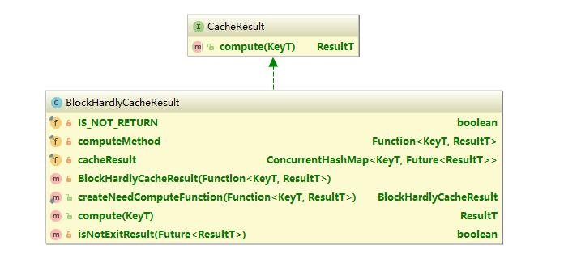

## Intent
Efficient cache result is a high-performance framework for saving cached results.It tries to solve the performance 
problems of some algorithms in high concurrency situations.


## Explanation
It almost does not lock to complete the results cache and get the results.In the case of concurrency, 
when need a result, the result is taken immediately if it has already been calculated.

## Applicability
- You frequently calculate a value
- You want to safely save the results under concurrency conditions
- You do not want to lock when saving results

## Tutorials
First you should new a entity class of CacheResult.
```` java
//java 1.8
CacheResult<Long, Long> cacheResult = BlockHardlyCacheResult.<Long, Long>createNeedComputeFunction(key -> key += 1);
````
```` java
//java 1.7
CacheResult<Long, Long> cacheResult = BlockHardlyCacheResult.<Long, Long>createNeedComputeFunction(new Function<Long, Long>() {
    @Override
    public Long apply(Long key) {
        key += 1;
        return key;
    }
});
````
Second, each call to the compute method begins
```` java
long key = 12;
long result = cacheResult.compute(key);
````
You can also specify any type of object as KeyT and ResultT to make sure your algorithm is more flexible.