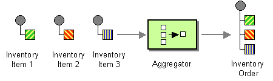

## Intent
Sometimes in enterprise systems there is a need to group incoming data in order to process it as a whole. For example
you may need to gather offers and after defined number of offers has been received you would like to choose the one with
the best parameters. 

Aggregator allows you to merge messages based on defined criteria and parameters. It gathers original messages, 
applies aggregation strategy and upon fulfilling given criteria, releasing merged messages.

## Diagram 

## Applicability
Use the Aggregator pattern when

* You need to combine multiple incoming messages 
* You want to process grouped data

## Credits

* [Gregor Hohpe, Bobby Woolf - Enterprise Integration Patterns](http://www.enterpriseintegrationpatterns.com/patterns/messaging/Aggregator.html)
* [Apache Camel - Documentation](http://camel.apache.org/aggregator2.html)
* [Enterprise Integration Patterns: Designing, Building, and Deploying Messaging Solutions](https://www.amazon.com/gp/product/0321200683/ref=as_li_tl?ie=UTF8&camp=1789&creative=9325&creativeASIN=0321200683&linkCode=as2&tag=javadesignpat-20&linkId=122e0cff74eedd004cc81a3ecfa623cf)
