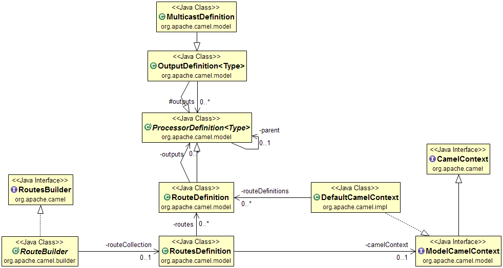

## Intent
Broadcast messages from sender to all the interested receivers.

## Class diagram

## Applicability
Use the Publish Subscribe Channel pattern when

* two or more applications need to communicate using a messaging system for broadcasts.

## Credits

* [J2EE Design Patterns](http://www.amazon.com/J2EE-Design-Patterns-William-Crawford/dp/0596004273/ref=sr_1_2)
