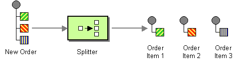

## Intent
It is very common in integration systems that incoming messages consists of many items bundled together. For example
an invoice document contains multiple invoice lines describing transaction (quantity, name of provided
service/sold goods, price etc.). Such bundled messages may not be accepted by other systems. This is where splitter
pattern comes in handy. It will take the whole document, split it based on given criteria and send individual
items to the endpoint.

## Applicability
Use the Splitter pattern when

* You need to split received data into smaller pieces to process them individually
* You need to control the size of data batches you are able to process

## Credits

* [Gregor Hohpe, Bobby Woolf - Enterprise Integration Patterns](http://www.enterpriseintegrationpatterns.com/patterns/messaging/Sequencer.html)
* [Apache Camel - Documentation](http://camel.apache.org/splitter.html)

