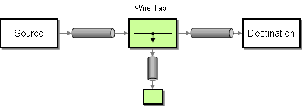

## Intent
In most integration cases there is a need to monitor the messages flowing through the system. It is usually achieved
by intercepting the message and redirecting it to a different location like console, filesystem or the database.
It is important that such functionality should not modify the original message and influence the processing path.

## Diagram

## Applicability
Use the Wire Tap pattern when

* You need to monitor messages flowing through the system
* You need to redirect the same, unchanged message to two different endpoints/paths

## Credits

* [Gregor Hohpe, Bobby Woolf - Enterprise Integration Patterns](http://www.enterpriseintegrationpatterns.com/patterns/messaging/WireTap.html)
* [Apache Camel - Documentation](http://camel.apache.org/wire-tap.html)
* [Enterprise Integration Patterns: Designing, Building, and Deploying Messaging Solutions](https://www.amazon.com/gp/product/0321200683/ref=as_li_tl?ie=UTF8&camp=1789&creative=9325&creativeASIN=0321200683&linkCode=as2&tag=javadesignpat-20&linkId=122e0cff74eedd004cc81a3ecfa623cf)
