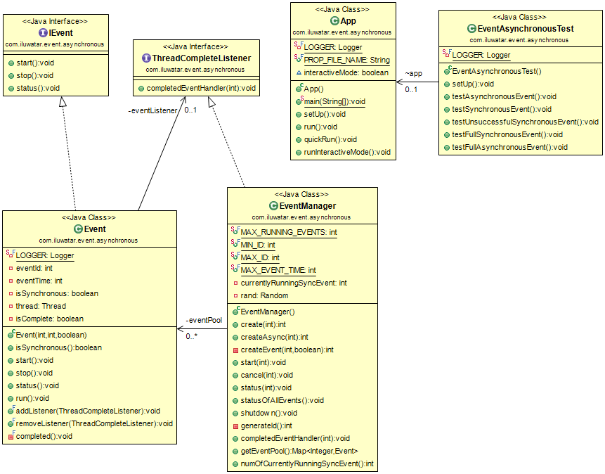

## Intent
The Event-based Asynchronous Pattern makes available the advantages of multithreaded applications while hiding many
of the complex issues inherent in multithreaded design. Using a class that supports this pattern can allow you to:

1. Perform time-consuming tasks, such as downloads and database operations, "in the background," without interrupting your application.
2. Execute multiple operations simultaneously, receiving notifications when each completes.
3. Wait for resources to become available without stopping ("hanging") your application.
4. Communicate with pending asynchronous operations using the familiar events-and-delegates model.

## Class diagram

## Applicability
Use the Event-based Asynchronous pattern(s) when

* Time-consuming tasks are needed to run in the background without disrupting the current application.

## Credits

* [Event-based Asynchronous Pattern Overview](https://msdn.microsoft.com/en-us/library/wewwczdw%28v=vs.110%29.aspx?f=255&MSPPError=-2147217396)
