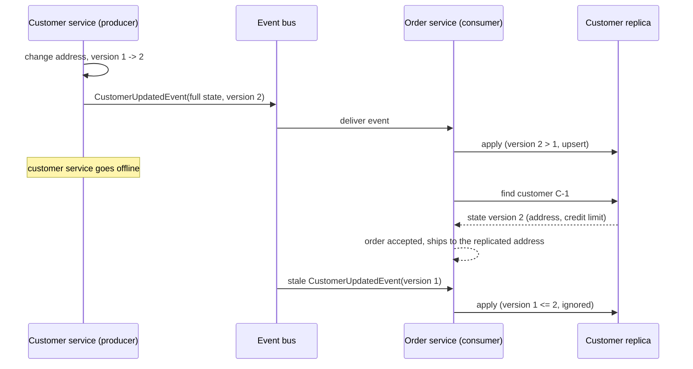
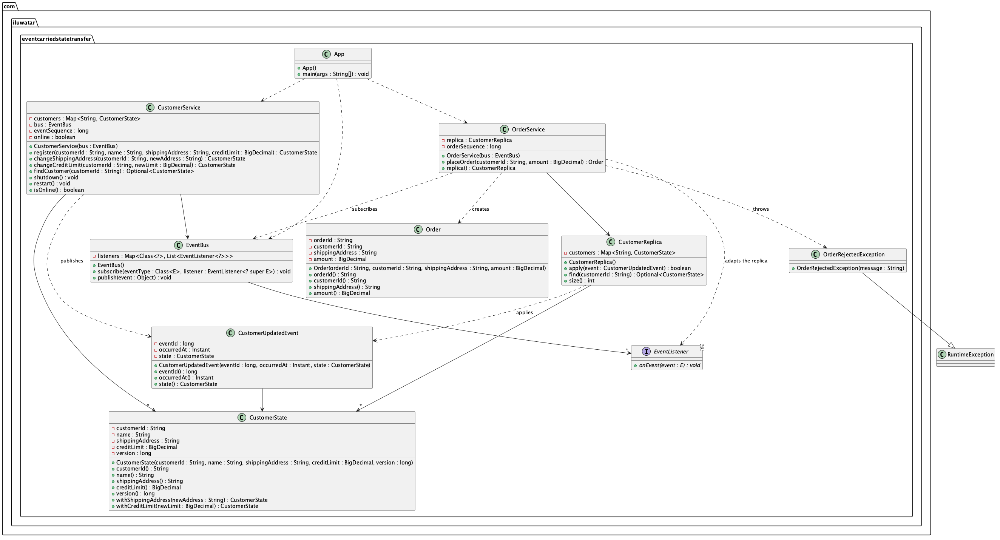

## Also known as

* ECST
* Stateful events
* Fat events

## Intent of Event-Carried State Transfer Design Pattern

Propagate state changes as events that carry the complete new state of the changed entity, so that consuming services can maintain their own local copy of the data and act on it without querying the producing service.

## Detailed Explanation of Event-Carried State Transfer Pattern with Real-World Examples

Real-world example

> A retailer's customer service is the system of record for names, shipping addresses and credit limits. The order service needs that data for every order. Instead of calling the customer service on each order, the customer service publishes a `CustomerUpdated` event every time a customer changes, and the event contains the customer's full record. The order service keeps its own copy of the customers it has seen and ships orders from that copy. When the customer service goes down for maintenance, orders keep flowing.

In plain words

> Do not just tell other services that something changed, send them the whole new state so they never have to ask.

Martin Fowler says

> Event-Carried State Transfer ... shows up when you want to update clients of a system in such a way that they don't need to contact the source system in order to do further work. ... The consumer can then process the data in its own way, and doesn't need to contact the source system.

Sequence diagram





## Programmatic Example of Event-Carried State Transfer Pattern in Java

The example has a producer, a channel and a consumer. The producer is the customer service, the channel is a tiny in-memory event bus and the consumer is the order service with its local customer replica.

1. **The state and the event that carries it**

`CustomerState` is the complete record of a customer, including a version that grows with every change. `CustomerUpdatedEvent` embeds the whole state, which is what distinguishes this pattern from a plain event notification.

```java
public record CustomerState(
    String customerId, String name, String shippingAddress, BigDecimal creditLimit, long version) {

  public CustomerState withShippingAddress(String newAddress) {
    return new CustomerState(customerId, name, newAddress, creditLimit, version + 1);
  }

  public CustomerState withCreditLimit(BigDecimal newLimit) {
    return new CustomerState(customerId, name, shippingAddress, newLimit, version + 1);
  }
}

public record CustomerUpdatedEvent(long eventId, Instant occurredAt, CustomerState state) {}
```

2. **The channel**

`EventBus` is a synchronous publish/subscribe channel keyed by event class. In production this role is played by a message broker.

```java
public <E> void subscribe(Class<E> eventType, EventListener<? super E> listener) {
  var subscribers = listeners.computeIfAbsent(eventType, key -> new ArrayList<>());
  subscribers.add(listener);
  LOGGER.info("Subscriber {} registered for {}", subscribers.size(), eventType.getSimpleName());
}

public void publish(Object event) {
  var subscribers = listeners.getOrDefault(event.getClass(), List.of());
  if (subscribers.isEmpty()) {
    LOGGER.warn("No subscribers for {}", event.getClass().getSimpleName());
    return;
  }
  for (var listener : subscribers) {
    deliver(listener, event);
  }
}
```

3. **The producer**

`CustomerService` owns the authoritative data. Every change is stored and then announced with the full new state. `findCustomer` is the direct query a consumer would have to make without the pattern, and it stops working once the service is shut down.

```java
public CustomerState changeShippingAddress(String customerId, String newAddress) {
  LOGGER.info("Customer {} moves to {}", customerId, newAddress);
  return store(existing(customerId).withShippingAddress(newAddress));
}

private CustomerState store(CustomerState state) {
  customers.put(state.customerId(), state);
  var event = new CustomerUpdatedEvent(++eventSequence, Instant.now(), state);
  bus.publish(event);
  return state;
}

public Optional<CustomerState> findCustomer(String customerId) {
  if (!online) {
    throw new IllegalStateException("customer service is offline");
  }
  return Optional.ofNullable(customers.get(customerId));
}
```

4. **The consumer's replica**

`CustomerReplica` is the local copy fed only by events. Applying an event is an upsert guarded by the version, so events that arrive late or twice are ignored.

```java
public boolean apply(CustomerUpdatedEvent event) {
  var incoming = event.state();
  var current = customers.get(incoming.customerId());
  if (current != null && current.version() >= incoming.version()) {
    LOGGER.info("Ignoring event {} for {}: version {} is not newer than replica version {}", ...);
    return false;
  }
  customers.put(incoming.customerId(), incoming);
  return true;
}
```

5. **The consumer**

`OrderService` subscribes its replica to the bus and afterwards reads only from the replica. It holds no reference to the customer service.

```java
public OrderService(EventBus bus) {
  bus.subscribe(CustomerUpdatedEvent.class, replica::apply);
}

public Order placeOrder(String customerId, BigDecimal amount) {
  var customer =
      replica
          .find(customerId)
          .orElseThrow(
              () -> new OrderRejectedException("Unknown customer " + customerId + " in replica"));
  if (amount.compareTo(customer.creditLimit()) > 0) {
    throw new OrderRejectedException(
        "Amount " + amount + " exceeds credit limit " + customer.creditLimit() + " of " + customerId);
  }
  return new Order(
      "ORD-" + ++orderSequence, customerId, customer.shippingAddress(), amount);
}
```

6. **The demo**

`App` registers a customer and changes the address, takes the customer service offline and places an order from the replica, publishes a stale event that the replica ignores, and shows the replica enforcing the credit limit. It then brings the customer service back and raises that limit: the new limit travels inside the event, and the order that was just rejected is accepted from the replica alone, without a single call back to the producer.

```java
var bus = new EventBus();
var customerService = new CustomerService(bus);
var orderService = new OrderService(bus);

customerService.register("C-1", "Alice", "1 Harbour Street, Lisbon", new BigDecimal("500.00"));
customerService.changeShippingAddress("C-1", "42 Ocean Avenue, Porto");

customerService.shutdown();
lookUpDirectly(customerService, "C-1"); // fails, the producer is down
var order = orderService.placeOrder("C-1", new BigDecimal("120.00")); // succeeds from the replica

bus.publish(new CustomerUpdatedEvent(99, Instant.now(), staleVersionOne)); // ignored
tryToOrder(orderService, "C-1", new BigDecimal("900.00")); // rejected, above the replicated limit

customerService.restart();
customerService.changeCreditLimit("C-1", new BigDecimal("1500.00")); // the event carries the new limit
tryToOrder(orderService, "C-1", new BigDecimal("900.00")); // accepted now, still only from the replica
```

Program output:

```
INFO EventBus -- Subscriber 1 registered for CustomerUpdatedEvent
INFO App -- --- Step 1: every customer change is published with the full customer state ---
INFO CustomerService -- Registering customer C-1 (Alice)
INFO CustomerService -- Publishing event 1 with the full state of C-1 (version 1)
INFO EventBus -- Publishing CustomerUpdatedEvent to 1 subscriber(s)
INFO CustomerReplica -- Replica updated from event 1: C-1 is now at version 1 with address '1 Harbour Street, Lisbon' and limit 500.00
INFO App -- Order service replica: C-1 version 1 at '1 Harbour Street, Lisbon' with limit 500.00
INFO CustomerService -- Customer C-1 moves to 42 Ocean Avenue, Porto
INFO CustomerService -- Publishing event 2 with the full state of C-1 (version 2)
INFO EventBus -- Publishing CustomerUpdatedEvent to 1 subscriber(s)
INFO CustomerReplica -- Replica updated from event 2: C-1 is now at version 2 with address '42 Ocean Avenue, Porto' and limit 500.00
INFO App -- Order service replica: C-1 version 2 at '42 Ocean Avenue, Porto' with limit 500.00
INFO App -- --- Step 2: the customer service goes offline, orders still flow from the replica ---
WARN CustomerService -- Customer service is going offline
WARN App -- Direct lookup of C-1 failed: customer service is offline
INFO OrderService -- Accepted ORD-1 for C-1 (120.00) shipping to '42 Ocean Avenue, Porto' using replica version 2
INFO App -- ORD-1 ships to '42 Ocean Avenue, Porto' without asking the customer service
INFO App -- --- Step 3: a stale event arrives late and the replica ignores it ---
INFO EventBus -- Publishing CustomerUpdatedEvent to 1 subscriber(s)
INFO CustomerReplica -- Ignoring event 99 for C-1: version 1 is not newer than replica version 2
INFO App -- Order service replica: C-1 version 2 at '42 Ocean Avenue, Porto' with limit 500.00
INFO App -- --- Step 4: the replica is enough to enforce business rules ---
WARN App -- Order rejected: Amount 900.00 exceeds credit limit 500.00 of C-1
WARN App -- Order rejected: Unknown customer C-2 in replica
INFO App -- --- Step 5: a new credit limit travels in the event and unblocks the rejected order ---
INFO CustomerService -- Customer service is back online
INFO CustomerService -- Customer C-1 gets a credit limit of 1500.00
INFO CustomerService -- Publishing event 3 with the full state of C-1 (version 3)
INFO EventBus -- Publishing CustomerUpdatedEvent to 1 subscriber(s)
INFO CustomerReplica -- Replica updated from event 3: C-1 is now at version 3 with address '42 Ocean Avenue, Porto' and limit 1500.00
INFO App -- Order service replica: C-1 version 3 at '42 Ocean Avenue, Porto' with limit 1500.00
INFO OrderService -- Accepted ORD-2 for C-1 (900.00) shipping to '42 Ocean Avenue, Porto' using replica version 3
INFO App -- Order ORD-2 accepted
```

## When to Use the Event-Carried State Transfer Pattern in Java

* Consumers need data owned by another service on every request and a synchronous call would add latency, load, or a hard availability dependency.
* The producer must stay available and responsive regardless of how many consumers depend on its data.
* Consumers can tolerate eventual consistency, reading data that is a few events behind the producer.
* Several services need their own view of the same data, possibly stored in different shapes.

## Real-World Applications of Event-Carried State Transfer Pattern in Java

* Kafka topics that carry full entity snapshots, consumed by services that build local materialized views.
* Change data capture pipelines such as Debezium, which stream the complete row state after each database change.
* Product catalogue or customer master data replicated into search, pricing, and fulfilment services in e-commerce platforms.

## Benefits and Trade-offs of Event-Carried State Transfer Pattern

Benefits:

* Consumers are autonomous: they answer from local data and keep working while the producer is down.
* The producer is not queried by consumers, so its load does not grow with the number of consumers.
* Every event is self-contained, which makes consumers simple to write and test.

Trade-offs:

* Eventual consistency: a consumer may act on data that is one or more events behind.
* Data is duplicated across services and every consumer has to store what it needs.
* Events are larger than plain notifications, and their schema has to be versioned and evolved carefully.
* Consumers must handle out-of-order and duplicated deliveries, for example with the version check shown here.

## Related Java Design Patterns

* [Event-Driven Architecture](../event-driven-architecture): the overall style in which services react to events; ECST is one of the ways events are used in it.
* [Publish-Subscribe](../publish-subscribe): the delivery mechanism the state-carrying events ride on.
* [Event Sourcing](../event-sourcing): stores events as the system of record and rebuilds state by replaying them.
* [Microservices Messaging](../microservices-messaging): asynchronous communication between services, which ECST relies on.
* [Command Query Responsibility Segregation](../command-query-responsibility-segregation): read models fed by ECST events are a common way to build the query side.

How this pattern differs from its neighbours: an event notification carries only an identifier and forces the consumer to call the producer back for details. Event-Carried State Transfer carries the full state, so the consumer keeps a local replica and never calls back. Event Sourcing keeps the events themselves as the source of truth; ECST only uses events to feed replicas while the producer remains the source of truth. Publish-Subscribe is the channel; ECST is about what the messages on that channel contain.

## References and Credits

* [What do you mean by "Event-Driven"? (Martin Fowler)](https://martinfowler.com/articles/201701-event-driven.html)
* [Stateful Event Pattern (Graham Brooks)](https://www.grahambrooks.com/event-driven-architecture/patterns/stateful-event-pattern/)
* [The Event-Carried State Transfer Pattern (itnext)](https://itnext.io/the-event-carried-state-transfer-pattern-aae49715bb7f)
* [Microservices Patterns: With examples in Java](https://amzn.to/3xaZwk0)
