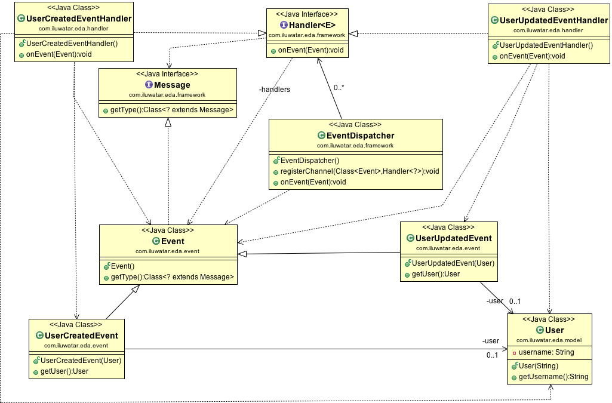

## Intent
Send and notify state changes of your objects to other applications using an Event-driven Architecture.

## Class diagram

## Applicability
Use an Event-driven architecture when

* you want to create a loosely coupled system
* you want to build a more responsive system
* you want a system that is easier to extend

## Real world examples

* SendGrid, an email API, sends events whenever an email is processed, delivered, opened etc... (https://sendgrid.com/docs/API_Reference/Webhooks/event.html)
* Chargify, a billing API, exposes payment activity through various events (https://docs.chargify.com/api-events)
* Amazon's AWS Lambda, lets you execute code in response to events such as changes to Amazon S3 buckets, updates to an Amazon DynamoDB table, or custom events generated by your applications or devices. (https://aws.amazon.com/lambda)
* MySQL runs triggers based on events such as inserts and update events happening on database tables.

## Credits

* [Event-driven architecture - Wikipedia](https://en.wikipedia.org/wiki/Event-driven_architecture)
* [Fundamental Components of an Event-Driven Architecture](http://giocc.com/fundamental-components-of-an-event-driven-architecture.html)
* [Real World Applications/Event Driven Applications](https://wiki.haskell.org/Real_World_Applications/Event_Driven_Applications)
* [Event-driven architecture definition](http://searchsoa.techtarget.com/definition/event-driven-architecture)
