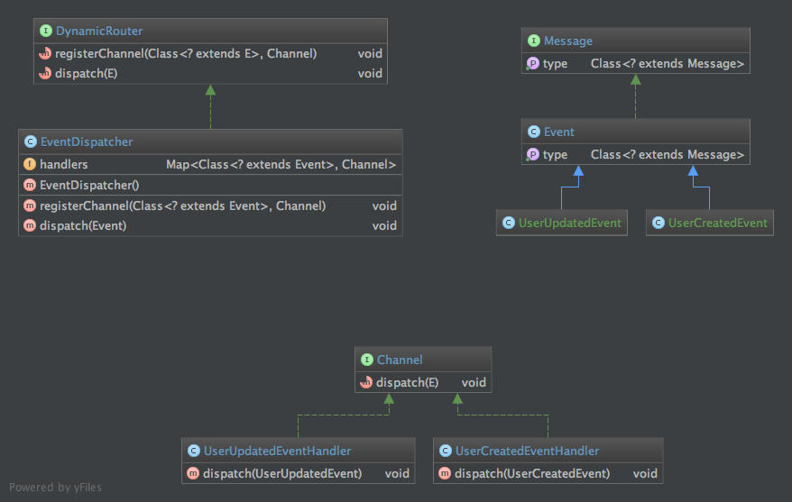

layout: pattern
title: Event Driven Architecture
folder: event-driven-architecture
permalink: /patterns/event-driven-architecture

**Intent:** Send and notify state changes of your objects to other applications using an Event-driven Architecture.

**Applicability:** Use an Event-driven architecture when

* you want to create a loosely coupled system
* you want to build a more responsive system
* you want a system that is easier to extend

**Real world examples:**

* A Loan Application has been accepted/rejected (Commercial Business).
* A new Rostering Schedule is ready for distribution to all crew (Airline Management System).
* An Illegal Trade Pattern has been detected (Trading Fraud Detection System).
* A simulated car has hits another simulated car (Commercial Racing Game).
* A robot has reached its destination (Real Time Warehouse Management System).
* A HTML message has been received (Web Server).
* A key has been pressed (Text Editor).

**Credits:**

* [Event-driven architecture - Wikipedia](http://www.computerweekly.com/feature/Write-through-write-around-write-back-Cache-explained)
* [Fundamental Components of an Event-Driven Architecture](http://giocc.com/fundamental-components-of-an-event-driven-architecture.html)
* [Real World Applications/Event Driven Applications](https://wiki.haskell.org/Real_World_Applications/Event_Driven_Applications)
* [Event-driven architecture definition](http://searchsoa.techtarget.com/definition/event-driven-architecture)
*