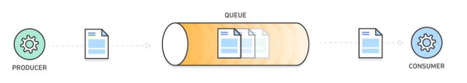

## Intent
The intent of the event queue design pattern, also known as message queues, is to decouple the relationship between the 
sender and receiver of events within a system. By decoupling the two parties, they do not interact with the event queue 
simultaneously. Essentially, the event queue handles and processes requests in an asynchronous manner, therefore, this 
system can be described as a first in, first out design pattern model. Event Queue is a suitable pattern if there is a 
resource with limited accessibility (i.e. Audio or Database), however, you need to provide access to all the requests 
which seeks this resource. Upon accessing an event from the queue, the program also removes it from the queue.



## Explanation 

Real world example

> The modern emailing system is an example of the fundamental process behind the event-queue design pattern. When an email
> is sent, the sender continues their daily tasks without the necessity of an immediate response from the receiver. 
> Additionally, the receiver has the freedom to access and process the email at their leisure. Therefore, this process 
> decouples the sender and receiver so that they are not required to engage with the queue at the same time.


In plain words

> The buffer between sender and receiver improves maintainability and scalability of a system. Event queues are typically 
> used to organise and carry out interprocess communication (IPC).

Wikipedia says

> Message queues (also known as event queues) implement an asynchronous communication pattern between two or more processes/
>threads whereby the sending and receiving party do not need to interact with the queue at the same time.


Key drawback

> As the event queue model decouples the sender-receiver relationship - this means that the event-queue design pattern is
> unsuitable for scenarios in which the sender requires a response. For example, this is a prominent feature within online 
> multiplayer games, therefore, this approach require thorough consideration.

**Programmatic Example**

Upon examining our event-queue example, here's the app which utilised an event queue system.

```java
import javax.sound.sampled.UnsupportedAudioFileException;
import java.io.IOException;

public class App {

    /**
     * Program entry point.
     *
     * @param args command line args
     * @throws IOException                   when there is a problem with the audio file loading
     * @throws UnsupportedAudioFileException when the loaded audio file is unsupported
     */
    public static void main(String[] args) throws UnsupportedAudioFileException, IOException,
            InterruptedException {
        var audio = Audio.getInstance();
        audio.playSound(audio.getAudioStream("./etc/Bass-Drum-1.wav"), -10.0f);
        audio.playSound(audio.getAudioStream("./etc/Closed-Hi-Hat-1.wav"), -8.0f);

        LOGGER.info("Press Enter key to stop the program...");
        try (var br = new BufferedReader(new InputStreamReader(System.in))) {
            br.read();
        }
        audio.stopService();
    }
}
```

Much of the design pattern is developed within the Audio class. Here we set instances, declare global variables and establish 
the key methods used in the above runnable class.

```java
public class Audio {
    private static final Audio INSTANCE = new Audio();

    private static final int MAX_PENDING = 16;

    private int headIndex;

    private int tailIndex;

    private volatile Thread updateThread = null;

    private final PlayMessage[] pendingAudio = new PlayMessage[MAX_PENDING];

    // Visible only for testing purposes
    Audio() {

    }

    public static Audio getInstance() {
        return INSTANCE;
    }
}
```

The Audio class is also responsible for handling and setting the states of the thread, this is shown in the code segments
below.

```java
/**
 * This method stops the Update Method's thread and waits till service stops.
 */
public synchronized void stopService() throws InterruptedException {
    if (updateThread != null) {updateThread.interrupt();}
    updateThread.join();
    updateThread = null;
}

/**
 * This method check the Update Method's thread is started.
 * @return boolean
 */
public synchronized boolean isServiceRunning() {
    return updateThread != null && updateThread.isAlive();}

/**
 * Starts the thread for the Update Method pattern if it was not started previously. Also when the
 * thread is ready it initializes the indexes of the queue
 */
public void init() {
    if (updateThread == null) {
        updateThread = new Thread(() -> {
            while (!Thread.currentThread().isInterrupted()) {
                update();
            }});}
    startThread();
}

/**
 * This is a synchronized thread starter.
 */
private synchronized void startThread() {
    if (!updateThread.isAlive()) {
        updateThread.start();
        headIndex = 0;
        tailIndex = 0;
    }
}
```

New audio is added into our event queue in the playSound method found in the Audio class. The update method is then utilised
to retrieve an audio item from the queue and play it to the user.

```java
public void playSound(AudioInputStream stream, float volume) {
    init();
    // Walk the pending requests.
    for (var i = headIndex; i != tailIndex; i = (i + 1) % MAX_PENDING) {
      var playMessage = getPendingAudio()[i];
      if (playMessage.getStream() == stream) {
        // Use the larger of the two volumes.
        playMessage.setVolume(Math.max(volume, playMessage.getVolume()));
        // Don't need to enqueue.
        return;
      }
    }
    getPendingAudio()[tailIndex] = new PlayMessage(stream, volume);
    tailIndex = (tailIndex + 1) % MAX_PENDING;
}
```

Within the Audio class are some more methods with assist the construction of the event-queue design patterns, they are 
summarised below.

- getAudioStream() = returns the input stream path of a file
- getPendingAudio() = returns the current event queue item 


## Class diagram


## Applicability

Use the Event Queue Pattern when

* The sender does not require a response from the receiver.
* You wish to decouple the sender & the receiver.
* You want to process events asynchronously.
* You have a limited accessibility resource and the asynchronous process is acceptable to reach that.

## Credits

* [Mihaly Kuprivecz - Event Queue] (http://gameprogrammingpatterns.com/event-queue.html)
* [Wikipedia - Message Queue] (https://en.wikipedia.org/wiki/Message_queue)
* [AWS - Message Queues] (https://aws.amazon.com/message-queue/)
