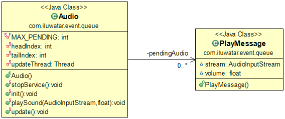

## Intent
Event Queue is a good pattern if You have a limited accessibility resource (for example: 
Audio or Database), but You need to handle all the requests that want to use that.
It puts all the requests in a queue and process them asynchronously.
Gives the resource for the event when it is the next in the queue and in same time
removes it from the queue.

## Applicability
Use the Event Queue pattern when

* You have a limited accessibility resource and the asynchronous process is acceptable to reach that

## Credits

* [Mihaly Kuprivecz - Event Queue] (http://gameprogrammingpatterns.com/event-queue.html)
