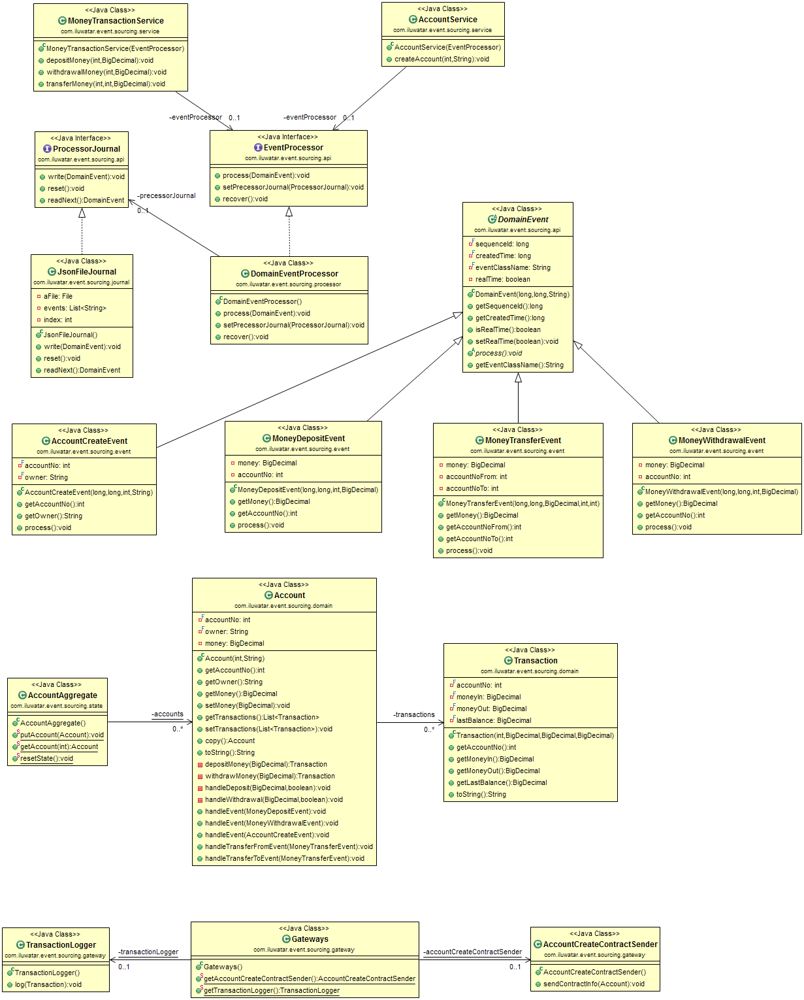

## Intent
Instead of storing just the current state of the data in a domain, use an append-only store to record the full series of actions taken on that data. The store acts as the system of record and can be used to materialize the domain objects. This can simplify tasks in complex domains, by avoiding the need to synchronize the data model and the business domain, while improving performance, scalability, and responsiveness. It can also provide consistency for transactional data, and maintain full audit trails and history that can enable compensating actions.

## Class diagram

## Applicability
Use the Event Sourcing pattern when

* You need very high performance on persisting your application state even your application state have a complex relational data structure  
* You need log of changes of your application state and ability to restore a state of any moment in time.
* You need to debug production problems by replaying the past events. 

## Real world examples

* [The Lmax Architecture] (https://martinfowler.com/articles/lmax.html)

## Credits

* [Martin Fowler - Event Sourcing] (https://martinfowler.com/eaaDev/EventSourcing.html)
* [Event Sourcing | Microsoft Docs] (https://docs.microsoft.com/en-us/azure/architecture/patterns/event-sourcing)
* [Reference 3: Introducing Event Sourcing] (https://msdn.microsoft.com/en-us/library/jj591559.aspx)
