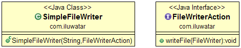

## Intent

Execute Around idiom frees the user from certain actions that should always be executed before and 
after the business method. A good example of this is resource allocation and deallocation leaving 
the user to specify only what to do with the resource.

## Explanation

Real world example

> We need to provide a class that can be used to write text strings to files. To make it easy for 
> the user we let our service class open and close the file automatically, the user only has to 
> specify what is written into which file.       

In plain words

> Execute Around idiom handles boilerplate code before and after business method.  

[Stack Overflow](https://stackoverflow.com/questions/341971/what-is-the-execute-around-idiom) says

> Basically it's the pattern where you write a method to do things which are always required, e.g. 
> resource allocation and clean-up, and make the caller pass in "what we want to do with the 
> resource".

**Programmatic Example**

Let's introduce our file writer class.

```java
@FunctionalInterface
public interface FileWriterAction {

  void writeFile(FileWriter writer) throws IOException;

}

public class SimpleFileWriter {

  public SimpleFileWriter(String filename, FileWriterAction action) throws IOException {
    try (var writer = new FileWriter(filename)) {
      action.writeFile(writer);
    }
  }
}
```

To utilize the file writer the following code is needed.

```java
    FileWriterAction writeHello = writer -> {
      writer.write("Hello");
      writer.append(" ");
      writer.append("there!");
    };
    new SimpleFileWriter("testfile.txt", writeHello);
```

## Class diagram



## Applicability

Use the Execute Around idiom when

* You use an API that requires methods to be called in pairs such as open/close or 
allocate/deallocate.

## Credits

* [Functional Programming in Java: Harnessing the Power of Java 8 Lambda Expressions](https://www.amazon.com/gp/product/1937785467/ref=as_li_tl?ie=UTF8&camp=1789&creative=9325&creativeASIN=1937785467&linkCode=as2&tag=javadesignpat-20&linkId=7e4e2fb7a141631491534255252fd08b)
