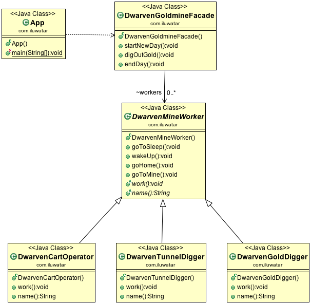

## Intent
Provide a unified interface to a set of interfaces in a subsystem.
Facade defines a higher-level interface that makes the subsystem easier to use.

## Applicability
Use the Facade pattern when

* you want to provide a simple interface to a complex subsystem. Subsystems often get more complex  as they evolve. Most patterns, when applied, result in more and smaller classes. This makes the subsystem more reusable and easier to customize, but it also becomes harder to use for clients that don't need to customize it. A facade can provide a simple default view of the subsystem that is good enough for most clients. Only clients needing more customizability will need to look beyond the facade.
* there are many dependencies between clients and the implementation classes of an abstraction. Introduce a facade to decouple the subsystem from clients and other subsystems, thereby promoting subsystem independence and portability.
* you want to layer your subsystems. Use a facade to define an entry point to each subsystem level. If subsystems are dependent, the you can simplify the dependencies between them by making them communicate with each other solely through their facades

## Credits

* [Design Patterns: Elements of Reusable Object-Oriented Software](http://www.amazon.com/Design-Patterns-Elements-Reusable-Object-Oriented/dp/0201633612)
