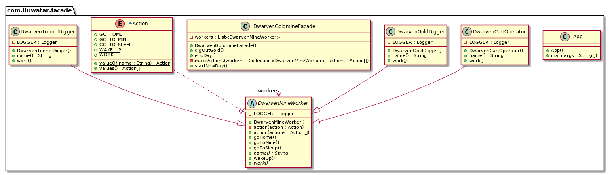

## Intent

Provide a unified interface to a set of interfaces in a subsystem. Facade defines a higher-level 
interface that makes the subsystem easier to use.

## Explanation

Real world example

> How does a goldmine work? "Well, the miners go down there and dig gold!" you say. That is what you 
> believe because you are using a simple interface that goldmine provides on the outside, internally 
> it has to do a lot of stuff to make it happen. This simple interface to the complex subsystem is a 
> facade.

In plain words

> Facade pattern provides a simplified interface to a complex subsystem.

Wikipedia says

> A facade is an object that provides a simplified interface to a larger body of code, such as a 
> class library.

**Programmatic Example**

Let's take our goldmine example from above. Here we have the dwarven mine worker hierarchy. First
there's a base class `DwarvenMineWorker`:

```java
@Slf4j
public abstract class DwarvenMineWorker {

  public void goToSleep() {
    LOGGER.info("{} goes to sleep.", name());
  }

  public void wakeUp() {
    LOGGER.info("{} wakes up.", name());
  }

  public void goHome() {
    LOGGER.info("{} goes home.", name());
  }

  public void goToMine() {
    LOGGER.info("{} goes to the mine.", name());
  }

  private void action(Action action) {
    switch (action) {
      case GO_TO_SLEEP:
        goToSleep();
        break;
      case WAKE_UP:
        wakeUp();
        break;
      case GO_HOME:
        goHome();
        break;
      case GO_TO_MINE:
        goToMine();
        break;
      case WORK:
        work();
        break;
      default:
        LOGGER.info("Undefined action");
        break;
    }
  }

  public void action(Action... actions) {
    Arrays.stream(actions).forEach(this::action);
  }

  public abstract void work();

  public abstract String name();

  enum Action {
    GO_TO_SLEEP, WAKE_UP, GO_HOME, GO_TO_MINE, WORK
  }
}
```

Then we have the concrete dwarf classes `DwarvenTunnelDigger`, `DwarvenGoldDigger` and 
`DwarvenCartOperator`:

```java
@Slf4j
public class DwarvenTunnelDigger extends DwarvenMineWorker {

  @Override
  public void work() {
    LOGGER.info("{} creates another promising tunnel.", name());
  }

  @Override
  public String name() {
    return "Dwarven tunnel digger";
  }
}

@Slf4j
public class DwarvenGoldDigger extends DwarvenMineWorker {

  @Override
  public void work() {
    LOGGER.info("{} digs for gold.", name());
  }

  @Override
  public String name() {
    return "Dwarf gold digger";
  }
}

@Slf4j
public class DwarvenCartOperator extends DwarvenMineWorker {

  @Override
  public void work() {
    LOGGER.info("{} moves gold chunks out of the mine.", name());
  }

  @Override
  public String name() {
    return "Dwarf cart operator";
  }
}

```

To operate all these goldmine workers we have the `DwarvenGoldmineFacade`:

```java
public class DwarvenGoldmineFacade {

  private final List<DwarvenMineWorker> workers;

  public DwarvenGoldmineFacade() {
      workers = List.of(
            new DwarvenGoldDigger(),
            new DwarvenCartOperator(),
            new DwarvenTunnelDigger());
  }

  public void startNewDay() {
    makeActions(workers, DwarvenMineWorker.Action.WAKE_UP, DwarvenMineWorker.Action.GO_TO_MINE);
  }

  public void digOutGold() {
    makeActions(workers, DwarvenMineWorker.Action.WORK);
  }

  public void endDay() {
    makeActions(workers, DwarvenMineWorker.Action.GO_HOME, DwarvenMineWorker.Action.GO_TO_SLEEP);
  }

  private static void makeActions(Collection<DwarvenMineWorker> workers,
      DwarvenMineWorker.Action... actions) {
    workers.forEach(worker -> worker.action(actions));
  }
}
```

Now let's use the facade:

```java
var facade = new DwarvenGoldmineFacade();
facade.startNewDay();
facade.digOutGold();
facade.endDay();
```

Program output:

```java
// Dwarf gold digger wakes up.
// Dwarf gold digger goes to the mine.
// Dwarf cart operator wakes up.
// Dwarf cart operator goes to the mine.
// Dwarven tunnel digger wakes up.
// Dwarven tunnel digger goes to the mine.
// Dwarf gold digger digs for gold.
// Dwarf cart operator moves gold chunks out of the mine.
// Dwarven tunnel digger creates another promising tunnel.
// Dwarf gold digger goes home.
// Dwarf gold digger goes to sleep.
// Dwarf cart operator goes home.
// Dwarf cart operator goes to sleep.
// Dwarven tunnel digger goes home.
// Dwarven tunnel digger goes to sleep.
```

## Class diagram



## Applicability

Use the Facade pattern when

* You want to provide a simple interface to a complex subsystem. Subsystems often get more complex 
as they evolve. Most patterns, when applied, result in more and smaller classes. This makes the 
subsystem more reusable and easier to customize, but it also becomes harder to use for clients that 
don't need to customize it. A facade can provide a simple default view of the subsystem that is good 
enough for most clients. Only clients needing more customization will need to look beyond the 
facade.
* There are many dependencies between clients and the implementation classes of an abstraction. 
Introduce a facade to decouple the subsystem from clients and other subsystems, thereby promoting 
subsystem independence and portability.
* You want to layer your subsystems. Use a facade to define an entry point to each subsystem level. 
If subsystems are dependent, then you can simplify the dependencies between them by making them 
communicate with each other solely through their facades.

## Credits

* [Design Patterns: Elements of Reusable Object-Oriented Software](https://www.amazon.com/gp/product/0201633612/ref=as_li_tl?ie=UTF8&camp=1789&creative=9325&creativeASIN=0201633612&linkCode=as2&tag=javadesignpat-20&linkId=675d49790ce11db99d90bde47f1aeb59)
* [Head First Design Patterns: A Brain-Friendly Guide](https://www.amazon.com/gp/product/0596007124/ref=as_li_tl?ie=UTF8&camp=1789&creative=9325&creativeASIN=0596007124&linkCode=as2&tag=javadesignpat-20&linkId=6b8b6eea86021af6c8e3cd3fc382cb5b)
