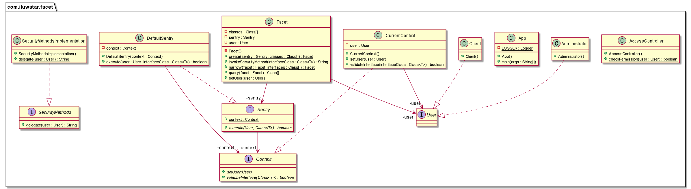

## Also known as

Attenuation

## Intent

Provide an interface to a powerful object in a restricted way, either by restricting parameters 
or only allowing calls to a subset of object's functions.

## Explanation

Real-world example

> Imagine a knight fighting a dragon. The knight can only attempt to attack the dragon by trying
> different attacks. Here, the facet stops the knight from directly changing the health of the 
> dragon, as well as only allowing certain attacks to affect the dragon.

In plain words

> Using the facet pattern, a class represents strictly limited access to another class.

C2 Wiki says that the intent is

> Restrict an interface to obtain a smaller interface that provides less authority. Usually the 
> smaller interface has only a subset of the methods, or allows only a subset of parameter values. 

**Programmatic Example**

Taking our knight versus dragon example from above. Firstly we have the `Knight` class and the 
`Attack` enum containing attacks that can belong to knights.

```java
@Slf4j
public class Knight {
  private final String name;
  private Attack attack;
  private DragonFacet dragonFacet;

  public Knight(String name, Attack attack, DragonFacet dragonFacet) {
    this.name = name;
    this.attack = attack;
    this.dragonFacet = dragonFacet;
  }

  public void attackDragon() {
    int oldHealth = dragonFacet.getHealth();
    dragonFacet.receiveAttack(attack);
    if (oldHealth == dragonFacet.getHealth()) {
      LOGGER.info("{}: Darn it! {} did nothing.", name, attack);
    } else {
      LOGGER.info("{}: Huzzah! {} hurt that dastardly dragon.", name, attack);
    }
  }
}

public enum Attack {
    ARROW, WATER_PISTOL, SWORD, FLAME_THROWER
}
```

Next are the `Dragon` class and the `DragonFacet` class. These belong to the same package, which is
different to the package containing `Knight`. This means that when there is no access level modifier to a variable or method, such as for `setHealth()`, nothing outside the package will have access to them. So, if the facet doesn't allow it then there is no way to access them.

Note that, according to C2 Wiki, 

> Facets should be implemented in such a way that if methods are added to the original interface, 
> they are not added by default to the facet. The methods to be included in a facet should have to 
> be explicitly indicated (although this could be by metadata or a naming convention). 

In this case, the methods are marked with `faceted`.

This is the simple `Dragon` class.

```java
public class Dragon {
  private int health;

  public Dragon(int health) {
    this.health = health;
  }

  int facetedGetHealth() {
    return health;
  }

  void setHealth(int health) {
    this.health = health;
  }

  void facetedReceiveAttack(Attack attack) {
    switch (attack) {
      case ARROW -> health -= 10;
      case WATER_PISTOL -> health -= 15;
      default -> health -= 5;
    }
  }
}
```

Then we have the `DragonFacet` to add control to `Dragon`.

```java
@Slf4j
package com.iluwatar.facet.dragon;

import com.iluwatar.facet.Attack;
import lombok.extern.slf4j.Slf4j;

@Slf4j
public class DragonFacet {
  private Dragon dragon;

  public DragonFacet(Dragon dragon) {
    this.dragon = dragon;
  }

  public int getHealth() {
    return dragon.facetedGetHealth();
  }

  public void receiveAttack(Attack attack) {
    if (attack == Attack.WATER_PISTOL || attack == Attack.ARROW) {
      dragon.facetedReceiveAttack(attack);
    }
  }
}

```

Note that `DragonFacet` only provides access to two of the three methods in `Dragon` 
(the ones marked with `faceted`). Also, `receiveAttack` makes a check for valid parameters.

And here is the dragon-fighting scenario.

```java
var facet = new DragonFacet(new Dragon(100));
var sirJim = new Knight("Sir Jim", Attack.WATER_PISTOL, facet);
sirJim.attackDragon();
var sirLuke = new Knight("Sir Luke", Attack.FLAME_THROWER, facet);
sirLuke.attackDragon();
```

Program output:

```
Sir Jim: Huzzah! WATER_PISTOL hurt that dastardly dragon.
Sir Luke: Darn it! FLAME_THROWER did nothing.
```

## Class diagram



## Applicability

Facet is applicable when the client should have restricted access to an object. It is
a special type of proxy, but no extra functionality may be provided; that is, the facet
should only provide a subset of the object's functionality to a client.

This is often a security pattern, used in order to satisfy the Principle of Least 
Authority. For example, if an object should be read-only, then the client should 
be provided with a read-only facet.


## Related patterns

* [Proxy](https://java-design-patterns.com/patterns/proxy/)

## Credits

* [Facet Pattern](http://wiki.c2.com/?FacetPattern)
* [Capability Theory Glossary](http://www.cap-lore.com/CapTheory/Glossary.html)
