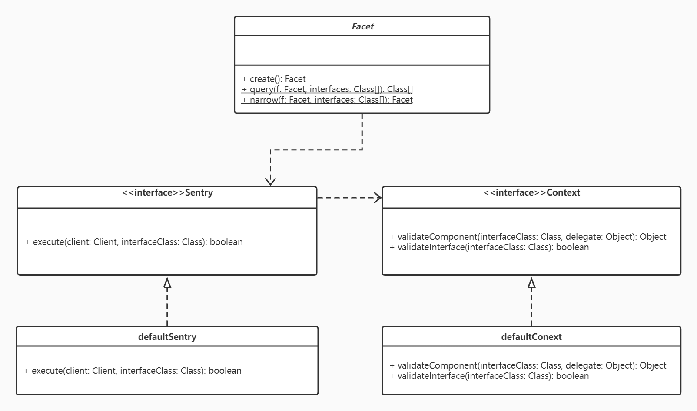

## Name

Facet Pattern

## Also known as

None

## Intent

Restrict an interface to obtain a smaller interface that provides less authority. Usually the smaller interface has only a subset of the methods, or allows only a subset of parameter values.

## Explanation

Facets are used as a security pattern in CapabilityOrientedProgramming, in order to satisfy the PrincipleOfLeastAuthority. For example, if some client of an object only needs to be able to read information from it, that client should be provided with a read-only facet.

The facet interface is always a subset of the original interface, and the purpose is to restrict authority rather than to translate between incompatible interfaces.

## Class Diagram



## Applicability

Like other SecurityPatterns, FacetPattern can be used to improve robustness or safety, even when security per se is not an issue. It may also be useful in some cases to provide a deterministic or purely functional subset of an interface.

``` java
A simple example:
// A simple Account class to which you might want to add security
interface MutableAccount {
void credit(long amount);

void debit(long amount);

}
interface ImmutableAccount {
long balance();

}
class Account implements MutableAccount, ImmuatbleAccount {
void credit(long amount) {
// ...
}

void debit(long amount) {
// ...
}
long balance() {
// ...
}
}
// Create a Context that will determine when its appropriate to use an interface
class AccountContext extends DefaultContext {
private Permission accountModificationPermission
= new AccountPermission(…..);
public boolean validateInterface(Class interfaceClass) {
// Perform a security check before allowing any changes to an Account
if(interfaceClass.equals(MutableAccount.class)) {
// Security Check, substitute whatever you’d like to use, this uses
// a simple AccessController check for clarity
return AccessController.checkPermission(accountModificationPermission);
}
// Allow anyone immutable access
if(interfaceClass.equals(ImmutableAccount.class))
return true;
return super.validateInterface(interfaceClass);
}
}
// Create a Facet that will control access to the Account object at runtime
Sentry sentry = new DefaultSentry(new AccountContext());
Facet f = Facet.create(sentry, new Class[]{ImmutableAccount.class, MutableAccount.class});
// Make sure both interfaces are supported
f = f.narrow(new Class[]{ImmutableAccount.class, MutableAccount.class});
// Now f can be used as if it were an ImmutableAccount or ImmutableAccount, except
// that it will only delegate a method call to the real Account class when the
// correct permission is available.
```

## Known uses

The design of location and space based frameworks for mobile
computing

## Related patterns

* Adapter Pattern
* Facade Pattern
* Proxy/Surrogate Pattern
* Handle Body Pattern
* Decorator/Wrapper Pattern

## Credits

* [Facet Pattern](http://wiki.c2.com/?FacetPattern)
* [Microsoft Word - Facet Pattern](https://hillside.net/plop/plop2002/final/plop2002_ecrahen0_0.pdf)
* [What is Facet design pattern?](https://stackoverflow.com/questions/30164108/what-is-facet-design-pattern)