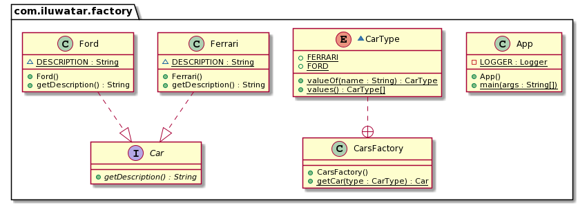

## Also known as

* Simple Factory
* Static Factory Method

## Intent

Providing a static method encapsulated in a class called factory, in order to hide the 
implementation logic and makes client code focus on usage rather then initialization new objects.

## Explanation

Real world example

> Lets say we have a web application connected to SQLServer, but now we want to switch to Oracle. To 
> do so without modifying existing source code, we need to implements Simple Factory pattern, in 
> which a static method can be invoked to create connection to a given database.

Wikipedia says

> Factory is an object for creating other objects – formally a factory is a function or method that 
> returns objects of a varying prototype or class.

**Programmatic Example**

We have an interface `Car` and two implementations `Ford` and `Ferrari`.

```java
public interface Car {
  String getDescription();
}

public class Ford implements Car {

  static final String DESCRIPTION = "This is Ford.";

  @Override
  public String getDescription() {
    return DESCRIPTION;
  }
}

public class Ferrari implements Car {
   
  static final String DESCRIPTION = "This is Ferrari.";

  @Override
  public String getDescription() {
    return DESCRIPTION;
  }
}
```

Enumeration above represents types of cars that we support (`Ford` and `Ferrari`).

```java
public enum CarType {
  
  FORD(Ford::new), 
  FERRARI(Ferrari::new);
  
  private final Supplier<Car> constructor; 
  
  CarType(Supplier<Car> constructor) {
    this.constructor = constructor;
  }
  
  public Supplier<Car> getConstructor() {
    return this.constructor;
  }
}
```
Then we have the static method `getCar` to create car objects encapsulated in the factory class 
`CarsFactory`.

```java
public class CarsFactory {
  
  public static Car getCar(CarType type) {
    return type.getConstructor().get();
  }
}
```

Now on the client code we can create different types of cars using the factory class.

```java
var car1 = CarsFactory.getCar(CarType.FORD);
var car2 = CarsFactory.getCar(CarType.FERRARI);
LOGGER.info(car1.getDescription());
LOGGER.info(car2.getDescription());
```

Program output:

```java
This is Ford.
This is Ferrari.
```

## Class Diagram



## Applicability

Use the Simple Factory pattern when you only care about the creation of a object, not how to create 
and manage it.

Pros

* Allows keeping all objects creation in one place and avoid of spreading 'new' keyword across codebase.
* Allows to write loosely coupled code. Some of its main advantages include better testability, easy-to-understand code, swappable components, scalability and isolated features.

Cons

* The code becomes more complicated than it should be. 

## Real world examples

* [java.util.Calendar#getInstance()](https://docs.oracle.com/javase/8/docs/api/java/util/Calendar.html#getInstance--)
* [java.util.ResourceBundle#getBundle()](https://docs.oracle.com/javase/8/docs/api/java/util/ResourceBundle.html#getBundle-java.lang.String-)
* [java.text.NumberFormat#getInstance()](https://docs.oracle.com/javase/8/docs/api/java/text/NumberFormat.html#getInstance--)
* [java.nio.charset.Charset#forName()](https://docs.oracle.com/javase/8/docs/api/java/nio/charset/Charset.html#forName-java.lang.String-)
* [java.net.URLStreamHandlerFactory#createURLStreamHandler(String)](https://docs.oracle.com/javase/8/docs/api/java/net/URLStreamHandlerFactory.html) (Returns different singleton objects, depending on a protocol)
* [java.util.EnumSet#of()](https://docs.oracle.com/javase/8/docs/api/java/util/EnumSet.html#of(E))
* [javax.xml.bind.JAXBContext#createMarshaller()](https://docs.oracle.com/javase/8/docs/api/javax/xml/bind/JAXBContext.html#createMarshaller--) and other similar methods.

## Related patterns

* [Factory Method](https://java-design-patterns.com/patterns/factory-method/)
* [Factory Kit](https://java-design-patterns.com/patterns/factory-kit/)
* [Abstract Factory](https://java-design-patterns.com/patterns/abstract-factory/)
