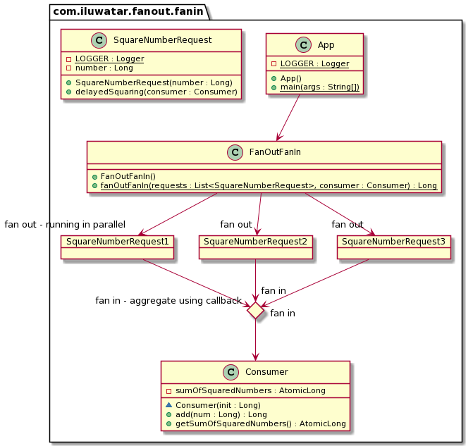

## Also known as

* Scatter-Gather

## Intent

The Fan-Out/Fan-In pattern aims to improve concurrency and optimize processing time by dividing a task into multiple sub-tasks that can be processed in parallel (fan-out) and then combining the results of these sub-tasks into a single outcome (fan-in).

## Explanation

The Fan-Out/Fan-In service will take in a list of requests and a consumer. Each request might complete at a different time. Fan-Out/Fan-In service will accept the input params and returns the initial system an ID to acknowledge that the pattern service has received the requests. Now the caller will not wait or expect the result in the same connection.

Meanwhile, the pattern service will invoke the requests that have come. The requests might complete at different time. These requests will be processed in different instances of the same function in different machines or services. As the
requests get completed, a callback service every time is called that transforms the result into a common single object format that gets pushed to a consumer. The caller will be at the other end of the consumer receiving the result.

**Programmatic Example**

The implementation provided has a list of numbers and end goal is to square the numbers and add them to a single result. `FanOutFanIn` class receives the list of numbers in the form of list of `SquareNumberRequest` and a `Consumer` instance
that collects the results as the requests get over. `SquareNumberRequest` will square the number with a random delay to give the impression of a long-running process that can complete at any time. `Consumer` instance will add the results from different `SquareNumberRequest` that will come random time instances.

Let's look at `FanOutFanIn` class that fans out the requests in async processes.

```java
public class FanOutFanIn {
    public static Long fanOutFanIn(final List<SquareNumberRequest> requests, final Consumer consumer) {

        ExecutorService service = Executors.newFixedThreadPool(requests.size());

        // fanning out
        List<CompletableFuture<Void>> futures = requests
                .stream()
                .map(request -> CompletableFuture.runAsync(() -> request.delayedSquaring(consumer), service))
                .collect(Collectors.toList());

        CompletableFuture.allOf(futures.toArray(new CompletableFuture[0])).join();

        return consumer.getSumOfSquaredNumbers().get();
    }
}
```

`Consumer` is used a callback class that will be called when a request is completed. This will aggregate the result from all requests.

```java
public class Consumer {

    private final AtomicLong sumOfSquaredNumbers;

    Consumer(Long init) {
        sumOfSquaredNumbers = new AtomicLong(init);
    }

    public Long add(final Long num) {
        return sumOfSquaredNumbers.addAndGet(num);
    }
}
```

Request is represented as a `SquareNumberRequest` that squares the number with random delay and calls the `Consumer` once it is squared.

```java
public class SquareNumberRequest {

    private final Long number;

    public void delayedSquaring(final Consumer consumer) {

        var minTimeOut = 5000L;

        SecureRandom secureRandom = new SecureRandom();
        var randomTimeOut = secureRandom.nextInt(2000);

        try {
            // this will make the thread sleep from 5-7s.
            Thread.sleep(minTimeOut + randomTimeOut);
        } catch (InterruptedException e) {
            LOGGER.error("Exception while sleep ", e);
            Thread.currentThread().interrupt();
        } finally {
            consumer.add(number * number);
        }
    }
}
```

## Class diagram



## Applicability

Appropriate in scenarios where tasks can be broken down and executed in parallel, especially suitable for data processing, batch processing, and situations requiring aggregation of results from various sources.

## Known Uses

* Large-scale data processing applications.
* Services requiring aggregation from multiple sources before delivering a response, such as in distributed caching or load balancing systems.

## Consequences

Benefits:

* Enhances performance by parallel processing.
* Increases responsiveness of systems.
* Efficient utilization of multi-core processor architectures.

Trade-offs:

* Increased complexity in error handling.
* Potential for increased overhead due to task synchronization and result aggregation.
* Dependency on the underlying infrastructure's ability to support concurrent execution.

## Related Patterns

* MapReduce: Similar to Fan-Out/Fan-In, MapReduce also involves distributing tasks across a number of workers (map) and aggregating the results (reduce), which is particularly useful for processing large data sets.
* [Command](https://java-design-patterns.com/patterns/command/): Command Pattern facilitates the decoupling of the sender and the receiver, akin to how Fan-Out/Fan-In decouples task submission from task processing.
* [Producer-Consumer](https://java-design-patterns.com/patterns/producer-consumer/): Works synergistically with Fan-Out/Fan-In by organizing task execution where producers distribute tasks that are processed by multiple consumers, and results are then combined, enhancing throughput and efficiency in data processing.

## Related patterns

* [Aggregator Microservices](https://java-design-patterns.com/patterns/aggregator-microservices/)
* [API Gateway](https://java-design-patterns.com/patterns/api-gateway/)

## Credits

* [Understanding Azure Durable Functions - Part 8: The Fan Out/Fan In Pattern](http://dontcodetired.com/blog/post/Understanding-Azure-Durable-Functions-Part-8-The-Fan-OutFan-In-Pattern)
* [Fan-out/fan-in scenario in Durable Functions - Cloud backup example](https://docs.microsoft.com/en-us/azure/azure-functions/durable/durable-functions-cloud-backup)
* [Understanding the Fan-Out/Fan-In API Integration Pattern](https://dzone.com/articles/understanding-the-fan-out-fan-in-api-integration-p)
* [Java Concurrency in Practice](https://amzn.to/3vXytsb)
* [Patterns of Enterprise Application Architecture](https://amzn.to/49QQcPD)
