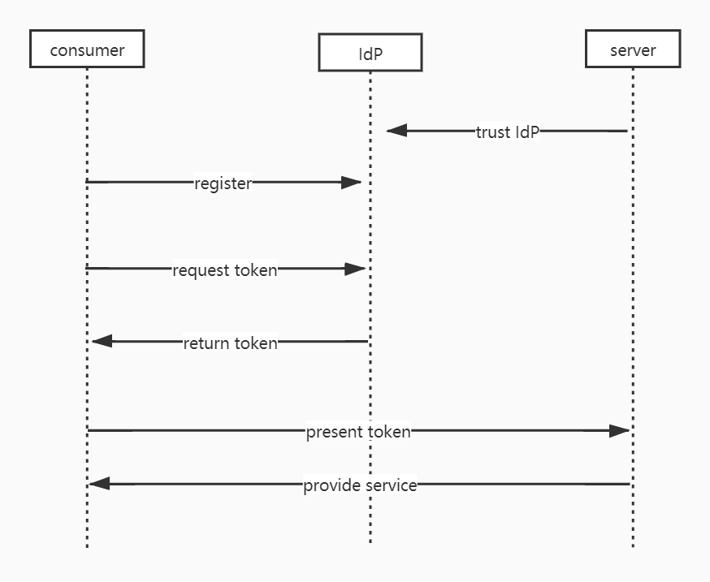

## Also known as
claims-based access control

## Intent
The Federated Identity pattern simplify development, minimize the requirement for user administration, and improve the user experience of the application.

## Timing diagram

## Applicability
Use Federated Identity pattern when

* Single sign on in the enterprise.
* Federated identity with multiple partners. 
* Federated identity in SaaS applications.

## Credits

* [Federated Identity Pattern](https://docs.microsoft.com/en-us/previous-versions/msp-n-p/dn589790(v=pandp.10)?redirectedfrom=MSDN)

