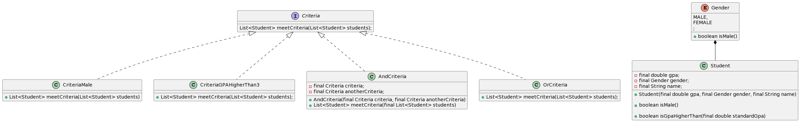

## Name / classification
Filter pattern
## Also known as
Criteria pattern, specification pattern
## Intent
This design pattern is used to filter a set of objects that meets a specific criteria.
Different criterias can also be also be used in conjunction by using logical operations
such as 'and' as well as 'or'. 
## Explanation
#### Real world example
> When a user visits a e-commerce website and is looking for specific products that
> meet one or more criterias, e.g only show products in stock with in a certain price category.
> The filter pattern could be used in the API to filter out products that meet the users criteria(s).

#### In simple words
> A filter that filters out objects that not meet one, or more criterias.

#### Wikipedia says
> In computer programming, the specification pattern is a particular software design pattern, whereby business rules can
> be recombined by chaining the business rules together using boolean logic. The pattern is frequently used in the 
> context of domain-driven design.

###### Programmatic Example
> We have a defined a Product class which have four different properties; name, price, category and number in stock.
> 
```java

public class Product {

  private String productName;
  private int price;
  private ProductCategory category;
  private int nrInStock;

  public Product(String productName, int price, ProductCategory category, int nrInStock) {
    this.productName = productName;
    this.price = price;
    this.category = category;
    this.nrInStock = nrInStock;
  }

  public String getProductName() {
    return this.productName;
  }

  public int getPrice() {
    return this.price;
  }

  public ProductCategory getCategory() {
    return this.category;
  }

  public int getNrInStock() {
    return this.nrInStock;
  }

}
```
> This example below demonstrates the how the filter could be used. 
```java
public class App {
    public static void main(String[] args) {

        Criteria inStockCriteria = new InStockCriteria();
        Criteria mediumPriceCriteria = new MediumPriceCriteria();

        List<Criteria> criteria = new ArrayList();
        criteria.add(inStockCriteria);
        criteria.add(mediumPriceCriteria);

        AndCriteria andCriteria = new AndCriteria(criteria);

        Product jeans = new Product("Jeans", 1000, ProductCategory.CLOTHING, 4);
        Product shirt = new Product("Shirt", 400, ProductCategory.CLOTHING, 0);
        Product shoes = new Product("Shoes", 600, ProductCategory.CLOTHING, 2);
        List<Product> products = new ArrayList<>();
        products.add(jeans);
        products.add(shirt);
        products.add(shoes);
        
        
        List<Product> mediumPriceInStock = andCriteria.meetCriteria(products);

        // mediumPriceInStock contains Shoes, shirt is not in stock and jeans does not meet the price criteria.
        System.out.println("Products in stock:");
        for(Product : productsInStock) {
            System.out.println(Product.getProductName())
        }
    }
}

```

## Class diagram


## Applicability
Use the filter pattern in the following situations.
* When you have a object with several attributes and want to filter them based on if the object meet
several or more criterias. 

## Tutorials
* [Filter pattern by GeeksforGeeks](https://www.geeksforgeeks.org/filter-pattern-in-java/)
* [Filter pattern by DZone](https://dzone.com/articles/using-filter-design-pattern-in-java)

## Known uses
* [Filter builders in MongoDB](https://www.mongodb.com/docs/drivers/java/sync/current/fundamentals/builders/filters/)

## Consequences
* Pros
>  It is easy to add new / remove filtering criteria to the code, allowing flexibility and maintainability the code.
* Cons 
> Perfomance could be an issue if several criterias are applied and filtering on a large set.
## Related patterns
* Specification
## Credits
[David Sky, Structural Patterns - Filter/Criteria](https://davidskyspace.com/structural-patterns-filter-criteria/)