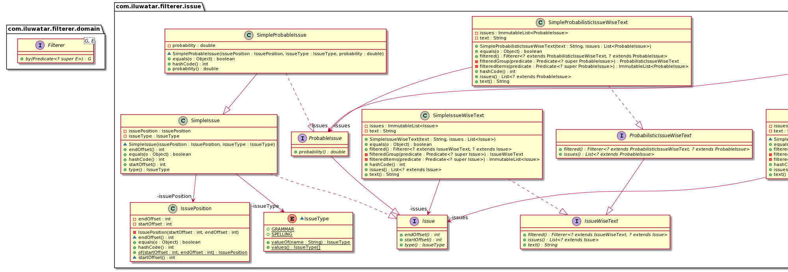

## Also known as

* Filters
* Pipes and Filters

## Intent

The Filterer pattern aims to apply a series of filters to data objects, where each filter processes the data based on specific rules and criteria, and passes the data to the next filter in the sequence.

## Explanation

Real-world example

> Imagine a library that needs to filter books based on different criteria such as genre, author, publication year, or availability. Instead of writing separate methods for each possible combination of criteria, the library system employs the Filterer design pattern. Each filter criterion is encapsulated as an object, and these filter objects can be combined dynamically at runtime to create complex filtering logic. For example, a user can search for books that are both available and published after 2010 by combining the availability filter and the publication year filter. This approach makes the system more flexible and easier to maintain, as new filtering criteria can be added without modifying existing code.

In plain words

> Filterer pattern is a design pattern that helps container-like objects return filtered versions of themselves.

**Programmatic Example**

We are designing a threat (malware) detection software which can analyze target systems for threats that are present in it. In the design we have to take into consideration that new Threat types can be added later. Additionally, there is a requirement that the threat detection system can filter the detected threats based on different criteria (the target system acts as container-like object for threats).

To model the threat detection system, we introduce `Threat` and `ThreatAwareSystem` interfaces.

```java
public interface Threat {
    String name();
    int id();
    ThreatType type();
}

public interface ThreatAwareSystem {
    String systemId();
    List<? extends Threat> threats();
    Filterer<? extends ThreatAwareSystem, ? extends Threat> filtered();
}
```

Notice the `filtered` method that returns instance of `Filterer` interface which is defined as:

```java
@FunctionalInterface
public interface Filterer<G, E> {
    G by(Predicate<? super E> predicate);
}
```

A simple implementation of `ThreatAwareSystem`:

```java
public class SimpleThreatAwareSystem implements ThreatAwareSystem {

    private final String systemId;
    private final ImmutableList<Threat> issues;

    public SimpleThreatAwareSystem(final String systemId, final List<Threat> issues) {
        this.systemId = systemId;
        this.issues = ImmutableList.copyOf(issues);
    }

    @Override
    public String systemId() {
        return systemId;
    }

    @Override
    public List<? extends Threat> threats() {
        return new ArrayList<>(issues);
    }

    @Override
    public Filterer<? extends ThreatAwareSystem, ? extends Threat> filtered() {
        return this::filteredGroup;
    }

    private ThreatAwareSystem filteredGroup(Predicate<? super Threat> predicate) {
        return new SimpleThreatAwareSystem(this.systemId, filteredItems(predicate));
    }

    private List<Threat> filteredItems(Predicate<? super Threat> predicate) {
        return this.issues.stream()
                .filter(predicate)
                .collect(Collectors.toList());
    }
}
```

Now if we introduce a new subtype of `Threat` interface that adds probability with which given threat can appear:

```java
public interface ProbableThreat extends Threat {
    double probability();
}
```

We can also introduce a new interface that represents a system that is aware of threats with their probabilities:

```java
public interface ProbabilisticThreatAwareSystem extends ThreatAwareSystem {
    @Override
    List<? extends ProbableThreat> threats();
    @Override
    Filterer<? extends ProbabilisticThreatAwareSystem, ? extends ProbableThreat> filtered();
}
```

We will be able to filter `ProbabilisticThreatAwareSystem` by `ProbableThreat` properties:

```java
public class SimpleProbabilisticThreatAwareSystem implements ProbabilisticThreatAwareSystem {

    private final String systemId;
    private final ImmutableList<ProbableThreat> threats;

    public SimpleProbabilisticThreatAwareSystem(final String systemId, final List<ProbableThreat> threats) {
        this.systemId = systemId;
        this.threats = ImmutableList.copyOf(threats);
    }

    @Override
    public String systemId() {
        return systemId;
    }

    @Override
    public List<? extends ProbableThreat> threats() {
        return threats;
    }

    @Override
    public Filterer<? extends ProbabilisticThreatAwareSystem, ? extends ProbableThreat> filtered() {
        return this::filteredGroup;
    }

    private ProbabilisticThreatAwareSystem filteredGroup(final Predicate<? super ProbableThreat> predicate) {
        return new SimpleProbabilisticThreatAwareSystem(this.systemId, filteredItems(predicate));
    }

    private List<ProbableThreat> filteredItems(final Predicate<? super ProbableThreat> predicate) {
        return this.threats.stream()
                .filter(predicate)
                .collect(Collectors.toList());
    }
}
```

Now let's see the full example in action showing how the filterer pattern works in practice.

```java
@Slf4j
public class App {

  public static void main(String[] args) {
    filteringSimpleThreats();
    filteringSimpleProbableThreats();
  }

  private static void filteringSimpleProbableThreats() {
    LOGGER.info("### Filtering ProbabilisticThreatAwareSystem by probability ###");

    var trojanArcBomb = new SimpleProbableThreat("Trojan-ArcBomb", 1, ThreatType.TROJAN, 0.99);
    var rootkit = new SimpleProbableThreat("Rootkit-Kernel", 2, ThreatType.ROOTKIT, 0.8);

    List<ProbableThreat> probableThreats = List.of(trojanArcBomb, rootkit);

    var probabilisticThreatAwareSystem =
        new SimpleProbabilisticThreatAwareSystem("Sys-1", probableThreats);

    LOGGER.info("Filtering ProbabilisticThreatAwareSystem. Initial : "
        + probabilisticThreatAwareSystem);

    //Filtering using filterer
    var filteredThreatAwareSystem = probabilisticThreatAwareSystem.filtered()
        .by(probableThreat -> Double.compare(probableThreat.probability(), 0.99) == 0);

    LOGGER.info("Filtered by probability = 0.99 : " + filteredThreatAwareSystem);
  }

  private static void filteringSimpleThreats() {
    LOGGER.info("### Filtering ThreatAwareSystem by ThreatType ###");

    var rootkit = new SimpleThreat(ThreatType.ROOTKIT, 1, "Simple-Rootkit");
    var trojan = new SimpleThreat(ThreatType.TROJAN, 2, "Simple-Trojan");
    List<Threat> threats = List.of(rootkit, trojan);

    var threatAwareSystem = new SimpleThreatAwareSystem("Sys-1", threats);

    LOGGER.info("Filtering ThreatAwareSystem. Initial : " + threatAwareSystem);

    //Filtering using Filterer
    var rootkitThreatAwareSystem = threatAwareSystem.filtered()
        .by(threat -> threat.type() == ThreatType.ROOTKIT);

    LOGGER.info("Filtered by threatType = ROOTKIT : " + rootkitThreatAwareSystem);
  }
}
```

Running the example produces the following console output.

```
08:33:23.568 [main] INFO com.iluwatar.filterer.App -- ### Filtering ThreatAwareSystem by ThreatType ###
08:33:23.574 [main] INFO com.iluwatar.filterer.App -- Filtering ThreatAwareSystem. Initial : SimpleThreatAwareSystem(systemId=Sys-1, issues=[SimpleThreat(threatType=ROOTKIT, id=1, name=Simple-Rootkit), SimpleThreat(threatType=TROJAN, id=2, name=Simple-Trojan)])
08:33:23.576 [main] INFO com.iluwatar.filterer.App -- Filtered by threatType = ROOTKIT : SimpleThreatAwareSystem(systemId=Sys-1, issues=[SimpleThreat(threatType=ROOTKIT, id=1, name=Simple-Rootkit)])
08:33:23.576 [main] INFO com.iluwatar.filterer.App -- ### Filtering ProbabilisticThreatAwareSystem by probability ###
08:33:23.581 [main] INFO com.iluwatar.filterer.App -- Filtering ProbabilisticThreatAwareSystem. Initial : SimpleProbabilisticThreatAwareSystem(systemId=Sys-1, threats=[SimpleProbableThreat{probability=0.99} SimpleThreat(threatType=TROJAN, id=1, name=Trojan-ArcBomb), SimpleProbableThreat{probability=0.8} SimpleThreat(threatType=ROOTKIT, id=2, name=Rootkit-Kernel)])
08:33:23.581 [main] INFO com.iluwatar.filterer.App -- Filtered by probability = 0.99 : SimpleProbabilisticThreatAwareSystem(systemId=Sys-1, threats=[SimpleProbableThreat{probability=0.99} SimpleThreat(threatType=TROJAN, id=1, name=Trojan-ArcBomb)])
```

## Class diagram



## Applicability

* Use when you need to filter a collection of objects dynamically based on different criteria.
* Suitable for applications where filtering logic changes frequently or needs to be combined in various ways.
* Ideal for scenarios requiring separation of filtering logic from the core business logic.

## Tutorials

* [Filterer Pattern (Tomasz Linkowski)](https://blog.tlinkowski.pl/2018/filterer-pattern/)
* [Filterer Pattern in 10 Steps (Java Code Geeks)](https://www.javacodegeeks.com/2019/02/filterer-pattern-10-steps.html)

## Known Uses

* Stream processing libraries in Java, such as Apache Kafka Streams, utilize this pattern to build complex data processing pipelines.
* Image processing software often uses filters to apply effects or transformations to images sequentially.

## Consequences

Benefits:

* Increases flexibility by allowing different filters to be added or reorganized without affecting other parts of the system.
* Enhances testability, as filters can be tested independently.
* Promotes loose coupling between the stages of data processing.

Trade-offs:

* Potential performance overhead from continuous data passing between filters.
* Complexity can increase with the number of filters, potentially affecting maintainability.

## Related Patterns

* [Chain of Responsibility](https://java-design-patterns.com/patterns/chain-of-responsibility/): Filters can be seen as a specialized form of the Chain of Responsibility, where each filter decides if and how to process the input data and whether to pass it along the chain.
* [Decorator](https://java-design-patterns.com/patterns/decorator/): Similar to Decorator in that both modify behavior dynamically; however, filters focus more on data transformation than on adding responsibilities.

## Credits

* [Design Patterns: Elements of Reusable Object-Oriented Software](https://amzn.to/3W8sn2W)
* [Kafka: The Definitive Guide: Real-Time Data and Stream Processing at Scale](https://amzn.to/49N3nRU)
* [Java Performance: The Definitive Guide](https://amzn.to/3vRW3qj)
