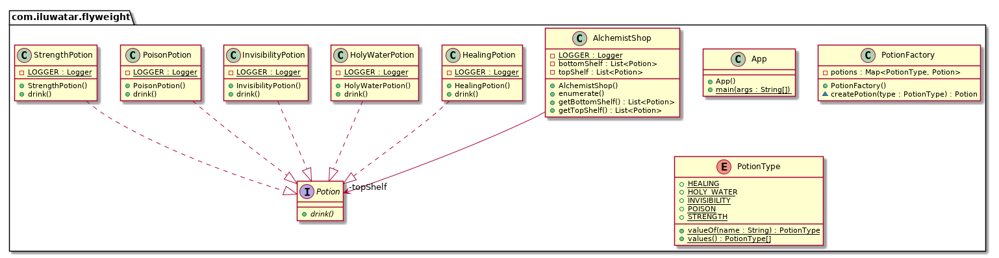

## Intent

The Flyweight pattern's primary intent is to reduce the number of objects created, decrease memory footprint and increase performance by sharing as much data as possible with similar objects.

## Explanation

Real-world example

> Alchemist's shop has shelves full of magic potions. Many of the potions are the same so there is no need to create a new object for each of them. Instead, one object instance can represent  multiple shelf items so the memory footprint remains small.

In plain words

> It is used to minimize memory usage or computational expenses by sharing as much as possible with similar objects.

Wikipedia says

> In computer programming, flyweight is a software design pattern. A flyweight is an object that minimizes memory use by sharing as much data as possible with other similar objects; it is a way to use objects in large numbers when a simple repeated representation would use an unacceptable amount of memory.

**Programmatic example**

Translating our alchemist shop example from above. First of all, we have different potion types:

```java
public interface Potion {
  void drink();
}

@Slf4j
public class HealingPotion implements Potion {
  @Override
  public void drink() {
    LOGGER.info("You feel healed. (Potion={})", System.identityHashCode(this));
  }
}

@Slf4j
public class HolyWaterPotion implements Potion {
  @Override
  public void drink() {
    LOGGER.info("You feel blessed. (Potion={})", System.identityHashCode(this));
  }
}

@Slf4j
public class InvisibilityPotion implements Potion {
  @Override
  public void drink() {
    LOGGER.info("You become invisible. (Potion={})", System.identityHashCode(this));
  }
}
```

Then the actual Flyweight class `PotionFactory`, which is the factory for creating potions.

```java
public class PotionFactory {

  private final Map<PotionType, Potion> potions;

  public PotionFactory() {
    potions = new EnumMap<>(PotionType.class);
  }

  Potion createPotion(PotionType type) {
    var potion = potions.get(type);
    if (potion == null) {
      switch (type) {
        case HEALING -> {
          potion = new HealingPotion();
          potions.put(type, potion);
        }
        case HOLY_WATER -> {
          potion = new HolyWaterPotion();
          potions.put(type, potion);
        }
        case INVISIBILITY -> {
          potion = new InvisibilityPotion();
          potions.put(type, potion);
        }
        default -> {
        }
      }
    }
    return potion;
  }
}
```

`AlchemistShop` contains two shelves of magic potions. The potions are created using the aforementioned `PotionFactory`.

```java
@Slf4j
public class AlchemistShop {

  private final List<Potion> topShelf;
  private final List<Potion> bottomShelf;

  public AlchemistShop() {
    var factory = new PotionFactory();
    topShelf = List.of(
        factory.createPotion(PotionType.INVISIBILITY),
        factory.createPotion(PotionType.INVISIBILITY),
        factory.createPotion(PotionType.STRENGTH),
        factory.createPotion(PotionType.HEALING),
        factory.createPotion(PotionType.INVISIBILITY),
        factory.createPotion(PotionType.STRENGTH),
        factory.createPotion(PotionType.HEALING),
        factory.createPotion(PotionType.HEALING)
    );
    bottomShelf = List.of(
        factory.createPotion(PotionType.POISON),
        factory.createPotion(PotionType.POISON),
        factory.createPotion(PotionType.POISON),
        factory.createPotion(PotionType.HOLY_WATER),
        factory.createPotion(PotionType.HOLY_WATER)
    );
  }

  public final List<Potion> getTopShelf() {
    return List.copyOf(this.topShelf);
  }

  public final List<Potion> getBottomShelf() {
    return List.copyOf(this.bottomShelf);
  }

  public void drinkPotions() {
    LOGGER.info("Drinking top shelf potions\n");
    topShelf.forEach(Potion::drink);
    LOGGER.info("Drinking bottom shelf potions\n");
    bottomShelf.forEach(Potion::drink);
  }
}
```

In our scenario, a brave visitor enters the alchemist shop and drinks all the potions.

```java
// create the alchemist shop with the potions
var alchemistShop = new AlchemistShop();
// a brave visitor enters the alchemist shop and drinks all the potions
alchemistShop.drinkPotions();
```

Program output:

```java
Drinking top shelf potions 
You become invisible. (Potion=1509514333)
You become invisible. (Potion=1509514333)
You feel strong. (Potion=739498517)
You feel healed. (Potion=125130493)
You become invisible. (Potion=1509514333)
You feel strong. (Potion=739498517)
You feel healed. (Potion=125130493)
You feel healed. (Potion=125130493)
Drinking bottom shelf potions
Urgh! This is poisonous. (Potion=166239592)
Urgh! This is poisonous. (Potion=166239592)
Urgh! This is poisonous. (Potion=166239592)
You feel blessed. (Potion=991505714)
You feel blessed. (Potion=991505714)
```

## Class diagram



## Applicability

The Flyweight pattern's effectiveness depends heavily on how and where it's used. Apply the Flyweight pattern when all the following are true:

* An application uses a large number of objects.
* Storage costs are high because of the sheer quantity of objects.
* Most of the object state can be made extrinsic.
* Many groups of objects may be replaced by relatively few shared objects once the extrinsic state is removed.
* The application doesn't depend on object identity. Since flyweight objects may be shared, identity tests will return true for conceptually distinct objects.

## Known uses

* [java.lang.Integer#valueOf(int)](http://docs.oracle.com/javase/8/docs/api/java/lang/Integer.html#valueOf%28int%29) and similarly for Byte, Character and other wrapped types.
* Java’s String class, which uses the Flyweight pattern internally to manage string literals.
* GUI applications, where objects like fonts or graphical components are shared rather than duplicated.

## Consequences

Benefits:

* Reduces the number of instances of an object, conserving memory.
* Centralizes state management, reducing the risk of inconsistent state.

Trade-offs:

* Increases complexity by adding the management layer for shared objects.
* Potential overhead in accessing shared objects if not well implemented.

## Related Patterns

[Composite](https://java-design-patterns.com/patterns/composite/): Often combined with Flyweight when the composites are shareable. Both are used to manage hierarchies and structures of objects.
[State](https://java-design-patterns.com/patterns/state/): Can be used to manage state in a shared Flyweight object, distinguishing internal state (invariant) from external state (context-specific).

## Credits

* [Design Patterns: Elements of Reusable Object-Oriented Software](https://amzn.to/3w0pvKI)
* [Head First Design Patterns: Building Extensible and Maintainable Object-Oriented Software](https://amzn.to/49NGldq)
