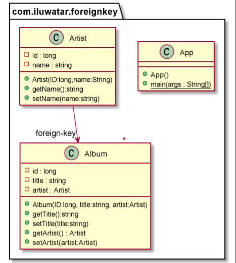

## Intent
Also known as,maps an association between objects to a foreign key reference between tables.

Key points:

- A Foreign Key Mapping maps an object reference to a foreign key in the database.

- In java programming, objects can refer to each other directly by object references.

- In a relational database, a FOREIGN KEY is a key used to link two tables together.

- In a relational database, a FOREIGN KEY is a field (or collection of fields) in one table that refers to the PRIMARY KEY in another table.

- The table containing the foreign key is called the child table, and the table containing the candidate key is called the referenced or parent table.

By simulating the outer chain of database between two classes, one class can store the information of another class, similar to reading the information of another table in one table

## Class diagram

## Applicability
Use the Foreign-Key-Mapping idiom when

* Each object contains the database key from the appropriate database table. If two objects are linked together with an association, this association can be replaced by a foreign key in the database.