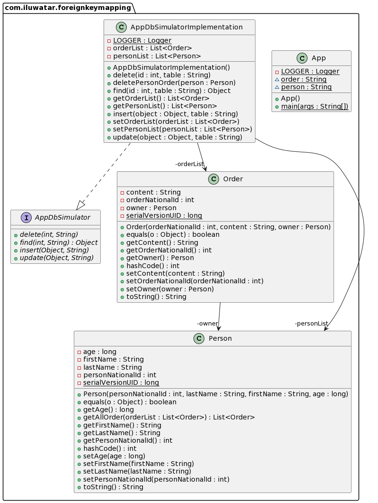

## Intent
Maps an association between objects to a foreign key reference between tables.

## Explanation
### Real world Example
| PersonID    | LastName | FirstName       | Age       |
| ----------- | ----------- | ----------- | ----------- |
| 1      | Hansen       | Ola       | 30       |
| 2   | Svendson        | Tove       | 23       |
| 3   | Pettersen        | Kari        | 20       |

| OrderID       | Content | PersonID       |
| ----------- | ----------- | ----------- |
| 1      | coco       | 3       |
| 2   | cafe        | 3       |
| 3   | juice        | 2       |
| 4   | wola        | 1       |

Notice that the "PersonID" column in the "Orders" table points to the "PersonID" column in the "Persons" table.\
The "PersonID" column in the "Persons" table is the PRIMARY KEY in the "Persons" table.\
The "PersonID" column in the "Orders" table is a FOREIGN KEY in the "Orders" table.\
The FOREIGN KEY constraint is used to prevent actions that would destroy links between tables.\
The FOREIGN KEY constraint also prevents invalid data from being inserted into the foreign key column, because it has to be one of the values contained in the table it points to.

### In simple word
A foreign key is a set of attributes that references a candidate key. For example, a table called TEAM may have an attribute, MEMBER_NAME, which is a foreign key referencing a candidate key, PERSON_NAME, in the PERSON table. Since MEMBER_NAME is a foreign key, any value existing as the name of a member in TEAM must also exist as a person's name in the PERSON table; in other words, every member of a TEAM is also a PERSON.

### Wikipedia says
In the context of relational databases, a foreign key is a set of attributes subject to a certain kind of inclusion dependency constraints, specifically a constraint that the tuples consisting of the foreign key attributes in one relation, R, must also exist in some other (not necessarily distinct) relation, S, and furthermore that those attributes must also be a candidate key in S.

### Programmatic example
* Assume we have a database which contain two tables, Person Table and Order Table.

## Class diagram

## Applicability

## Credits
