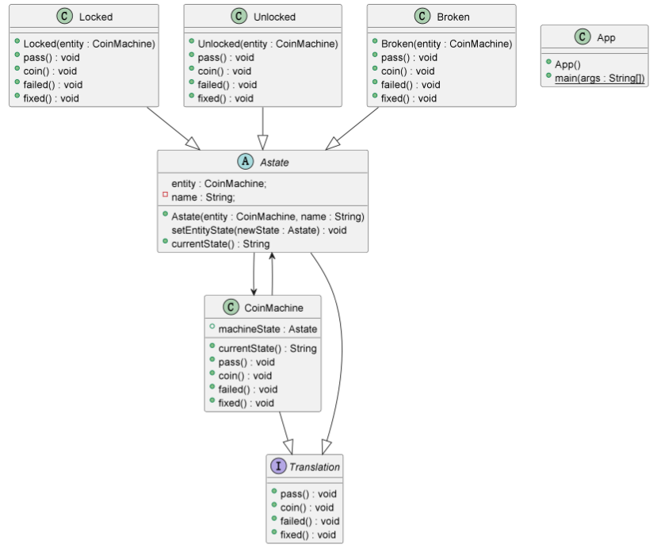

## Also known as

State Object

## Intent
Describe the dynamic behavior of an entity in reactive systems

## Explanation

Real-world example

> There is a coin machine starts in a locked
> state (Locked). When a coin is detected (Coin),
> the machine changes to the unlocked state
> (UnLocked) and open the turnstyle gate for
> the person to pass. When the machine detects 
> that a person has passed (Pass) it turns back 
> to the locked state. If the machine is broken,
> it is needed to be repaired.

In plain words

> The FSM pattern implements the state transition diagram
> specifications such as actions, events,
> and a state transition mechanism.

*Programmatic Example**

Here is the Astate(state of FSM pattern) interface and its concrete implementations.

```java
public abstract class Astate implements Translation {
  CoinMachine entity;
  private String name;

  public Astate(CoinMachine entity, String name) {
    this.entity = entity;
    this.name = name;
  }

  void setEntityState(Astate newState) {
    entity.machineState = newState;
    this.name = "";
    this.entity = null;
  }

  public String currentState() {
    return name;
  }
}

public class Broken extends Astate {
  public Broken(CoinMachine entity) {
    super(entity, "Broken");
  }

  @Override
  public void pass() {

  }

  @Override
  public void coin() {

  }

  @Override
  public void failed() {

  }

  @Override
  public void fixed() {
    setEntityState(new Locked(entity));
  }
}

public class Locked extends Astate {

  public Locked(CoinMachine entity) {
    super(entity, "Locked");
  }

  @Override
  public void pass() {

  }

  @Override
  public void coin() {
    setEntityState(new Unlocked(entity));
  }

  @Override
  public void failed() {
    setEntityState(new Broken(entity));
  }

  @Override
  public void fixed() {

  }
}

public interface Translation {
  public void pass();

  public void coin();

  public void failed();

  public void fixed();
}

public class Unlocked extends Astate {
  public Unlocked(CoinMachine entity) {
    super(entity, "Unlocked");
  }

  @Override
  public void pass() {
    setEntityState(new Locked(entity));
  }

  @Override
  public void coin() {

  }

  @Override
  public void failed() {
    setEntityState(new Broken(entity));
  }

  @Override
  public void fixed() {

  }
}
```
And here is the coin machine combined with different states.

```java
public class CoinMachine implements Translation {
  public Astate machineState = new Locked(this);

  public void updateState(Astate newState) {
    machineState = newState;
  }

  @Override
  public void pass() {
    machineState.pass();
  }

  @Override
  public void coin() {
    machineState.coin();
  }

  @Override
  public void failed() {
    machineState.failed();
  }

  @Override
  public void fixed() {
    machineState.fixed();
  }

  public String currentState() {
    return machineState.currentState();
  }
}
```

Here is the full example of how the coin machine
 changes state in reaction to a user's behavior.
 
```java
  public static void main(String[] args) {
    CoinMachine coinMachine = new CoinMachine();
    System.out.println(coinMachine.currentState());
    coinMachine.coin();
    System.out.println(coinMachine.currentState());
    coinMachine.pass();
    System.out.println(coinMachine.currentState());
    coinMachine.failed();
    System.out.println(coinMachine.currentState());
    coinMachine.fixed();
    System.out.println(coinMachine.currentState());
  }
```

Program output:

```java
    Locked
    Unlocked
    Locked
    Broken
    Locked
```

## Class diagram



## Applicability

Use the State pattern in either of the following cases

 * An object's behavior depends on its state, and it must change its behavior at run-time depending on that state

## Credits
* [The description of the pattern](https://community.wvu.edu/~hhammar/rts/adv%20rts/statecharts%20patterns%20papers%20and%20%20examples/paper%20on%20state%20pattern%20B31-full.pdf)
