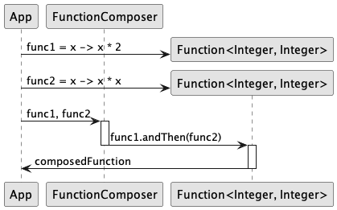

## Also known as

* Function Chaining
* Function Pipelining
* Functional Composition

## Intent of Function Composition Design Pattern

The Function Composition design pattern in Java enables the creation of complex functions by combining simpler ones. This enhances modular code and reusability, crucial for maintainable software development.

## Detailed Explanation of Function Composition Pattern with Real-World Examples

Real-world example

> Imagine a fast-food restaurant where the process of making a burger is broken down into several steps: grilling the patty, toasting the bun, adding condiments, and assembling the burger. Each of these steps can be seen as a function.
>
> In the Functional Composition design pattern, these individual steps (functions) can be composed into a complete burger-making process. Each step remains simple and reusable. For instance, the grilling function could be reused for making sandwiches or other dishes that require a grilled patty. This modular approach allows the restaurant to efficiently create various menu items by reusing and combining simple, predefined steps.

In plain words

> The Function Composition pattern allows building complex functions by combining simpler ones, making it easier to manage, test, and reuse individual pieces of functionality.

Wikipedia says

> Function composition is an act or mechanism to combine simple functions to build more complicated ones. Like the usual composition of functions in mathematics, the result of each function is passed as the argument of the next, and the result of the last one is the result of the whole.

## Programmatic Example of Function Composition Pattern in Java

In the functional programming paradigm, function composition is a powerful technique. For instance, in Java, you can use higher-order functions to compose operations like multiplying and squaring numbers.

Using Java's functional interfaces, we can define simple functions and compose them. Here's how function composition works in Java.

Let's start with defining two simple functions. In this case, we have a function `timesTwo` that multiplies its input by 2, and a function `square` that squares its input.

```java
Function<Integer, Integer> timesTwo = x -> x * 2;
Function<Integer, Integer> square = x -> x * x;
```

Next, we use the `FunctionComposer` class to compose these two functions into a new function. The `composeFunctions` method takes two functions as arguments and returns a new function that is the composition of the input functions.

```java
Function<Integer, Integer> composedFunction = FunctionComposer.composeFunctions(timesTwo, square);
```

Finally, we apply the composed function to an input value. In this case, we apply it to the number 3. The result is the square of the number 3 multiplied by 2, which is 36.

```java
public static void main(String[] args) {
    final var logger = LoggerFactory.getLogger(App.class);
    Function<Integer, Integer> timesTwo = x -> x * 2;
    Function<Integer, Integer> square = x -> x * x;

    Function<Integer, Integer> composedFunction = FunctionComposer.composeFunctions(timesTwo, square);

    int result = composedFunction.apply(3);
    logger.info("Result of composing 'timesTwo' and 'square' functions applied to 3 is: " + result);
}
```

This will output:

```
Result of composing 'timesTwo' and 'square' functions applied to 3 is: 36
```

This example demonstrates how the Function Composition pattern can be used to create complex functions by composing simpler ones, enhancing modularity and reusability of function-based logic.

## Function Composition Pattern Sequence diagram



## When to Use the Function Composition Pattern in Java

Use the Function Composition pattern when:

* You want to create a pipeline of operations in Java. This enhances code clarity and quality by structuring complex logic into simpler, reusable components.
* You are working in a functional programming environment or a language that supports higher-order functions.
* When you want to avoid deep nesting of function calls and instead build a pipeline of operations.
* When aiming to promote immutability and side-effect-free functions in your design.

## Function Composition Pattern Java Tutorials

* [Function Composition in Java (Medium)](https://functionalprogramming.medium.com/function-composition-in-java-beaf39426f52)
* [Functional Programming in Java (Baeldung)](https://www.baeldung.com/java-functional-programming)

## Real-World Applications of Function Composition Pattern in Java

* Stream processing in Java 8 and above
* Query builders in ORM libraries
* Middleware composition in web frameworks

## Benefits and Trade-offs of Function Composition Pattern

Benefits:

* High reusability of composed functions.
* Increased modularity, making complex functions easier to understand and maintain.
* Flexible and dynamic creation of function pipelines at runtime.
* Enhances readability by structuring code in a linear, declarative manner.
* Facilitates easier testing of individual functions.

Trade-offs:

* Potentially higher complexity when debugging composed functions. 
* Overhead from creating and managing multiple function objects in memory-intensive scenarios.
* May require a paradigm shift for developers unfamiliar with functional programming concepts.

## Related Java Design Patterns

* [Chain of Responsibility](https://java-design-patterns.com/patterns/chain-of-responsibility/) - Both patterns allow processing to be broken down into a series of steps, but Functional Composition focuses on function composition rather than responsibility delegation.
* [Decorator](https://java-design-patterns.com/patterns/decorator/) - Similar in combining behaviors, but Decorator applies additional behavior to objects, while Functional Composition builds new functions.
* [Strategy](https://java-design-patterns.com/patterns/strategy/) - Provides interchangeable functions (strategies), which can be composed in Functional Composition.

## References and Credits

* [Effective Java](https://amzn.to/4cGk2Jz)
* [Functional Programming in Java](https://amzn.to/3JUIc5Q)
* [Java 8 in Action: Lambdas, Streams, and functional-style programming](https://amzn.to/3QCmGXs)
