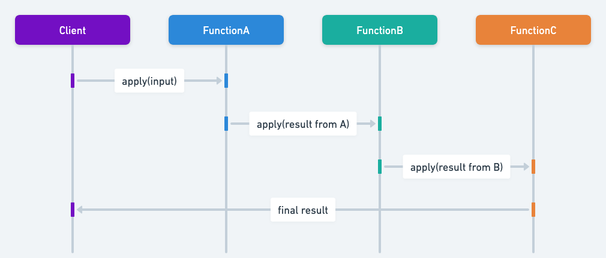

## Also known as

* Function Chaining
* Higher-Order Function Wrapping

## Intent of Function Composition Design Pattern

Combine multiple small functions into a single operation that executes them in a sequence, producing a new function as the result.

## Detailed Explanation of Function Composition Pattern with Real-World Examples

Real-world example

> Imagine a fast-food restaurant where the process of making a burger is broken down into several steps: grilling the patty, toasting the bun, adding condiments, and assembling the burger. Each of these steps can be seen as a function.
>
> In the Functional Composition design pattern, these individual steps (functions) can be composed into a complete burger-making process. Each step remains simple and reusable. For instance, the grilling function could be reused for making sandwiches or other dishes that require a grilled patty. This modular approach allows the restaurant to efficiently create various menu items by reusing and combining simple, predefined steps.

In plain words

> The Function Composition pattern allows building complex functions by combining simpler ones, making it easier to manage, test, and reuse individual pieces of functionality.

Wikipedia says

> Function composition is an act or mechanism to combine simple functions to build more complicated ones. Like the usual composition of functions in mathematics, the result of each function is passed as the argument of the next, and the result of the last one is the result of the whole.

Sequence diagram



## Programmatic Example of Function Composition Pattern in Java

In the functional programming paradigm, function composition is a powerful technique. For instance, in Java, you can use higher-order functions to combine operations like multiplying and squaring numbers.

Using Java's functional interfaces, we can define simple functions and compose them. Here's how function composition works in Java.

Let's start with defining two simple functions. In this case, we have a function `timesTwo` that multiplies its input by 2, and a function `square` that squares its input:

```java
Function<Integer, Integer> timesTwo = x -> x * 2;
Function<Integer, Integer> square = x -> x * x;
```

Next, we use the `FunctionComposer` class to compose these two functions into a new function. The `composeFunctions` method takes two functions as arguments and returns a new function that is the composition of the input functions:

```java
Function<Integer, Integer> composedFunction = FunctionComposer.composeFunctions(timesTwo, square);
```

Finally, we apply the composed function to an input value. In this case, we apply it to the number 3. The result is the square of the number 3 multiplied by 2, which is 36:

```java
public static void main(String[] args) {
    final var logger = LoggerFactory.getLogger(App.class);
    Function<Integer, Integer> timesTwo = x -> x * 2;
    Function<Integer, Integer> square = x -> x * x;

    Function<Integer, Integer> composedFunction = FunctionComposer.composeFunctions(timesTwo, square);

    int result = composedFunction.apply(3);
    logger.info("Result of composing 'timesTwo' and 'square' functions applied to 3 is: " + result);
}
```

This will output:

```
Result of composing 'timesTwo' and 'square' functions applied to 3 is: 36
```

This example demonstrates how the Function Composition pattern can be used to create complex functions by composing simpler ones, enhancing modularity and reusability of function-based logic.

## When to Use the Function Composition Pattern in Java

Use the Function Composition pattern when:

* When you want to build complex transformations by chaining smaller, reusable functions in Java.
* When the logic is best expressed through a series of operations that naturally feed one into another.
* When you want to reduce code duplication and improve readability by isolating each operation in its own function.

## Function Composition Pattern Java Tutorials

* [Function Composition in Java (Medium)](https://functionalprogramming.medium.com/function-composition-in-java-beaf39426f52)
* [Functional Programming in Java (Baeldung)](https://www.baeldung.com/java-functional-programming)

## Real-World Applications of Function Composition Pattern in Java

* Java’s Stream API, where map and filter are composed for data transformations.
* Google Guava’s Function utilities.
* Apache Commons libraries that provide utilities for chaining functions.

## Benefits and Trade-offs of Function Composition Pattern

Benefits:

* Encourages highly modular and reusable code.
* Simplifies complex logic by breaking it down into smaller, testable units.
* Makes the code more expressive and easier to maintain.

Trade-offs:

* Excessive chaining can reduce readability if taken too far.
* May introduce performance overhead due to multiple function calls.
* Errors can be harder to trace in a deeply composed function pipeline.

## Related Java Design Patterns

* [Chain of Responsibility](https://java-design-patterns.com/patterns/chain-of-responsibility/) - Both patterns allow processing to be broken down into a series of steps, but Functional Composition focuses on function composition rather than responsibility delegation.
* [Composite](https://java-design-patterns.com/patterns/composite/): Also deals with combining smaller components, though it is typically about object structure rather than function operations.

## References and Credits

* [Effective Java](https://amzn.to/4cGk2Jz)
* [Functional Programming in Java](https://amzn.to/3JUIc5Q)
* [Java 8 in Action: Lambdas, Streams, and functional-style programming](https://amzn.to/3QCmGXs)
