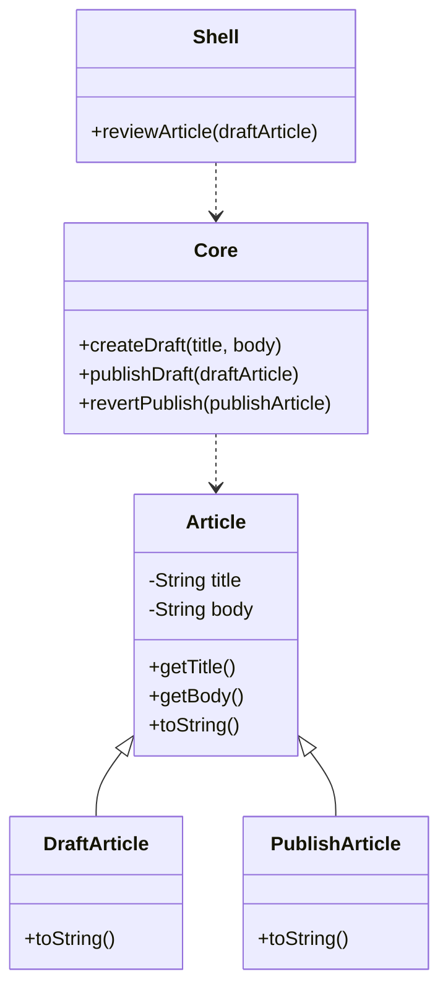

--- 
layout: pattern 
title: functional-core-imperative-shell 
folder: functionalcoreimperativeshell 
permalink: /patterns/functionalcoreimperativeshell/ 
categories: Structural 
language: en 
tags:
- Functional Programming
---

## Functional Core Imperative Shell Design Pattern

## Intent

The pattern makes the program easier to understand, and reduce the program’s total states, plus, it is easy to test the functional parts.

## Explanation

- In plain words

Purely functional code only calls functions to get immutable values, no values will be changed in this process, which makes it easy to understand.

The object values don't change: they just create new values.

However, new methods are needed to deal with things like user input and database. This design pattern shows that we can use a helper class, an imperative shell, to covers the core, and deal with these stuff.

- Programmatic example 

In the program, the Core part manages the article states. In order to decide whether this article should be published, it needs to get a reviewer’s input. In this case, the Shell class deal with this problem. 

## Class diagram

## Applicability

When should the pattern be used?

## Tutorials

Run the Main class to try the user input. See how the Core and Shell classes cooperate with each other. 

## Consequences

Pros: 

- readability
- easy to debug

Cons:

- poor performance
- inflexible

## Related patterns

Strategy Pattern

Chain of Responsibility Pattern

## Credits

For more example, check these two amazing blogs: 

- [FUNCTIONAL CORE, IMPERATIVE SHELL - DESTROY ALL SOFTWARE](https://www.destroyallsoftware.com/screencasts/catalog/functional-core-imperative-shell)
- [The Functional Core, Imperative Shell Pattern](https://www.kennethlange.com/functional-core-imperative-shell/)

And this Github repo shows how can we do this in typescript:

- [repo link](https://github.com/kenneth-lange/ts-functional-core-imperative-shell)

