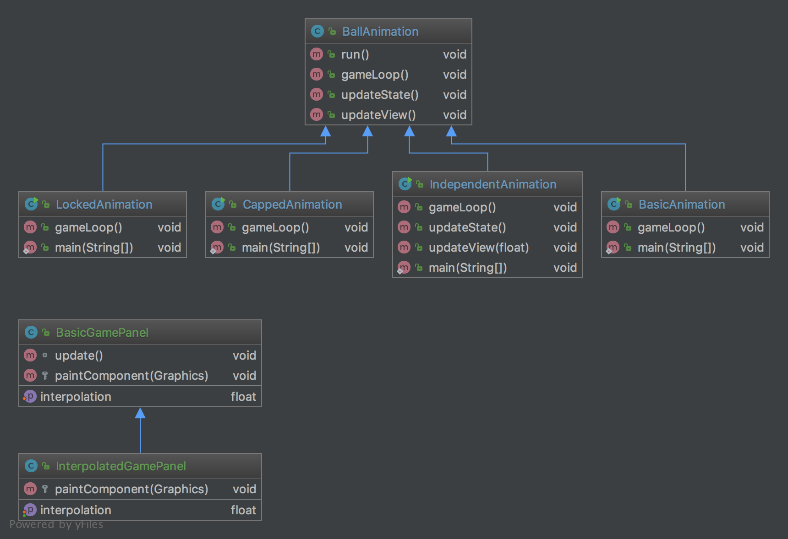

## Intent
Given a game in which a ball travels and bounces from the boundaries of a box,
define interchangeable loop sequences that will update the game and display.

## Applicability
Use the Game Loop pattern when creating games, animations or UIs that need to update state irrespective of user input.
Using this pattern, you are able to allow the system to update state while handling the rendering separately,
effectively allowing you to control the user's frame rate in whichever way suits the application.

The Game Loop pattern works best when:
* Creating games, animations or UIs
* State and render need to be separated
* Needing to optimise game performance (i.e. Frames Per Second) 

There are four examples in this project:
* Basic (state and render affected by hardware speed)
* Locked (state and render locked to the same fixed amount of updates)
* Capped (state locked to fixed update rate, render can update up to the number of times the state does per second)
* Independent (state updates at a fixed rate, render can update more than the rate of state updates via interpolation)

Note: Independent is one worth paying attention to in production.

## Real world examples
* [Java 2D](https://gist.github.com/martincruzot/a55d744a77448f1adaa9)
* [Render Loop in LITIengine](https://github.com/gurkenlabs/litiengine/blob/master/src/de/gurkenlabs/litiengine/RenderLoop.java)

## Credits

* [Fix Your Timestep!](https://gafferongames.com/post/fix_your_timestep/)
* [Discussion on Game Loops in Java](http://www.java-gaming.org/index.php?topic=24220.0)
