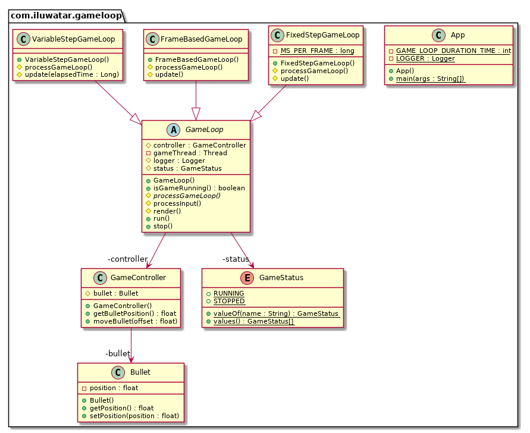

---  
layout: pattern  
title: Game Loop 
folder:  game-loop  
permalink: /patterns/game-loop/  
categories: Behavioral
tags:  
 - Game programming
---  
  
## Intent  
A game loop runs continuously during gameplay. Each turn of the loop, it processes user input without blocking, updates the game state, and renders the game. It tracks the passage of time to control the rate of gameplay.

This pattern decouple the progression of game time from user input and processor speed.

## Applicability  
This pattern is used in every game engine. 

## Explanation
Game loop is the main process of all the game rendering threads. It drives input process, internal status update, rendering, AI and all the other processes. 

There are a lot of implementations of game loop:

- Frame-based game loop

Frame-based game loop is the easiest implementation. The loop always keeps spinning for the following three processes: processInput, update and render. The problem with it is you have no control over how fast the game runs. On a fast machine, that loop will spin so fast users won’t be able to see what’s going on. On a slow machine, the game will crawl. If you have a part of the game that’s content-heavy or does more AI or physics, the game will actually play slower there.

- Variable-step game loop

The variable-step game loop chooses a time step to advance based on how much real time passed since the last frame. The longer the frame takes, the bigger steps the game takes. It always keeps up with real time because it will take bigger and bigger steps to get there.

- Fixed-step game loop

For fixed-step game loop, a certain amount of real time has elapsed since the last turn of the game loop. This is how much game time need to be simulated for the game’s “now” to catch up with the player’s.

## Class diagram

## Credits  
  
* [Game Programming Patterns - Game Loop](http://gameprogrammingpatterns.com/game-loop.html)
