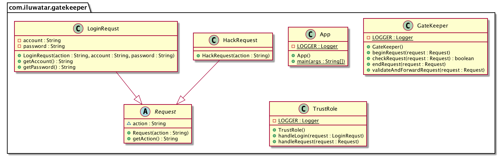

## Intent

Protect applications and services by using a dedicated host instance that acts as a broker between clients and the application or service, validates and sanitizes requests, and passes requests and data between them. 

## Explanation

Real world example

> If our server will access some sensitive databases or other servers, we can create a Gatekeeper role for this server, and we use this Gatekeeper role to authenticate the requests from the client, so that the server's access to the database is hidden from the client. This can provide an additional layer of security, and limit the attack surface of the system.

**Programmatic Example**

We have an abstract class `Request` and two subclasses `HackRequest` and `LoginRequest`.

```java
public abstract class Request {
  String action;
}

public class HackRequest extends Request {
  public HackRequest(String action) {
    super(action);
  }
}

public class LoginRequst extends Request {
  private String account;
  private String password;

  public LoginRequst(String action, String account, String password) {
    super(action);
    this.account = account;
    this.password = password;
  }
}
```

And we have a `TrustRole` as server to commuicate with database and handle the requests that meet the requirements.

```java
public class TrustRole {
  public void handleRequest(Request request) {
    if (request.getAction().equals("login")) {
      LOGGER.info("Handle login request.");
      handleLogin((LoginRequst) request);
    }
  }

  public void handleLogin(LoginRequst request) {
    LOGGER.info("Link to the database and check account: "
            + request.getAccount() + " and password: " + request.getPassword() + ".");
  }

}
```
Then we need to add a `GateKeeper` to verify these request, and choose the requests that meet the requirements to forward to the server.

```java
public class GateKeeper {
  public void validateAndForwardRequest(Request request) {
    beginRequest(request);
    endRequest(request);
  }

  public void beginRequest(Request request) {
    var trustRole = new TrustRole();
    LOGGER.info("----------------------------");
    LOGGER.info("Start the request: " + request.getAction());
    if (checkRequest(request)) {
      LOGGER.info("Accept the request!");
      trustRole.handleRequest(request);
    } else {
      LOGGER.info("Refuse the request!");
    }

  }

  public void endRequest(Request request) {
    LOGGER.info("End the request: " + request.getAction());
  }

  public boolean checkRequest(Request request) {
    if (request.getAction().equals("login")) {
      return true;
    } else {
      return false;
    }
  }
}
```

Now on the client code we can create different types of requests, and use Gatekeeper to handle them.

```java
var goodRequest = new LoginRequst("login", "admin", "123456");
var badRequest = new HackRequest("dangerous action");
var gateKeeper = new GateKeeper();
gateKeeper.validateAndForwardRequest(goodRequest);
gateKeeper.validateAndForwardRequest(badRequest);
```

Program output:

```
----------------------------
Start the request: login
Accept the request!
Handle login request.
Link to the database and check account: admin and password: 123456.
End the request: login
----------------------------
Start the request: dangerous action
Refuse the request!
End the request: dangerous action
```

## Class Diagram



## Applicability

This pattern is ideally suited for:

- Applications that handle sensitive information, expose services that must have high a degree of protection from malicious attacks, or perform mission-critical operations that must not be disrupted.
- Distributed applications where it is necessary to perform request validation separately from the main tasks, or to centralize this validation to simplify maintenance and administration.

Pros

* **Limited risk and exposure**. The Gatekeeper does not have access to the credentials or keys used by the trusted host to access storage and services. If the Gatekeeper is compromised, the attacker does not obtain access to these credentials or keys.
* **Appropriate security**. The Gatekeeper runs in a limited privilege mode, whereas the remainder of the application runs in the full trust mode required to access storage and services. If the Gatekeeper is compromised, it cannot directly access the application services or data.

Cons

* Adding a layer of validation can lead to performance degradation.

## Related patterns

* [Valet Key Pattern](https://msdn.microsoft.com/en-us/library/dn568102.aspx)