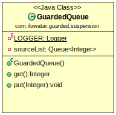

## Intent
Use Guarded suspension pattern to handle a situation when you want to execute a method on object which is not in a proper state.

## Class diagram


## Applicability
Use Guarded Suspension pattern when the developer knows that the method execution will be blocked for a finite period of time

## Explanation

Real world example

> When we reserve a dining room online and arrive to find it unready, the manager has it cleaned while we wait. 
> Once ready, we're escorted to the room. This process exemplifies the Guarded Suspension pattern.

In plain words

> Guarded Suspension pattern is used when one thread waits for the result of another thread's execution.

Wikipedia says

> In concurrent programming, Guarded Suspension manages operations requiring a lock
> and a precondition, delaying execution until the precondition is met.

**Programmatic Example**

The `GuardedQueue` class encapsulates a queue, and provides two synchronized methods, `get` and `put`.
The `get` method waits if the queue is empty, and the `put` method adds an item to the queue and notifies waiting threads:

```java
public class GuardedQueue {
private final Queue<Integer> sourceList = new LinkedList<>();

    public synchronized Integer get() {
        while (sourceList.isEmpty()) {
            try {
                wait();
            } catch (InterruptedException e) {
                e.printStackTrace();
            }
        }
        return sourceList.peek();
    }

    public synchronized void put(Integer e) {
        sourceList.add(e);
        notify();
    }
}

public class App {
public static void main(String[] args) {
GuardedQueue guardedQueue = new GuardedQueue();
ExecutorService executorService = Executors.newFixedThreadPool(3);

        // Here we create the first thread which is supposed to get from guardedQueue
        executorService.execute(guardedQueue::get);

        try {
            Thread.sleep(2000);
        } catch (InterruptedException e) {
            e.printStackTrace();
        }

        // Here we create the second thread which is supposed to put to guardedQueue
        executorService.execute(() -> {
            guardedQueue.put(20);
        });

        executorService.shutdown();
        try {
            executorService.awaitTermination(30, TimeUnit.SECONDS);
        } catch (InterruptedException e) {
            e.printStackTrace();
        }
    }
}
```


## Related patterns

* Balking 
