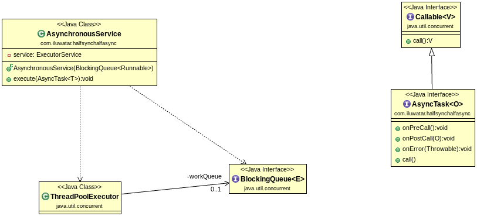

## Also known as

* Async-Sync Bridge
* Half-Synchronous/Half-Asynchronous

## Intent

The Half-Sync/Half-Async pattern aims to decouple asynchronous and synchronous processing in concurrent systems, allowing efficient interaction and data exchange between asynchronous and synchronous components.

## Class diagram



## Explanation

Real world example

> Imagine a busy restaurant kitchen where the process of taking orders is asynchronous, allowing waiters to continue taking orders from customers without waiting for the chefs to cook the previous ones. Meanwhile, the cooking (synchronous part) follows a specific sequence and requires waiting for each dish to be prepared before starting the next. This setup enables the restaurant to handle multiple customer orders efficiently, while ensuring each dish is cooked with the required attention and timing, much like the Half-Sync/Half-Async pattern manages asynchronous tasks and synchronous processing in software systems.

In plain words

> The Half-Sync/Half-Async pattern separates operations into asynchronous tasks that handle events without waiting, and synchronous tasks that process these events in an orderly and blocking manner.

Wikipedia says

> The Half-Sync/Half-Async design pattern is used to solve situations where one part of the application runs synchronously while another runs asynchronously, and the two modules need to communicate with each other.

## Programmatic Example

The Half-Sync/Half-Async design pattern is a concurrency pattern that separates synchronous and asynchronous processing in a system, simplifying the programming model without affecting performance. It's particularly useful in scenarios where you have a mix of short, mid, and long duration tasks.

In the provided code, we can see an example of the Half-Sync/Half-Async pattern in the `App`, `AsynchronousService`, and `ArithmeticSumTask` classes.

The `App` class is the entry point of the application. It creates an instance of `AsynchronousService` and uses it to handle various tasks asynchronously.

```java
public class App {

  public static void main(String[] args) {
    var service = new AsynchronousService(new LinkedBlockingQueue<>());
    service.execute(new ArithmeticSumTask(1000));
    service.execute(new ArithmeticSumTask(500));
    service.execute(new ArithmeticSumTask(2000));
    service.execute(new ArithmeticSumTask(1));
    service.close();
  }
}
```

The `AsynchronousService` class is the asynchronous part of the system. It manages a queue of tasks and processes them in a separate thread.

```java
public class AsynchronousService {
  // Implementation details...
}
```

The `ArithmeticSumTask` class represents a task that can be processed asynchronously. It implements the `AsyncTask` interface, which defines methods for pre-processing, post-processing, and error handling.

```java
static class ArithmeticSumTask implements AsyncTask<Long> {
  private final long numberOfElements;

  public ArithmeticSumTask(long numberOfElements) {
    this.numberOfElements = numberOfElements;
  }

  @Override
  public Long call() throws Exception {
    return ap(numberOfElements);
  }

  @Override
  public void onPreCall() {
    if (numberOfElements < 0) {
      throw new IllegalArgumentException("n is less than 0");
    }
  }

  @Override
  public void onPostCall(Long result) {
    LOGGER.info(result.toString());
  }

  @Override
  public void onError(Throwable throwable) {
    throw new IllegalStateException("Should not occur");
  }
}
```

In this example, the `App` class enqueues tasks to the `AsynchronousService`, which processes them asynchronously. The `ArithmeticSumTask` class defines the task to be processed, including pre-processing, the actual processing, and post-processing steps. This is a basic example of the Half-Sync/Half-Async pattern, where tasks are enqueued and processed asynchronously, while the main thread continues to handle other tasks.

## Applicability

Use the Half-Sync/Half-Async pattern in scenarios where:

* High-performance is required and the system must handle asynchronous operations along with synchronous processing.
* The system needs to effectively utilize multicore architectures to balance tasks between asynchronous and synchronous processing.
* Decoupling of asynchronous tasks from synchronous processing is necessary to simplify the design and implementation.


## Known uses

* [BSD Unix networking subsystem](https://www.dre.vanderbilt.edu/~schmidt/PDF/PLoP-95.pdf)
* [Real Time CORBA](http://www.omg.org/news/meetings/workshops/presentations/realtime2001/4-3_Pyarali_thread-pool.pdf)
* [Android AsyncTask framework](https://developer.android.com/reference/android/os/AsyncTask)
* Java's standard libraries utilize this pattern with thread pools and execution queues in the concurrency utilities (e.g., java.util.concurrent).
* Network servers handling concurrent connections where IO operations are handled asynchronously and processing of requests is done synchronously.

## Consequences

Benefits:

* Improves responsiveness and throughput by separating blocking operations from non-blocking operations.
* Simplifies programming model by isolating asynchronous and synchronous processing layers.

Trade-offs:

* Adds complexity in managing two different processing modes.
* Requires careful design to avoid bottlenecks between the synchronous and asynchronous parts.

## Related Patterns

* [Leader/Followers](https://java-design-patterns.com/patterns/leader-followers/): Both patterns manage thread assignments and concurrency, but Leader/Followers uses a single thread to handle all I/O events, dispatching work to others.
* [Producer/Consumer](https://java-design-patterns.com/patterns/producer-consumer/): Can be integrated with Half-Sync/Half-Async to manage work queues between the async and sync parts.
* [Reactor](https://java-design-patterns.com/patterns/reactor/): Often used with Half-Sync/Half-Async to handle multiple service requests delivered to a service handler without blocking the handler.

## Credits

* [Douglas C. Schmidt and Charles D. Cranor - Half Sync/Half Async](https://www.dre.vanderbilt.edu/~schmidt/PDF/PLoP-95.pdf)
* [Pattern-Oriented Software Architecture Volume 2: Patterns for Concurrent and Networked Objects](https://amzn.to/3UgC24V)
* [Java Concurrency in Practice](https://amzn.to/4aRMruW)
