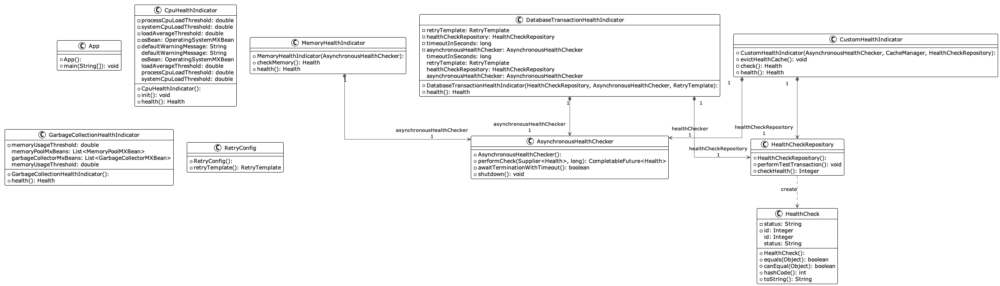

## Also known as

* Health Monitoring
* Service Health Check

## Intent

The Health Check pattern is designed to proactively monitor the health of individual software components or services, allowing for quick identification and remediation of issues that may affect overall system functionality.

## Explanation

In microservices architecture, it's critical to continuously check the health of individual services. The Health Check Pattern is a mechanism for microservices to expose their health status. This pattern is implemented by including a health check endpoint in microservices that returns the service's current state. This is vital for maintaining system resilience and operational readiness.

Real-world example

> In a cloud-native environment, such as Kubernetes or AWS ECS, health checks are used to ensure that containers are running correctly. If a service fails its health check, it can be automatically restarted or replaced, ensuring high availability and resilience.

In Plain Words

> The Health Check Pattern is like a regular doctor's visit for services in a microservices architecture. It helps in early detection of issues and ensures that services are healthy and available.

## Programmatic Example

The Health Check design pattern is a pattern that allows a system to proactively monitor the health of its components. This pattern is particularly useful in distributed systems where the health of individual components can affect the overall health of the system.

In the provided code, we can see an example of the Health Check pattern in the `App` class and the use of Spring Boot's Actuator.

The `App` class is the entry point of the application. It starts a Spring Boot application which has health check capabilities built-in through the use of Spring Boot Actuator.

```java
package com.iluwatar.health.check;

import org.springframework.boot.SpringApplication;
import org.springframework.boot.autoconfigure.SpringBootApplication;
import org.springframework.cache.annotation.EnableCaching;
import org.springframework.scheduling.annotation.EnableScheduling;

@EnableCaching
@EnableScheduling
@SpringBootApplication
public class App {
  public static void main(String[] args) {
    SpringApplication.run(App.class, args);
  }
}
```

Spring Boot Actuator provides several built-in health checks through its `/actuator/health` endpoint. For example, it can check the status of the database connection, disk space, and other important system parameters. You can also add custom health checks as needed.

To add a custom health check, you can create a class that implements the `HealthIndicator` interface and override its `health` method. Here is an example:

```java
import org.springframework.boot.actuate.health.Health;
import org.springframework.boot.actuate.health.HealthIndicator;
import org.springframework.stereotype.Component;

@Component
public class CustomHealthCheck implements HealthIndicator {
    @Override
    public Health health() {
        int errorCode = check(); // perform some specific health check
        if (errorCode != 0) {
            return Health.down()
              .withDetail("Error Code", errorCode).build();
        }
        return Health.up().build();
    }
     
    public int check() {
        // Our logic to check health
        return 0;
    }
}
```

In this example, the `check` method contains the logic for the health check. If the health check fails, it returns a non-zero error code, and the `health` method builds a `DOWN` health status with the error code. If the health check passes, it returns a `UP` health status.

This is a basic example of the Health Check pattern, where health checks are built into the system and can be easily accessed and monitored.

## Class Diagram



## Applicability

This pattern is applicable in microservices architectures, distributed systems, or any complex system where it’s crucial to continuously check the health of various software components to ensure system reliability and availability.

## Known Uses

* Kubernetes liveness and readiness probes
* AWS elastic load balancing health checks
* Spring Boot Actuator

## Consequences

Benefits:

* Improved system reliability through early detection of failures.
* Enhanced system availability by allowing for automatic or manual recovery processes.
* Simplifies maintenance and operations by providing clear visibility into system health.

Trade-offs:

* Additional overhead for implementing and maintaining health check mechanisms.
* May introduce complexity in handling false positives and negatives in health status reporting.

## Related Patterns

* [Circuit Breaker](https://java-design-patterns.com/patterns/circuit-breaker/): Both patterns enhance system resilience; while Health Check monitors health status, Circuit Breaker protects a system from repeated failures.
* [Observer](https://java-design-patterns.com/patterns/observer/): Health Check can be seen as a specific use case of the Observer pattern, where the subject being observed is the system’s health.

## Credits

* [Health Check API pattern on Microservices.io](https://microservices.io/patterns/observability/health-check-api.html)
* [Release It! Design and Deploy Production-Ready Software](https://amzn.to/3Uul4kF)
* [Microservices Patterns: With examples in Java](https://amzn.to/3UyWD5O)
