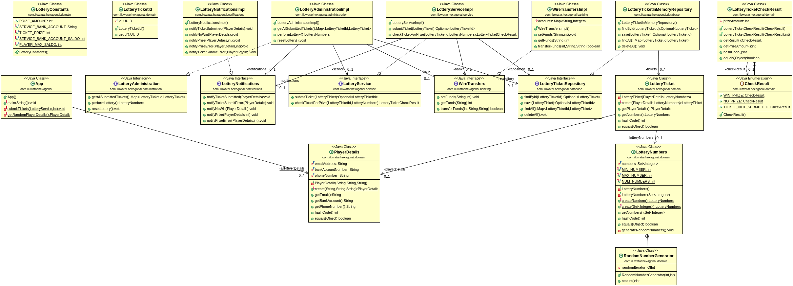

## Also known as

* Ports and Adapters

## Intent

Hexagonal Architecture, often applied within the Java ecosystem, is designed to promote the decoupling of application's core logic from external interfaces, such as databases, user interfaces, or third-party services, thus allowing an application to be at the center of input/output systems.

## Explanation

Real world example

> A real-world analogous example of Hexagonal Architecture can be seen in online banking systems. In such systems, the core banking logic (like processing transactions, managing accounts, and calculating interest) represents the application's core. This core is then surrounded by various adapters that allow the system to interact with different external interfaces without affecting the business logic. For instance, customers might access their accounts through a web interface, a mobile app, or even through ATM services. Meanwhile, the banking system also needs to interface with external services for credit checks, fraud detection, and interbank transactions. Each of these interfaces interacts with the core banking logic through specific adapters designed to translate the external calls to and from the application's internal APIs. This setup allows the bank to modify or extend its external interfaces without having to alter the core business logic, enhancing flexibility and maintainability.

In plain words

> Hexagonal Architecture organizes an application into a central core of business logic surrounded by ports and adapters that manage interactions with external systems like user interfaces and databases, allowing the core to remain independent of external concerns.

Wikipedia says

> The hexagonal architecture, or ports and adapters architecture, is an architectural pattern used in software design. It aims at creating loosely coupled application components that can be easily connected to their software environment by means of ports and adapters. This makes components exchangeable at any level and facilitates test automation.

## Programmatic Example

The Hexagonal Architecture, also known as Ports and Adapters, is a design pattern that aims to create a loosely coupled application where the core business logic is isolated from external interfaces like databases, user interfaces, or third-party services. This allows the core application to be independent and easily testable.

In the provided code, we can see an example of the Hexagonal Architecture pattern in the `App` class and the use of Google's Guice for dependency injection.

The `App` class is the entry point of the application. It creates an instance of `LotteryAdministration` and `LotteryService` through dependency injection and uses them to handle various tasks.

```java
public class App {

  public static void main(String[] args) {

    var injector = Guice.createInjector(new LotteryTestingModule());

    // start new lottery round
    var administration = injector.getInstance(LotteryAdministration.class);
    administration.resetLottery();

    // submit some lottery tickets
    var service = injector.getInstance(LotteryService.class);
    SampleData.submitTickets(service, 20);

    // perform lottery
    administration.performLottery();
  }
}
```

The `LotteryAdministration` class is responsible for managing the lottery rounds. It has methods to start a new round, perform the lottery, and reset the lottery.

```java
public class LotteryAdministration {

  private final LotteryTicketRepository repository;
  private final LotteryEventLog notifications;
  private final WireTransfers wireTransfers;

  @Inject
  public LotteryAdministration(LotteryTicketRepository repository, LotteryEventLog notifications,
                               WireTransfers wireTransfers) {
    this.repository = repository;
    this.notifications = notifications;
    this.wireTransfers = wireTransfers;
  }

  public Map<LotteryTicketId, LotteryTicket> getAllSubmittedTickets() {
    return repository.findAll();
  }

  public LotteryNumbers performLottery() {
    // Implementation details...
  }

  public void resetLottery() {
    repository.deleteAll();
  }
}
```

The `LotteryService` class is responsible for managing the lottery tickets. It has methods to submit a ticket, check a ticket's status, and get the winning ticket.

```java
public class LotteryService {

  private final LotteryTicketRepository repository;
  private final LotteryEventLog notifications;
  private final WireTransfers wireTransfers;

  @Inject
  public LotteryService(LotteryTicketRepository repository, LotteryEventLog notifications,
                        WireTransfers wireTransfers) {
    this.repository = repository;
    this.notifications = notifications;
    this.wireTransfers = wireTransfers;
  }

  public Optional<LotteryTicketId> submitTicket(LotteryTicket ticket) {
    // Implementation details...
  }

  public LotteryTicketCheckResult checkTicketForPrize(
      LotteryTicketId id,
      LotteryNumbers winningNumbers
  ) {
    // Implementation details...
  }
}
```

In this example, the `LotteryAdministration` and `LotteryService` classes are the core of the application. They interact with external interfaces like `LotteryTicketRepository`, `LotteryEventLog`, and `WireTransfers` through dependency injection, keeping the core business logic decoupled from external concerns. This is a basic example of the Hexagonal Architecture pattern, where the core application is at the center of input/output systems.

## Class diagram



## Applicability

This pattern is particularly effective in environments where:

* The application needs to interact with multiple external systems.
* There is a requirement for high testability and maintainability.
* The application should remain unaffected by changes in external interfaces.

## Known Uses

* Implemented extensively within enterprise applications that leverage frameworks like Spring.
* Used in microservices architectures to maintain clear boundaries and protocols between services.
* Adopted in systems that require integration with various databases or external APIs without impacting the business logic.

## Consequences

Benefits:

* Improved Testability: Allows the core functionality to be tested independently of external components.
* Flexibility: Facilitates the addition or replacement of components that interact with the application without modifying the core business logic.
* Maintainability: Reduces dependencies on external interfaces, simplifying upgrades and maintenance.

Trade-offs:

* Complexity: Introduces more abstractions and layers, which can complicate the system design and understanding.
* Overhead: Might be an over-engineering for simple applications, where simpler architectural patterns could suffice.

## Related Patterns

* Layered Architecture: Shares the concept of organizing code into responsibilities; however, Hexagonal emphasizes port-based interaction with external elements.
* Microservices: Often used in conjunction with Hexagonal Architecture to define clear boundaries and protocols between services.

## Credits

* [Alistair Cockburn - Hexagonal Architecture](http://alistair.cockburn.us/Hexagonal+architecture)
* [Implementing Domain-Driven Design](https://amzn.to/4dmBjrB)
* [Building Microservices](https://amzn.to/3UACtrU)
